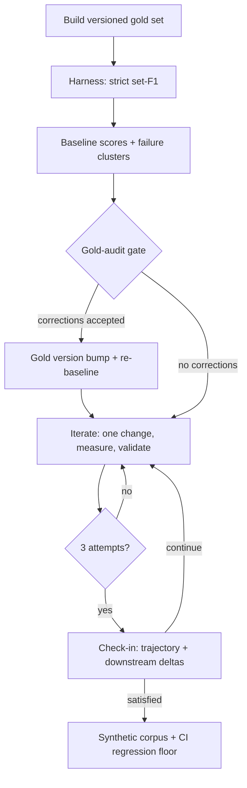
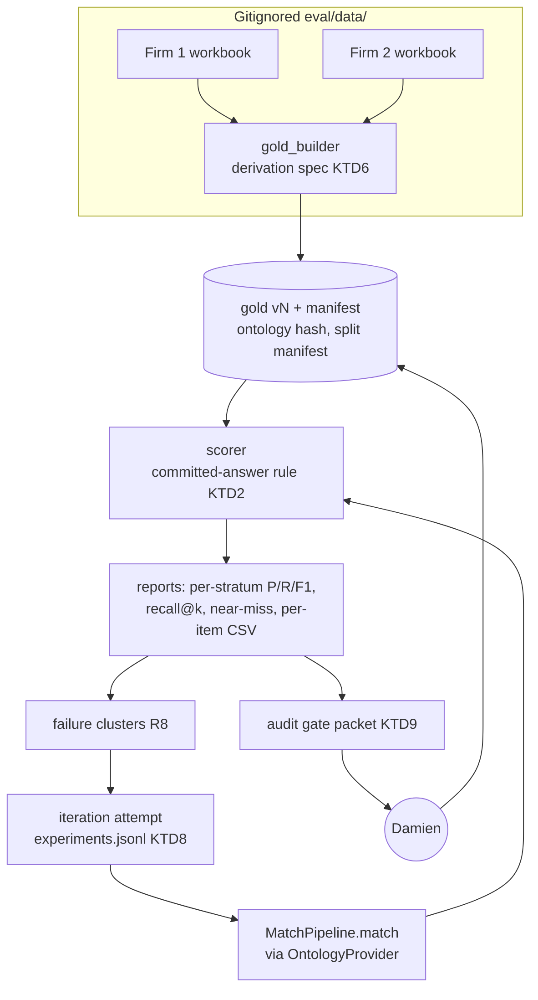

# folio-resolve F1 Improvement Loop - Plan

## Goal Capsule

- **Objective:** Raise folio-resolve's measured F1 (strict IRI-set precision/recall) on real-world firm-taxonomy gold through an evaluation-driven improvement loop, so folio-mapper, folio-enrich, and other consumers inherit the gains through the library.
- **Product authority:** Damien's dialogue answers of 2026-07-27 (cockpit ask `folio-resolve-2026-07-27-f1-loop-scope`, plus the planning-round answers on holdout redesign, answer rule, input context, and new-gold budget).
- **Execution profile:** Orchestrating session judges and ships; Opus subagents implement and analyze; Sonnet subagents handle mechanical extraction and batch runs (KD10).
- **Stop conditions:** Pause for Damien at the post-baseline audit gate and at each 3-iteration check-in. Never commit to consumer repos. Never change gold without his acceptance. Surface (do not resolve) any evidence that a session-settled decision cannot work.
- **Open blockers:** None.

---

## Product Contract

**Product Contract preservation:** changed R6, KD2, AE4 — cross-firm holdout redesigned after workbook profiling showed Firm 2 has ~125 scorable gold rows (user-directed, 2026-07-27). R4 gains the cap from KTD5. R1 clarified: Firm 1 has three heading tiers, and Firm-2 term-set gold coverage varies from 114 rows (WorkType) to 0 (Jurisdiction). All other requirements unchanged in meaning; IDs stable.

### Summary

Build a multi-label gold set from two firms' SALI-mapping workbooks and a strict IRI-set-F1 evaluation harness, then run an iterative improvement loop over folio-resolve — three iterations per check-in — with the gold itself correctable and versioned. Downstream consumers are validated read-only at each check-in. Once Damien is satisfied with F1, a gated follow-on phase generates a synthetic test corpus from the real-data patterns and wires it in as a permanent regression floor.

### Problem Frame

folio-resolve's precision machinery was calibrated against curated corpora, and its label matcher reaches 100% gold recall on bench samples — but its performance on real firm taxonomies (the actual mapping workload) has never been measured. The one quantified gap points at candidate generation: retiring folio-enrich's forked recall orchestration would collapse the ranked candidate set by 87.5% (`docs/migration/SCHEDULE.md`). Two real firm workbooks with human-curated SALI mappings now make a genuine F1 measurement possible. Because the mappings were made by hand, the gold itself may contain errors, and an F1 score is only as trustworthy as the gold it is measured against.

### Key Decisions

- KD1. **Strict exact-IRI set-F1 is the headline metric** (session-settled: user-directed — chosen over hierarchical partial credit: hard to game, easy to trust). Governs R5.
- KD2. **Firm 1 carries the statistical holdout; Firm 2 is a directional cross-firm signal** (session-settled: user-directed, 2026-07-27 planning round — chosen over the original cross-firm split and over hand-building Firm-2 validation gold: Firm 2 has ~125 scorable rows, too few to detect the F1 movements that matter). Governs R6.
- KD3. **Three iterations per check-in** (session-settled: user-directed — chosen over longer autonomous runs: early redirection beats long unobserved runways). Governs R10.
- KD4. **Changes land in folio-resolve only** (session-settled: user-directed — chosen over multi-repo freedom: clean attribution and rollback). Governs R9, R13.
- KD5. **Gold is correctable and versioned** (session-settled: user-directed — the goal is highest true classification accuracy, not fidelity to one spreadsheet pass). Governs R3, R11.
- KD6. **Suspect-gold routing: audit gate after baseline, then batches at check-ins** (session-settled: user-directed — chosen over per-suspect interrupts or check-in-only: earliest signal without mid-loop pings). Governs R11.
- KD7. **Blank SALI cells mean "not yet mapped"** (session-settled: user-directed — chosen over treating blanks as true negatives: blanks are incomplete work). Governs R4.
- KD8. **All four Firm-2 term sets are in scope** (session-settled: user-directed — Jurisdiction has zero gold rows today, so it contributes coverage findings and new-gold candidates rather than scores). Governs R1.
- KD9. **The loop is failure-driven** (session-settled: user-approved — every iteration's target must be justified by measured failure clusters; the recall-engine port is the expected iteration-1 target, the embedding channel is admitted only if clusters show misses no lexical strategy can reach). Governs R8, R9.
- KD10. **Tiered delegation** (session-settled: user-directed — orchestrator judges and ships; Opus subagents implement and analyze; Sonnet subagents handle work they do sufficiently well).

### Actors

- A1. Damien — product and gold authority; decides gold corrections, check-in continuations, and the synthetic-phase gate.
- A2. Orchestrating session — decomposes work, judges results, runs check-ins, ships.
- A3. Worker subagents — execute gold construction, harness code, failure analysis, and library changes under A2's specs, tiered per KD10.

### Requirements

**Gold construction**

- R1. The gold set covers both workbooks: Firm 1's mapping sheet (three heading tiers with SALI 0–6 label cells that cascade to children) and all four Firm-2 term sets (WorkType, Legal Topic, Sector, Jurisdiction) where SALI mappings are populated.
- R2. Gold SALI labels and legacy IRIs resolve to FOLIO IRIs by exact-label lookup, alternative/lemma-label lookup, and legacy-IRI normalization — never by the pipeline under test. Gold rows still unresolved go to a human-assisted resolution batch at the audit gate (per KTD6); exclusion counts are a headline figure on every report.
- R3. The gold set is versioned. Every reported score cites the gold version it was measured against; accepted corrections bump the version, and the score trajectory is re-baselined so no F1 movement comes from moving goalposts.
- R4. Rows with blank SALI columns are excluded from scoring and reported as coverage. Confident pipeline suggestions on blank rows queue for Damien as new-gold candidates, capped per KTD5.
- R5. The harness scores micro-averaged precision, recall, and F1 — per firm, per stratum, and overall — by strict exact-IRI set comparison against the committed answer set (KTD2). Parent/child near-misses are reported as diagnostics and score zero.
- R6. Tuning uses Firm 1. The statistical holdout is a frozen, stratified 20% of Firm 1, split at Level-2-group boundaries so cascaded gold cannot leak across slices. Firm 2 is evaluated whole as a directional signal, reported as changed-item counts with bootstrap confidence intervals, never bare F1 deltas.
- R7. Harness runs are offline (locally cached FOLIO ontology) and reproducible: versioned inputs, deterministic outputs, pinned ontology hash (KTD7).
- R8. A failure-analysis step clusters misses by cause (candidate-set gaps, synonymy, homonym traps, normalization, hierarchy), and each iteration's target is justified by cluster size.

**Improvement loop**

- R9. Each iteration lands one coherent change in folio-resolve, measured before/after on the tune set and checked against the Firm-2 signal. No new runtime dependencies; existing optional extras are allowed.
- R10. After three iteration attempts (reverted attempts count), a check-in reaches Damien as a Cockpit ask plus decision artifact: F1 trajectory with gold-driven and code-driven movement separated, per-change attribution, downstream validation deltas, and a keep-going/stop recommendation.
- R11. A gold-audit gate runs after the baseline, before iteration 1: pipeline-vs-gold disagreements are triaged into pipeline-wrong (iteration fuel) and gold-suspect (sent to Damien with suggested corrections and evidence per KTD9). New suspects found later batch into check-ins.
- R12. The existing test suite stays green throughout, and any change to default scoring behavior is versioned deliberately via the golden no-drift table in `tests/test_scoring.py`, never by silent drift.

**Downstream validation**

- R13. Each check-in includes read-only validation of the improved library against folio-mapper's demo probe payloads and folio-enrich's demo corpus and golden-baseline harness, using the snapshot-diff rule in KTD10, without committing to those repos.

**Synthetic regression phase (gated on Damien's satisfaction signal)**

- R14. A synthetic test corpus is generated from the real data's patterns — vocabulary styles, multi-label shapes, trap types — with asserted disjointness from all tuning data.
- R15. The synthetic suite runs in CI as an F1 regression floor, so later library changes cannot silently lower F1.

### Key Flows

- F1. **Baseline and audit.** **Trigger:** gold set and harness exist. **Steps:** score baseline; cluster failures; triage disagreements; deliver the audit sheet (derivation spec with worked examples, suspects, unresolved-label resolutions, new-gold candidates) to Damien; fold accepted corrections into a new gold version; re-baseline. **Outcome:** trusted gold, trusted baseline. **Covers R2, R3, R5, R8, R11.**
- F2. **Improvement iteration.** **Trigger:** baseline or prior iteration complete. **Steps:** pick the largest justified failure cluster; implement one change in the library on its own branch; re-score tune set; check the Firm-2 signal; record the attempt in the experiments log with a keep/revert decision. After three attempts, run downstream validation and check in. **Outcome:** measured, attributable F1 movement. **Covers R6, R8, R9, R10, R12, R13.**
- F3. **Gold correction.** **Trigger:** suspect surfaced at audit gate or check-in. **Steps:** Damien reviews suggestion and evidence; accepts or rejects; accepted corrections bump the gold version at the gate/check-in boundary; rejections are remembered and never resurface unchanged. **Outcome:** gold quality rises with F1, goalposts never move silently. **Covers R3, R11.**
- F4. **Synthetic phase.** **Trigger:** Damien signals satisfaction with F1. **Steps:** generate synthetic corpus from real-data patterns; assert disjointness; wire into CI as a regression floor. **Outcome:** durable protection. **Covers R14, R15.**

### Acceptance Examples

- AE1. **Gold suspect.** **Covers R11, R3.** **Given** the pipeline maps "Fund Formation" to a concept with strong label and definition evidence while gold says an unrelated concept, **when** triage runs, **then** the row appears on Damien's audit sheet with both candidates and evidence, and F1 is unaffected until he accepts — at which point the gold version bumps at the next boundary.
- AE2. **Blank row.** **Covers R4.** **Given** a Firm-2 Legal Topic row with empty SALI columns, **when** scoring runs, **then** the row is absent from the scored denominator, counted in coverage, and a confident pipeline suggestion for it may land on the capped new-gold candidate list.
- AE3. **Legacy IRI.** **Covers R2, R5.** **Given** gold IRI `http://lmss.sali.org/RBX1KA0BJR7y27zZSvaLBVE`, **when** the pipeline returns the corresponding `https://folio.openlegalstandard.org/` IRI, **then** the match counts — normalization happens at gold construction, not at scoring time.
- AE4. **Overfit tripwire.** **Covers R6, R9.** **Given** an iteration that gains F1 on Firm 1, **when** the Firm-2 changed-item CI is negative or any Firm-2 item regresses from correct to incorrect, **then** the change is flagged as overfitting and is not accepted as-is.
- AE5. **Near-miss.** **Covers R5.** **Given** the pipeline returns the direct parent of a gold concept, **when** scoring runs, **then** the item scores zero on that concept and the near-miss appears in the 1-hop diagnostics.

### Success Criteria

- Strict set-F1 on the frozen Firm-1 slice improves from baseline to final report, both measured against the same final gold version, with a bootstrap CI that excludes zero (otherwise reported as "not distinguishable from noise").
- Every iteration's F1 delta is attributable to one named change; gold-driven and code-driven movement are never conflated.
- Consumer demo validations show no blocking regression (KTD10) at any check-in.
- The gold set, harness, and experiments log survive the loop as durable artifacts a future session can rerun bit-identically.

### Scope Boundaries

- No code changes in consumer repos; validation there is read-only.
- No new runtime dependencies; existing optional extras (embedding, spacy, folio) are the outer limit. Tooling-level parsing deps per KTD11.
- No gold change without Damien's acceptance; the pipeline never grades itself.
- PyPI release timing and consumer pin bumps stay with ask `folio-resolve-2026-07-24-release-and-recall`, not this plan.
- FOLIO ontology content fixes (wrong labels, missing concepts, deprecations in FOLIO itself) are findings to report, not work items here.
- Firm-2 synonym/related-term handling is out of scope as unavailable: those columns are empty in all four sheets.

<!-- ce-section: work-relationships -->
### How This Work Fits Together

This plan owns the F1 improvement loop. The surrounding picture, as currently understood:

- **Shares** its expected iteration-1 payload with migration Stage 2 (`docs/migration/SCHEDULE.md`): the `RecallOntology` protocol + `MultiStrategyRecall` engine. Landing it here, evidence-justified, also advances retiring folio-enrich's forked `search.py`.
- **Enables** the "assess where migration falls short and how can we improve" thread from Damien's `q4-insights-bridges` answer — failure clusters and downstream deltas are that assessment's evidence.
- **Can proceed independently of** the PyPI release decision; consumers validate against the local library via editable installs.
- **Still to decide:** whether the synthetic corpus later becomes a shared fixture for consumer repos' own test suites.

### Outstanding Questions

- **Deferred to implementation:** the exact calibrated-probability threshold and top-k values for the committed answer set — set empirically at baseline, pinned in the versioned harness config (KTD2), and changed only as a named iteration change.
- **Deferred to implementation:** the confidence cutoff for new-gold candidate queueing (KTD5 caps the count; ranking makes the cutoff self-tuning).

---

## Planning Contract

### Key Technical Decisions

- KTD1. **Harness lives in a new top-level `eval/` package; all firm data stays out of git** (session-settled: user-directed — chosen over extending `bench/` or committing derived gold: `bench/` is a one-off script that imports a sibling repo and cannot run offline, and `tests/conftest.py` documents that this repo is public). Original workbooks live outside the repo tree (`~/.folio-resolve-eval-data/`); intake extracts only the in-scope taxonomy sheets into gitignored `eval/data/` as minimized derived files. A committed `eval/data/MANIFEST.md` records file SHA-256, hashed sheet names, row counts, and header signatures for in-scope sheets only — no literal sheet names, no listing of out-of-scope sheets. Loaders fail loudly on signature mismatch. Only harness code, synthetic fixtures, and ID-keyed aggregate reports are committed; no committed file — code, report, or planning document — may contain a firm surface string. Row-level outputs (per-item CSVs, audit packets, worked-examples sheets, experiment hypothesis text) live under gitignored `eval/data/reports/`. Governs R1, R7.
- KTD2. **Committed answer set = candidates at or above a calibrated-probability threshold, hard-capped at top-k** (session-settled: user-directed — chosen over top-1 and over the raw ≥45.0 list: the raw list makes precision near zero by construction). Threshold and k live in a versioned harness config recorded on every report; they are never gold-count-aware; changing them is a named iteration change under R9. Threshold-free diagnostics (recall@1/3/5/10, PR curve) accompany every score. Calibration uses `src/folio_resolve/calibration.py`, fitted once at baseline on tune-slice items only (a candidate is correct iff its IRI is in the item's gold set), serialized into the versioned config and hashed; refitting is a named iteration change under R9, never an automatic consequence of a gold bump. Governs R5.
- KTD3. **Scoring item = (firm, term set/practice group, ancestor path, leaf label), with hierarchy context in the pipeline input** (session-settled: user-directed — chosen over leaf-only: 203 duplicate Firm-1 leaf labels make leaf-only partially unsolvable). A leaf-only run is reported each check-in as an ablation. Ancestor/descendant lookups use folio-python's hierarchy utilities. Identical (input, gold-set) pairs dedupe before micro-averaging; non-referential leaves ("Other", "Miscellaneous", "N/A", "Various") are excluded and counted. Micro-average counts TP/FP/FN at the (item, IRI) level; empty prediction is an FN per gold IRI; a per-item CSV (gitignored per KTD1) accompanies every run so any aggregation can be recomputed offline. Adapter contract: `surface_term` carries the leaf label and the ancestor path passes as `heading_terms` — which today influences only gating, not candidate generation, so duplicate-label items share a committed answer set at baseline; context-aware candidate generation is a named iteration candidate under R9, not an assumed property. Near-miss = predicted IRI is a direct parent or child (1 hop) of a gold IRI; 2-hop and sibling buckets are separate diagnostics.
- KTD4. **Split integrity is structural** — the frozen slice is 20% of Firm 1, stratified by the 20 Level-1 practice groups, assigned at Level-2-group granularity so all rows under a parent land in one slice. A committed split manifest (item IDs + hash) is asserted at load: no item key in two slices; a normalized surface string occurring in both candidate slices is excluded from the frozen slice and its count reported on the manifest. Frozen items may be corrected only by rules that never inspected frozen scores (blanket normalization, deprecation sweeps, the R2 resolution pass) — never by score-driven per-row suspects. Instantiates KD2; governs R6.
- KTD5. **New-gold candidates cap at 25 per check-in**, ranked by score, drawn only from term sets that already have gold (session-settled: user-directed — chosen over full-scale gold authoring and over coverage-only). Accepted items enter gold tagged `provenance=pipeline_suggested`; every report includes a sensitivity score excluding them. Governs R4.
- KTD6. **Gold derivation spec.** Firm 1: scoring item = one Level-3 row; gold = set-union of the row's own SALI cells, the nearest preceding Level-2 row's cells, and the enclosing Level-1 row's cells — column position ignored, deduped by resolved IRI; a row carrying both L2 and L3 labels is the L2 mapping cascading to all its children; a row is blank only if own and inherited sets are empty. Firm 2 WorkType: parse `Bucket: Concept` values right-hand-side first, whole string second, bucket last, recording which branch fired; `?`-suffixed values route to gold-suspect, non-referential values (`varies`) are excluded and counted; `Additional SALI Mapping` is notes-not-gold, promotable at the audit gate. Pipe-delimited cells split into separate gold IRIs; multi-row terms (Firm-2 Legal Topic) group by term key and union. Normalization before lookup: NFKC, strip, collapse whitespace, normalize dash variants; labels that resolve only after normalization are logged. Relational expressions (`sali:isMemberOf`, arrow syntax) are excluded as a reported "relational assertion" category. Rows whose SALI NOTES contain `?`, `discuss`, `ask`, or `deprecat` are pre-flagged low-confidence, excluded from the frozen slice, and lead the first audit batch. The gold builder emits a worked-examples spec sheet (5+ real rows per rule) delivered with the audit gate. Governs R1, R2, R4.
- KTD7. **Determinism and pinned inputs.** Harness sets `PYTHONHASHSEED=0`, sorts candidates by (score desc, IRI asc) before any cutoff, and ships a determinism self-test whose second pass runs in a subprocess under a different `PYTHONHASHSEED` — identical output hash required — at the top of every scoring run. The harness constructs the ontology explicitly (pinned source and branch, cache required) and injects it into `FolioPythonProvider`; it resolves and hashes the concrete cache file before the run and aborts if the file is absent rather than falling through to a network fetch. That hash is recorded in every report and experiments-log row; a hash change aborts the run unless explicitly re-baselined, which is treated exactly like a gold bump. The `folio` extra is installed into the repo venv at a pinned folio-python version so runs never depend on an ambient user-site install. Governs R7.
- KTD8. **Iteration mechanics.** One branch and one commit per iteration attempt; an append-only `eval/reports/experiments.jsonl` records iteration, gold version, ontology hash, config hash, commit SHA, hypothesis, targeted cluster and size, before/after scores (tune + Firm-2 signal; frozen excluded), and a keep/revert/park decision with reason. Rejected attempts are `git revert`ed, never amended away. Reverted attempts count toward the three per check-in. Gold bumps happen only at gate/check-in boundaries; after a bump, the last accepted library state is re-scored on the new gold before the next iteration so Δgold and Δcode are separate trajectory lines. An iteration commit never also bumps gold. Governs R9, R10.
- KTD9. **Audit evidence and rejection memory.** Each suspect row carries: item ID, firm/stratum, ancestor path, surface label, gold labels+IRIs, pipeline labels+IRIs+scores, `extraction_path`, FOLIO definition snippets for both sides, the curator's SALI NOTES text when present, a one-line reason class, and Accept/Reject/Edit. Sorted by confidence × label frequency; capped at 50 per batch. `eval/reports/gold_decisions.jsonl` keyed by (item ID, proposed IRI set, gold version) suppresses previously rejected proposals unless the proposal or ontology hash changes; the suppressed count is always reported. The committed log carries item IDs, IRI sets, decisions, and reason classes only — never firm surface strings. Packets render as local files under gitignored `eval/data/reports/`; a hosted decision artifact, when used, carries its batch privately (never link-shared) and is deleted after its decisions fold in. Governs R11.
- KTD10. **Downstream validation is snapshot-diff.** At baseline, snapshot folio-mapper's demo probe outputs (`scripts/demos/`, `run_probe.py`), folio-enrich's migration-harness outputs (`backend/migration/`), and each consumer's own test-suite results, using an editable install of the local library into each consumer venv. The runner invokes consumer entry points via each repo's own `.venv/bin/python` — never bare `uv run`, which re-syncs from the lockfile and silently reverts the editable install — and asserts before each run that `folio_resolve.__file__` resolves into the local checkout, aborting otherwise. Each check-in diffs against the snapshot: a previously-correct expected output becoming incorrect, or a previously-passing consumer test now failing, is a blocking regression; all other deltas are listed as advisory. Nothing is committed in consumer repos. Governs R13.
- KTD11. **Excel parsing stays at tooling level** — gold-construction scripts run via `uv run --with openpyxl`; neither `openpyxl` nor `pandas` enters `pyproject.toml`. Preserves the pydantic-only core and the no-new-dependencies boundary without a new extra. Governs R9.
- KTD12. **Approved processing surfaces for firm data** — the local machine and the Anthropic API serving this session's orchestrator and subagents, reading only the in-scope taxonomy sheets, never the matter/client sheets. No firm content flows to other third-party models or services; CI processes synthetic fixtures only. Governs R1, R13.

### High-Level Technical Design

The harness wraps the library through its public seams only: `MatchPipeline.match()` (ranked candidates), `OntologyProvider` (`all_labels`, `search_by_label`, `get_concept`) backed by `FolioPythonProvider`, and `calibration.py` for the committed-answer threshold. The expected iteration-1 payload extends `ontology.py` with a `RecallOntology` protocol (`search_by_prefix`, `search_by_definition`, `parents_of`) and adds a `MultiStrategyRecall` engine mirroring folio-enrich's `backend/app/services/folio/search.py` stages (multi-term gathering, expansion re-scoring, ancestor surfacing) — directional guidance, confirmed by baseline clusters before build.

### Assumptions

- Most gold SALI labels resolve to current FOLIO concepts via label lookup plus normalization; the residual goes through the R2 resolution batch. Coverage is measured, not assumed.
- The locally cached FOLIO ontology (`~/.folio/cache/`) is current enough; its hash is pinned rather than its freshness assumed.
- Legacy-IRI normalization does not exist in this repo today and is built new in the gold builder (folio-python's normalization is the reference behavior).

### Sequencing

U1 → U2 → U3 → U4 → U5 (audit gate, Damien) → U6 → U7/U8 (iterations) → U9 → U10 (check-in, Damien) → loop or gate → U11 → U12. U9's baseline snapshot half runs right after U4.

---

## Implementation Units

### U1. Data intake, manifest, and gitignore

- **Goal:** Firm workbooks land in a durable, verified, uncommitted location.
- **Requirements:** R1, R7. Cites KTD1.
- **Dependencies:** None.
- **Files:** `eval/data/` (gitignored), `eval/data/MANIFEST.md` (committed), `.gitignore`, `pyproject.toml`, `eval/folio_eval/intake.py`, `tests/test_eval_intake.py`.
- **Approach:**
  1. Move the original workbooks from the upload location to `~/.folio-resolve-eval-data/`, outside the repo tree.
  2. Extract only the in-scope taxonomy sheets into gitignored `eval/data/` as minimized derived files.
  3. Write the manifest per KTD1 (file SHA-256, hashed sheet names, row counts, in-scope header signatures).
  4. Wire the eval package into the gates: `pythonpath = ["eval"]` under `[tool.pytest.ini_options]`, `mypy_path = "eval"`, and an `openpyxl.*` entry in the mypy ignore-missing-imports overrides.
  Loader verifies the manifest before any parse and fails loudly on mismatch.
- **Test scenarios:**
  - Loader accepts a file matching its manifest entry.
  - Loader rejects a byte-changed file with an error naming the failed hash.
  - Loader rejects a sheet whose header signature shifted (column inserted).
  - Test expectation for gitignore: `git status` shows no `eval/data/` content (asserted via a repo-hygiene test that `eval/data/` is ignored).
- **Verification:** Manifest committed; workbooks present locally; hygiene test green.

### U2. Gold builder

- **Goal:** Versioned multi-label gold set derived from both workbooks per the derivation spec.
- **Requirements:** R1, R2, R3. Cites KTD1, KTD3, KTD6.
- **Dependencies:** U1.
- **Files:** `eval/folio_eval/gold.py`, `eval/folio_eval/resolve_labels.py`, `eval/folio_eval/normalize.py`, `tests/test_eval_gold.py`, `tests/fixtures/eval_synthetic_workbook.py` (synthetic, committable).
- **Approach:**
  1. Parse Firm 1 (three-tier cascade union, KTD6) and Firm 2 (term grouping, compound-label parse) into scoring items keyed per KTD3.
  2. Resolve labels to FOLIO IRIs: exact preferred → alternative/lemma → legacy-IRI normalization; residuals to the resolution batch; record the resolution branch per gold IRI.
  3. Emit `gold_v{N}.jsonl` + manifest (gold version, ontology hash, counts, exclusion categories) using the atomic-write pattern from `src/folio_resolve/annotate/feedback_store.py` and the hash-plus-version filename pattern from `src/folio_resolve/lemma.py`.
  4. Emit the worked-examples spec sheet for the audit gate.
- **Execution note:** Run workbook-touching scripts via `uv run --with openpyxl` (KTD11); `intake.py` holds the only openpyxl import (function-local) and yields plain row tuples, so `gold.py` and every test run against synthetic fixtures under the base venv. Build the parser against synthetic fixtures first, real workbooks second.
- **Patterns to follow:** `lemma.py` cache naming; `feedback_store.py` atomic writes; `spec.py` for IRI handling.
- **Test scenarios (synthetic fixtures):**
  - Cascade: L3 row with no own cells inherits L2 ∪ L1 cells; blank only when all three are empty.
  - Row carrying L2+L3 labels cascades to all the L2's children.
  - Column position ignored: same gold set regardless of which SALI column holds a value.
  - Pipe-delimited cell splits into two gold IRIs.
  - `Bucket: Concept` parses right-hand-side; branch recorded; `?`-suffix routes to suspect; `varies` excluded.
  - Trailing-whitespace and dash-variant labels resolve after normalization and are logged.
  - Relational expression excluded into its category.
  - Duplicate (input, gold) pairs dedupe; "Other" excluded as non-referential.
  - Legacy IRI with trailing space normalizes to the FOLIO namespace (AE3).
  - Multi-row Firm-2 term unions its rows' labels.
- **Verification:** Gold builds from real workbooks with coverage/exclusion report; spec sheet renders; all fixture tests green.

### U3. Scoring harness

- **Goal:** Deterministic strict set-F1 scoring with splits, diagnostics, and CIs.
- **Requirements:** R5, R6, R7. Cites KTD2, KTD3, KTD4, KTD7.
- **Dependencies:** U2.
- **Files:** `eval/folio_eval/score.py`, `eval/folio_eval/splits.py`, `eval/folio_eval/answer_rule.py`, `eval/folio_eval/report.py`, `tests/test_eval_score.py`, `tests/test_eval_splits.py`.
- **Approach:** Adapter feeds items (with ancestor context, KTD3) to `MatchPipeline.match`; answer rule (KTD2) commits the set; scorer counts (item, IRI) TP/FP/FN per stratum; splits module builds and asserts the manifest (KTD4); report module writes JSON summary (shape mirroring `bench/summary.json`), per-item CSV, recall@k, near-miss buckets via folio-python ancestors/descendants, bootstrap CIs for Firm-2 signal and frozen-slice deltas.
- **Test scenarios:**
  - Covers AE5: parent prediction scores zero, lands in 1-hop diagnostics.
  - Known toy gold + canned pipeline outputs produce hand-computed P/R/F1 (pinned table mirroring `tests/test_scoring.py`'s golden pattern).
  - Empty prediction yields FN per gold IRI; empty gold row excluded from denominator.
  - Split manifest: no item in two slices; no normalized surface string in both tune and frozen; violation raises.
  - Determinism self-test: two runs, identical output hash.
  - Ontology-hash mismatch aborts without `--allow-ontology-bump`.
  - Answer rule is gold-count-blind: changing gold set size never changes the committed set.
- **Verification:** Harness scores the real baseline end-to-end offline; self-tests green.

### U4. Baseline run and failure clustering

- **Goal:** Trusted baseline scores plus cause-clustered failure analysis.
- **Requirements:** R8. Cites KTD2, KTD7.
- **Dependencies:** U3.
- **Files:** `eval/folio_eval/clusters.py`, `eval/reports/` (ID-keyed aggregates, committed; row-level outputs under gitignored `eval/data/reports/` per KTD1), `tests/test_eval_clusters.py`.
- **Approach:** Score baseline on tune + Firm-2 signal (frozen untouched); cluster misses by cause (candidate absent from ranked list vs ranked-below-cutoff vs synonymy vs homonym vs normalization vs hierarchy); for every candidate-gap miss, re-query the provider at a raised label-search limit (e.g., 200) and report how many gold IRIs were reachable but truncated by the adapter's default limit — the cheap raise-the-limit fix must be taken or ruled out before the recall port is credited (feeds U7); calibrate the initial answer-rule threshold/k on tune data only; emit the baseline report.
- **Test scenarios:**
  - Each cluster rule classifies a hand-built miss correctly.
  - A miss whose gold IRI never appears in `match()` output classifies as candidate-gap (the cluster that justifies the recall port).
- **Verification:** Baseline report exists with cluster sizes; threshold/k pinned in config with rationale line.

### U5. Audit gate packet and gold-decision machinery

- **Goal:** Damien's single-sitting audit sheet plus the machinery that folds his decisions into gold v2.
- **Requirements:** R2, R3, R11. Cites KTD5, KTD6, KTD9.
- **Dependencies:** U4.
- **Files:** `eval/folio_eval/audit.py`, `eval/reports/gold_decisions.jsonl` (committed — ID-keyed decision records only; surface labels stay in the gitignored packet), `tests/test_eval_audit.py`.
- **Approach:** Triage disagreements (pipeline-wrong vs gold-suspect); assemble the evidence packet (KTD9 fields, cap 50, SALI-NOTES rows leading); append the R2 resolution batch and the first ≤25 new-gold candidates (KTD5); deliver per KTD9's packet-surface rules as a Cockpit ask with a private decision artifact; fold Accept/Reject/Edit into `gold_v2` with rejection memory; re-baseline and emit Δgold line.
- **Test scenarios:**
  - Covers AE1: suspect appears with both candidates and evidence; gold unchanged until acceptance.
  - Rejected (item, proposal) pair is suppressed on the next triage; suppression count reported.
  - Accepted new-gold item carries `provenance=pipeline_suggested`; sensitivity score excludes it.
  - Frozen-slice item never appears as a score-driven suspect (KTD4 rule).
- **Verification:** Gate packet generated from real baseline; decision fold produces gold v2 and re-baselined scores.

### U6. Iteration protocol runner

- **Goal:** The loop's bookkeeping: experiments log, branch discipline, tripwires.
- **Requirements:** R9, R10, R12. Cites KTD7, KTD8.
- **Dependencies:** U4, U5.
- **Files:** `eval/folio_eval/experiment.py`, `eval/reports/experiments.jsonl`, `tests/test_eval_experiment.py`.
- **Approach:** One command wraps an attempt: record hypothesis + targeted cluster, run before/after scoring, append the KTD8 record, evaluate the AE4 tripwire, prompt keep/revert. The wrapper also re-runs audit triage incrementally on new disagreements (reusing U5's classification logic) so check-ins have a live suspect stream (R11).
- **Test scenarios:**
  - Covers AE4: Firm-2 negative CI or correct→incorrect item flags the attempt.
  - Reverted attempt appends a `revert` record and counts toward the check-in tally.
  - Attempt refuses to run if gold version or ontology hash changed since baseline (bumps only at boundaries).
- **Verification:** A dry-run attempt on an innocuous change produces a complete log record.

### U7. Iteration 1 — expected: recall engine port

- **Goal:** Close the largest baseline failure cluster; expected (per KD9 prior and `docs/migration/SCHEDULE.md`) to be the candidate-gap cluster via `RecallOntology` + `MultiStrategyRecall`.
- **Requirements:** R8, R9. Cites KTD8; instantiates KD9.
- **Dependencies:** U5, U6.
- **Files (expected):** `src/folio_resolve/ontology.py` (protocol extension), `src/folio_resolve/recall.py` (new), `src/folio_resolve/pipeline.py` (stage wiring), `tests/test_recall.py`; actual files follow the winning cluster.
- **Approach:** Confirm the top cluster justifies it — including U4's label-search-limit diagnostic having taken or ruled out the cheap adapter fix; port folio-enrich's `search.py` orchestration (multi-term gathering via `search_by_prefix`/`search_by_definition`/stem prefix, expansion re-scoring, ancestor surfacing) behind the existing lazy-import/optional-provider pattern; run as a U6 attempt.
- **Execution note:** Test-first against the synthetic ontology fixture; the enrich fork is the reference implementation, its committed golden baseline the cross-check.
- **Test scenarios:**
  - `InMemoryOntology` gains test doubles for the new protocol methods; `MultiStrategyRecall` surfaces a candidate absent from plain label search.
  - Ancestor surfacing adds parents without displacing higher-scored direct hits.
  - Pipeline with recall engine on/off is bit-identical when off (golden no-drift table green — R12).
- **Verification:** U6 record shows the cluster shrinking on tune without tripwire flags.

### U8. Iterations 2–3 — failure-driven

- **Goal:** Two further attempts targeting the then-largest clusters (candidates: threshold/gate calibration, normalization, synonymy via the existing embedding channel per KD9's gate).
- **Requirements:** R8, R9. Cites KTD8.
- **Dependencies:** U7.
- **Files:** Determined by cluster; each attempt names its files in its experiments record.
- **Approach:** Per U6 protocol; embedding channel only if clusters show lexically-unreachable misses.
- **Test scenarios:** Each attempt adds regression tests for its change per house style; golden no-drift table green or deliberately versioned (R12).
- **Verification:** Three attempt records exist; check-in ready.

### U9. Downstream validation runners

- **Goal:** Read-only consumer validation with the snapshot-diff rule.
- **Requirements:** R13. Cites KTD10.
- **Dependencies:** U3 (baseline snapshot right after U4; diffs at check-ins).
- **Files:** `eval/folio_eval/downstream.py`, `eval/reports/downstream_baseline/` (committed aggregates), `tests/test_eval_downstream.py`.
- **Approach:** Editable-install the local library into folio-mapper and folio-enrich venvs; invoke via each repo's `.venv/bin/python` with the `folio_resolve.__file__` assertion per KTD10; run mapper probes (`scripts/demos/run_probe.py`), enrich's migration harness (`backend/migration/harness.py`, `compare.py`), and each consumer's own test suite read-only; snapshot at baseline; diff per KTD10 at check-ins.
- **Test scenarios:**
  - Diff classifier: previously-correct→incorrect = blocking; new-correct and changed-ranking = advisory.
  - Runner leaves consumer working trees clean (asserted via `git status` in both repos).
  - Runner aborts when `folio_resolve` resolves outside the local checkout.
- **Verification:** Baseline snapshots captured; a diff run reports zero blocking regressions on an unchanged library.

### U10. Check-in packaging

- **Goal:** The every-3-attempts decision moment, delivered the house way.
- **Requirements:** R10. Cites KTD8, KTD9.
- **Dependencies:** U5, U6, U9.
- **Files:** `eval/folio_eval/checkin.py`, `tests/test_eval_checkin.py`.
- **Approach:** Assemble trajectory (Δcode and Δgold lines, per-attempt attribution, ablation per KTD3, downstream deltas, suspect batch, new-gold batch) into a Cockpit ask + interactive artifact; recommendation line (keep going / stop / redirect).
- **Test scenarios:** Report assembles from three synthetic experiment records; empty-suspect batch renders without an empty-section ask.
- **Verification:** First real check-in delivered to Damien.

### U11. Synthetic corpus (gated)

- **Goal:** Committable synthetic test data patterned on the real workbooks.
- **Requirements:** R14. Cites KTD1.
- **Dependencies:** Damien's satisfaction signal at a U10 check-in.
- **Files:** `eval/folio_eval/synthesize.py`, `tests/fixtures/synthetic_taxonomy/` (committed), `tests/test_eval_synthetic.py`.
- **Approach:** Generate firm-style items (vocabulary styles, multi-label shapes, cascade structures, homonym/place traps) with no real firm strings; assert zero overlap with tune+validate on normalized surfaces and gold IRI sets.
- **Test scenarios:** Disjointness assertions; generator determinism under fixed seed; trap categories each represented.
- **Verification:** Synthetic suite scores within 2 F1 points of the real frozen slice's final profile (sanity, not equality).

### U12. CI regression floor (gated)

- **Goal:** The repo's first test-running CI workflow, with the synthetic F1 floor.
- **Requirements:** R15. Cites KTD7.
- **Dependencies:** U11.
- **Files:** `.github/workflows/test.yml`, `eval/folio_eval/ci_floor.py`, `tests/test_eval_ci_floor.py`.
- **Approach:** Workflow runs pytest + mypy + ruff + the synthetic F1 check; floor = observed synthetic F1 minus a fixed 2-point margin to avoid flake; ontology snapshot for CI is the pinned cached file (vendored fixture or cached download keyed by hash). CI processes synthetic fixtures only (KTD12): real-data tests skip when `eval/data/` is absent, no `eval/` reports upload as workflow artifacts, and a workflow step fails on any staged workbook file under `eval/`.
- **Test scenarios:** Floor check passes at current F1; fails when fed a doctored score below floor; workflow syntax validated.
- **Verification:** Workflow green on a no-op PR; floor demonstrably trips on an induced regression.

---

## Verification Contract

| Gate | Command | Applies to |
|---|---|---|
| Unit + regression tests | `uv run pytest` | All units; golden no-drift table enforces R12 |
| Types (strict) | `uv run mypy src` and `uv run mypy eval` | All units |
| Lint | `uv run ruff check` | All units |
| Determinism | harness self-test (runs at top of every scoring run) | U3–U10 |
| Split integrity | split-manifest assertions at load | U3 onward |
| Frozen-slice discipline | frozen scores computed only at baseline and final report | U4–U10 |
| Downstream | snapshot-diff, zero blocking regressions | each check-in |
| CI floor (gated) | `.github/workflows/test.yml` synthetic F1 ≥ floor | U12 onward |

The optimization exit criterion is Success Criteria's CI-backed frozen-slice improvement, judged by Damien at check-ins — no fixed numeric F1 target is pinned.

## Definition of Done

- Gold v1 built with manifest; audit gate delivered; Damien's decisions folded into gold v2 with re-baseline.
- Three iteration attempts recorded in `experiments.jsonl` with keep/revert decisions and separated Δgold/Δcode trajectory.
- First check-in delivered as Cockpit ask + artifact with recommendation.
- Frozen slice verifiably untouched between baseline and final report (split manifest + frozen-discipline gate).
- No commits in consumer repos; consumer working trees clean after validation runs.
- On loop completion (after U11), the raw workbook copies are deleted from the external data directory and the session upload directory — the derived gold and hashed manifest are what survive — and the deletion is recorded in the final check-in.
- All verification gates green; abandoned experimental code from reverted attempts removed from the working tree.
- Gated phase (U11–U12) done only on Damien's signal: synthetic suite committed, CI workflow green with the floor demonstrably tripping on induced regression.

---

## Appendix — Workbook profile (measured 2026-07-27)

Firm 1 (`DUMMY_SALI_FOLIO_MAPPER.xlsx`, sheet `Copy of SALI ↔ Big Firm`, 1551 rows): 20 L1 practice groups, ~221 L2 labels, 1523 L3 rows; 867 L3 rows with own SALI cells, 656 without; 1828 populated SALI cells, zero IRIs; 33 pipe-delimited cells; 10 trailing-whitespace cells; 6 relational expressions; 203 duplicate L3 labels (two technology-practice leaf labels ×21 each; a non-referential `Other` ×18); 88 rows with SALI NOTES. Three near-identical 1551-row sheets exist; only `Copy of SALI ↔ Big Firm` carries SALI columns — the manifest pins it.

Firm 2 (`Copy_of_SALI___Big_CC_Firm.xlsx`): WorkType 145 rows / 114 mapped / 0 IRIs (compound `Bucket: Concept` values, 8 `?`-suffixed); Sector 54 / 6 / 6; Legal Topic 1972 / 5 / 5; Jurisdiction 388 / 0 / 0. `Term Synonym`/`Term Related` empty everywhere; `Term Depreciated`=Y on 2 unmapped rows; one IRI has a trailing space.

Pipeline facts: `MatchPipeline.match()` returns every survivor above `score_floor=45.0`, deduped, ranked (`src/folio_resolve/pipeline.py`); `OntologyProvider` = `all_labels` / `search_by_label` / `get_concept` (`src/folio_resolve/ontology.py`); no legacy-IRI normalization exists in-repo; `folio` package present in user site, absent from repo venv; FOLIO cache at `~/.folio/cache/github/` (multiple snapshots — hash pinning required).

## Sources / Research

- `docs/migration/SCHEDULE.md` — Stage-2 recall findings and the open `generate_search_terms` nondeterminism note (motivates KTD7).
- `bench/RESULTS.md`, `bench/summary.json` — gold-recall evidence; report-shape precedent.
- `src/folio_resolve/`: `pipeline.py`, `ontology.py`, `calibration.py`, `lemma.py` (versioned-cache pattern), `annotate/feedback_store.py` (atomic writes), `spec.py` (IRI handling); `tests/test_scoring.py` (golden no-drift pattern); `tests/conftest.py` (public-repo data policy).
- folio-enrich: `backend/app/services/folio/search.py` (recall reference implementation), `backend/migration/` (harness + corpus).
- folio-mapper: `scripts/demos/` + `run_probe.py`.
- folio-python: hierarchy utilities (ancestors/descendants), legacy-IRI normalization reference in `folio/graph.py`, cache under `~/.folio/cache/`.
