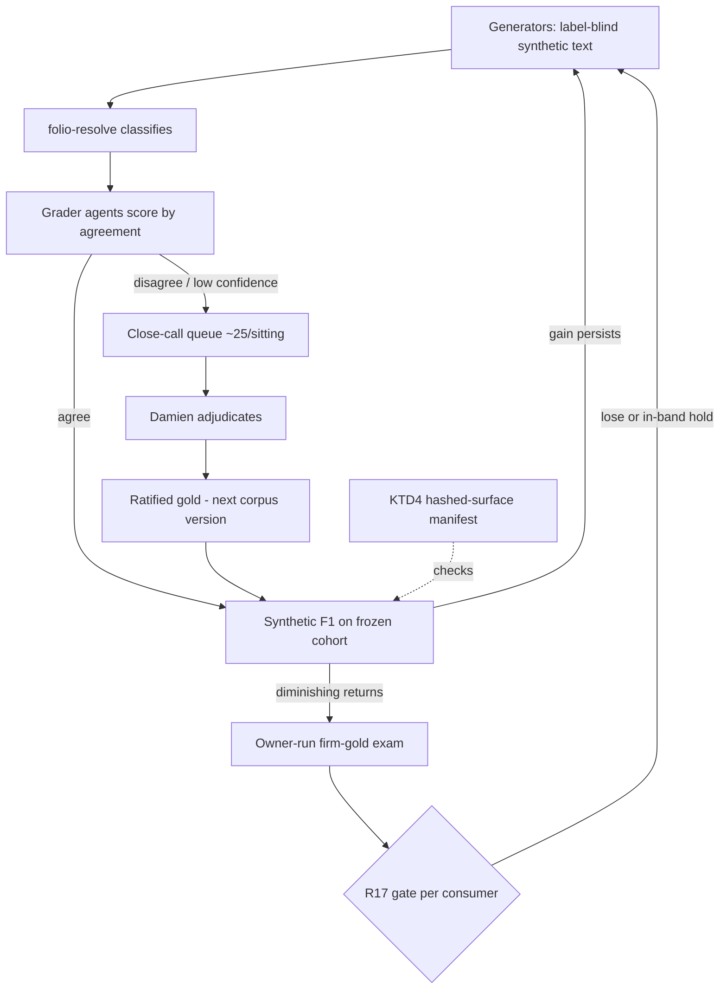
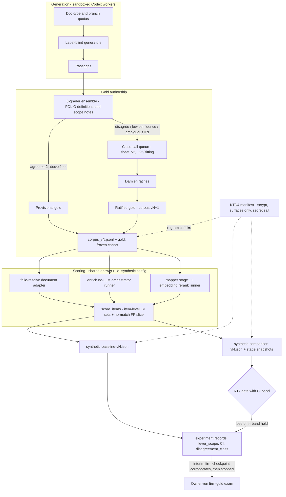

# Synthetic Benchmark F1 Campaign - Plan

## Goal Capsule

- Raise folio-resolve's measured F1 through two sequential stages: finish the Gate 1b gold adjudication and resume measured iterations against the firm gold, then stand up a public synthetic benchmark loop that agents can run end-to-end.
- Downstream adoption and per-consumer measurement (folio-enrich, folio-mapper, folio-insights) is not active scope; it is the round after this campaign converges.
- Product authority: this plan, plus the still-governing iteration protocol in `docs/plans/2026-07-27-001-feat-f1-improvement-loop-plan.md` for firm-gold scoring discipline.
- Open blockers: Gate 1b's adjudication sheet (`q1-sheet-v2-decisions` on cockpit ask `folio-resolve-2026-07-28-gold-audit-gate2`) is open on Damien; sittings begin as soon as the review workspace is reconciled (R1).

---

## Product Contract

### Summary

Finish the Gate 1b adjudication in ~25-row sittings and fold the results into the firm gold, then build a public, committable synthetic benchmark: Codex agents generate label-blind synthetic legal text, folio-resolve classifies it, grader agents score the classifications, and only genuine close calls reach Damien. Iterate against the synthetic F1 until returns diminish, with the firm-gold owner-run exam remaining the sole release gate. The same corpus then scores the unmodified downstream pipelines, and that head-to-head comparison — improve, never degrade — is the gate the deferred adoption round must pass through.

### Problem Frame

The v0.4.0 release proved the loop works — the recall engine measured tune F1 +0.0077 and Firm-2 F1 +0.0101 over the .2089/.1260 baselines with zero regressions — but the loop has two structural limits. First, the evaluation data is confidential law-firm material: agents can never read it, so every scored iteration routes through Damien, making him the loop's bottleneck. Second, absolute F1 is still low, and the attempt-0001 probe showed the residual misses are a ranking problem, not retrieval depth. Meanwhile the downstream consumers pin v0.4.0 but none constructs the recall engine, so nothing downstream improves until the library's F1 is worth adopting. The campaign needs an evaluation surface agents can run without Damien, and a disciplined path to a higher F1 before downstream adoption spends integration effort on it.

### Key Decisions

- KD1. **Sequence: Gate 1b and firm-gold iterations first, synthetic loop second, downstream adoption only after convergence.** (session-settled: user-directed — chosen over adopting downstream now: adoption should inherit a hardened F1, not the current one.) Governs R2, R3, R14.
- KD2. **The synthetic corpus is a public benchmark; the firm gold stays the private release exam.** (session-settled: user-directed — chosen over blending synthetic rows into the gold or tracking no synthetic metric: two numbers with clear roles, no leakage, agent-runnable.) Governs R7, R12, R13.
- KD3. **Adjudication reaches Damien in ~25-row sittings.** (session-settled: user-directed — chosen over 50–75 or 100+ batches: short phone-sized sittings, more round-trips accepted.) Governs R4, R10.
- KD4. **The synthetic generator is label-blind.** (session-settled: user-approved — chosen over letting generators see target concepts: a generator that writes toward known labels produces a benchmark that grades itself easy.) Governs R6.
- KD5. **Resolved close calls graduate into ratified synthetic gold.** (session-settled: user-approved — chosen over discarding adjudications after scoring: each sitting permanently hardens the benchmark.) Governs R11.
- KD6. **Agents pre-resolve aggressively; only badged judgment rows reach Damien.** (session-settled: user-approved — chosen over routing every ambiguous row to him: at 25 rows per sitting the queue must carry only high-information decisions.) Governs R4, R10.
- KD7. **Ranking, not retrieval, is the iteration lever.** Measured, not assumed: the label-limit probe showed more candidates slightly lower F1 while recall@10 rises — the misses live in ordering and calibration. Governs R5.
- KD8. **The synthetic corpus doubles as a cross-stack comparison baseline: the unmodified downstream pipelines are scored on the same corpus and gold before any adoption.** (session-settled: user-directed — chosen over comparing each stack's existing metrics: today's numbers come from different tasks and different gold, so only a shared benchmark makes folio-resolve and the downstream incumbents comparable; the working hypothesis that downstream may currently score higher is testable, not assumed away.) Governs R15, R16, R17.
- KD9. **folio-resolve's claimed incorporation of the downstream pipelines is audited, and missing parts are judged important only by measured F1 impact.** (session-settled: user-directed — chosen over trusting the extraction history: folio-resolve was built from the folio-enrich/folio-mapper pipelines in theory, but completeness was never validated in practice.) Governs R18, R19.

### Requirements

**Stage 1 — Gate 1b closeout and resumed iterations**

- R1. One canonical adjudication workspace serves the Gate 1b sheet: the tooling currently split across `feat/f1-eval-loop` and `feat/visual-eval-review` is reconciled onto a single branch before the first sitting.
- R2. The remaining Gate 1b backlog is queued into sittings, ordered by information value, with pre-checked rows auto-resolved per KD6.
- R3. Adjudication results fold into a new gold version, and measured iterations resume under the 2026-07-27 plan's protocol, with the attempt-budget state and the rebaseline-vs-attempt mode recorded before the first scored run.
- R4. Each sitting presented to Damien contains roughly 25 rows and is completable on a phone.
- R5. Firm-lane iteration work targets ranking and calibration per KD7; no further retrieval-widening attempts against the firm gold. The synthetic document lane inherits this prohibition only if the U8 retrieval-depth probe reproduces the firm-side result on corpus v1.

**Stage 2 — synthetic benchmark loop**

- R6. Generator agents produce realistic synthetic legal source text without access to the target concepts, labels, or gold mappings for the text they are writing.
- R7. The synthetic corpus, its gold, and its aggregate scores are committable and public; no firm surface string may enter any synthetic artifact.
- R8. folio-resolve classifies each synthetic input; grader agents score the classifications and reach a verdict by agreement, with disagreement or low confidence routing the row to the close-call queue.
- R9. The generate → classify → grade → score cycle runs end-to-end by agents alone for machine-agreed rows; close-call adjudication (R10) is the one owner step, and scoring never waits on it — disputed rows stay out of the scored cohort until ratified into the next corpus version.
- R10. Close calls and judgment calls reach Damien in ~25-row sittings per KD3/KD6.
- R11. A row Damien resolves becomes ratified synthetic gold and is never re-graded by agents.
- R12. The loop iterates until diminishing returns; the stop rule and its statistical guards are KTD12's, overridable by Damien.
- R13. No release or improvement claim rests on synthetic F1 alone: the owner-run firm-gold exam remains the release gate, and the frozen 79 stay unscored until the campaign's final report.

**Stage 2b — downstream comparison baseline**

- R15. The existing folio-enrich and folio-mapper pipelines, unmodified and pinned to the released `folio-resolve==0.4.0` wheel, run the synthetic corpus and receive per-repo precision, recall, and F1 on the shared gold.
- R16. folio-resolve and each downstream incumbent are compared on the same corpus and gold, reported per consumer.
- R17. The comparison is the adoption round's entry gate: adoption proceeds per consumer only where the folio-resolve-backed path measures at least as well as that consumer's incumbent — improve, never degrade. Verdicts carry a paired bootstrap confidence interval; a difference inside the band is a hold escalated to Damien, and a loss reopens the iteration loop (U9–U10), resets the stop counter, and blocks U13 until a candidate passes.
- R18. A component-parity audit maps each stage of the downstream matching pipelines (folio-enrich's annotation stages, folio-mapper's matching path) to its folio-resolve counterpart, marking each as ported, divergent, or absent — validating, not assuming, that the extraction was complete.
- R19. Whether an absent or divergent component matters is decided by measurement, not judgment: when an incumbent beats folio-resolve on the shared benchmark (R16), the gap is attributed to specific components from the R18 map, and those become the next iteration's port candidates.
- R20. An informative shipped-configuration lane measures folio-enrich's and folio-mapper's full pipelines (LLM stages included) on the corpus, owner-run with owner-held keys; its results contextualize the R17 verdicts — answering whether shipped downstream output quality exceeds folio-resolve — but never gate adoption.

**Continuity**

- R14. The deferred rounds are recorded as standing reminders in the cockpit work queue so they cannot be forgotten: downstream adoption + per-consumer P/R/F1 measurement (entered only through the R17 gate), and the ontokit integration decision.

### Actors

- A1. Damien — adjudicates close calls, runs the private firm-gold exam, owns stop/go on iterations.
- A2. Codex worker fleet — generates synthetic text, grades classifications, implements iteration changes; barred from firm rows (`eval/data/**`) per the standing fence, unrestricted on synthetic artifacts; worker outputs are proposals until owner review (KTD13).
- A3. Orchestrator session — decomposes work, dispatches workers, verifies artifacts, assembles sittings, reports measurements.
- A4. folio-resolve — the system under test; classifies both firm-gold and synthetic inputs.

### Key Flows

- F1. Gate 1b sitting
  - **Trigger:** The reconciled workspace (R1) has unresolved sheet rows.
  - **Steps:** Agents assemble the next ~25-row batch by information value; pre-checked rows auto-resolve; Damien works the sitting; results fold into the live gold; the next batch queues.
  - **Outcome:** Gold advances a version; when the sheet empties, Stage 1 iterations resume.
  - **Covers:** R1, R2, R3, R4.
- F2. Synthetic iteration
  - **Trigger:** A candidate improvement to folio-resolve exists, or the benchmark needs its initial baseline.
  - **Steps:** Generators write label-blind synthetic text; folio-resolve classifies; graders score by agreement; agreed rows score immediately; disputed rows queue for Damien; his rulings graduate to ratified gold in the next corpus version; synthetic F1 is computed on the frozen cohort and compared to the prior iteration.
  - **Outcome:** Continue, or stop on the R12 rule; a stopped loop hands a hardened F1 to the firm-gold exam and the R15–R17 downstream comparison, which together decide the adoption round.
  - **Covers:** R6–R13.

### Acceptance Examples

- AE1. **Covers R6.** Given a generation task for concepts in the Insurance branch, when the generator's sandboxed context and input-file manifest are inspected, then they contain no FOLIO labels, IRIs, or gold mappings for the rows being generated.
- AE2. **Covers R8, R10.** Given three graders score a classification 2-to-1 with the dissent above the confidence floor, when the batch closes, then the row enters the close-call queue rather than the scored aggregate.
- AE3. **Covers R11.** Given Damien ruled a queued row correct, when any later iteration re-runs grading, then that row's verdict comes from ratified gold and no grader re-scores it.
- AE4. **Covers R12.** Given two consecutive shared-scope iterations on the same corpus version each moved synthetic F1 by less than epsilon, with each delta inside its bootstrap confidence interval and no novel disagreement class, when the next iteration is proposed, then the loop stops and the firm-gold exam is requested instead.
- AE5. **Covers R17, R19.** Given the shared-benchmark comparison shows folio-resolve below folio-enrich's incumbent pipeline outside the confidence band, when the adoption round is proposed, then adoption for folio-enrich holds, the loop reopens, the gap is attributed to named components, and those become the next iteration's targets.

### Success Criteria

- The final owner-run firm-gold exam shows tune and Firm-2 F1 above the v0.4.0-accepted levels, with zero correct-to-incorrect regressions on Firm-2.
- A synthetic iteration completes end-to-end by agents alone for machine-agreed rows, and its corpus, gold, and scores are committed publicly with the surface-string check passing.
- A published per-consumer comparison on the shared benchmark gives each downstream repo a go/hold/no-go adoption verdict per R17.
- Damien's total adjudication load stays in ~25-row sittings; no sitting requires a desktop.

### Scope Boundaries

**Deferred for later — standing reminders, per R14**

- Downstream adoption + measurement: wire the recall engine into folio-enrich and folio-mapper behind opt-in flags, and measure per-consumer P/R/F1. Gated on this campaign's converged F1 and a passing R17 comparison per consumer.
- Ontokit integration: ontokit-api/web consume folio-python only today; whether they should consume folio-resolve is a separate future decision, not an assumption.
- folio-insights joining the comparison: decided after enrich and mapper land; a joining round would add its own consumer seam and R15/R16-equivalent requirement.

**Outside this campaign**

- Scoring the frozen 79 before the final report (per R13).
- Firm-lane retrieval-depth iterations (measured dead end, KD7; synthetic-lane applicability decided by the U8 probe per R5).
- Blending synthetic rows into the firm tune set (KD2).

### Dependencies / Assumptions

- The confidentiality fence stands: firm rows (`eval/data/**`) reach only Anthropic-surface contexts; Codex may touch `eval/` harness code that reads no firm rows (Damien's 2026-08-05 ruling). Synthetic artifacts are designed to be outside the fence entirely.
- `eval/folio_eval/clusters.py`'s surface-string check is the owner-run release-time backstop; the agent-runnable gate is KTD4's manifest checker.
- Assumed: synthetic-F1 movement correlates with firm-F1 movement well enough to steer iterations. The check is no longer only at stage boundaries: U9's interim firm-exam checkpoint tests it before the stop rule may fire.
- Assumed but unvalidated: folio-resolve incorporates the downstream matching pipelines it was extracted from. The migration was staged (folio-enrich retired only its search path to folio-resolve; its remaining annotation stages live in-repo), so R18 tests this rather than trusting it.

### Outstanding Questions

**Deferred to Implementation** (non-blocking)

- The document adapter's candidate-phrase extraction method (noun-phrase extraction vs. n-gram windows) — settled by measurement during U8, including the retrieval-depth probe.
- The grader model mix on the Codex side — settled by availability at dispatch time within KTD7's independence rules.

<!-- ce-section: work-relationships -->
### How This Work Fits Together

This plan owns the F1 campaign inside folio-resolve. The surrounding rounds are the current understanding, not a committed roadmap:

- Downstream adoption + measurement round — **depends on** this campaign's converged F1 and **enters only through** the R17 comparison gate; adopts the recall engine in consumers and measures per-consumer P/R/F1. Reminder held per R14.
- Ontokit integration decision — **can proceed independently**; **still to decide** whether ontokit consumes folio-resolve at all. Reminder held per R14.
- Gate 1b adjudication — owned here as Stage 1; its governing scoring protocol remains `docs/plans/2026-07-27-001-feat-f1-improvement-loop-plan.md`.
- The completed post-hardening round — `docs/plans/2026-08-06-post-hardening-integration-plan.md` shipped v0.4.0 and the consumer pins this campaign builds on.

### Sources / Research

- `docs/plans/2026-07-27-001-feat-f1-improvement-loop-plan.md` — governing iteration protocol, attempt accounting, gold model.
- `docs/handoffs/2026-08-06-f1-eval-loop-codex-transition.md` — the attempt-0001 no-op, the retrieval-vs-ranking probe evidence behind KD7, and the Codex fence.
- `docs/handoffs/2026-08-09-v0.4.0-post-release.md` — accepted v0.4.0 measurement, consumer pin state, Gate 1b residual.
- `docs/handoffs/2026-07-28-f1-loop-gate1b-handoff.md` — runner mechanics, audit-packet flags, privacy rules.
- `eval/folio_eval/downstream.py` — the existing consumer snapshot/diff harness the adoption round will extend.
- `eval/folio_eval/selftest.py` (`synthetic_scoring_payload`) — existing prior art: a fixed synthetic ontology and gold driven through the real answer-rule/score/report path.
- `docs/solutions/2026-07-28-eval-gold-derivation-lessons.md` — the answer key, not the matcher, moved baseline F1 from .0846 to .2093; gold granularity and join-key identity rules.
- `folio-enrich/docs/solutions/2026-07-07-ner-eval-gold-set-harness.md` — span-restricted scoring and non-circular gold seeding rules.

---

## Planning Contract

**Product Contract preservation:** restructured with reviewed changes, approved by Damien 2026-08-16 (cockpit ask `folio-resolve-2026-08-16-1658-f1-plan-review-decisions`): R5 scoped to the firm lane, R9 exempts adjudication, R17 gains the confidence band and loss branch, R20 added; Outstanding Questions resolved into KTDs; stable IDs otherwise unchanged.

**Path convention:** paths are folio-resolve-relative. Cross-repo files carry a `folio-enrich/` or `folio-mapper/` prefix; both siblings sit at `../` from this repo.

### Key Technical Decisions

- KTD1. **Reuse the firm-exam scoring stack with a synthetic-lane config.** `score_items` (`eval/folio_eval/score.py`) and the answer rule (`eval/folio_eval/answer_rule.py`) run unchanged. The complete synthetic `GoldItemRecord` mapping: `firm="synthetic"`, `stratum=stratum_id=doc_type`, `family_id=item_id`, `input_text=text`, `ancestor_path=()`, `flags=frozenset()`, `blank=False`, `leaf=""` — leaf-keyed diagnostics (`splits.surface_key`, cluster miss classification) do not apply to the synthetic slice. The synthetic lane pins its own `AnswerRuleConfig` — `top_k` sized to the corpus's gold-set density, never the firm exam's calibrated top-k of 2 — with its content hash recorded in the corpus manifest and every synthetic report. (session-settled: user-approved — chosen over a parallel synthetic scorer: identical rules keep synthetic F1 and firm F1 comparable.) Cites R7, R13.
- KTD2. **Item-level IRI-set scoring is the shared cross-stack metric.** One corpus item = one passage + one gold IRI set. enrich's span annotations collapse to a per-item IRI set; mapper output is already item-shaped. (session-settled: user-approved — chosen over span-level scoring: spans are incomparable across the three stacks.) Governs the implementation of R15, R16; cites R8.
- KTD3. **The deterministic lane gates R17; owner-run LLM-on lanes inform it.** The gate compares folio-resolve's document adapter, enrich's no-LLM orchestrator run, and mapper's real deterministic path — stage-1 filter plus embedding rerank over a fixed segment list, never bare `search_candidates` (a stage-1 fallback that would make the comparison a strawman). Both consumers also get an owner-run full-pipeline informative lane (R20, U11). The passage-to-segment rule for the mapper lane is the same candidate extraction U8 settles, applied identically to both stacks and recorded in the comparison artifact. (session-settled: user-directed — lane definitions and the informative lanes chosen by Damien 2026-08-16 over gating on bare `search_candidates` or on the LLM-on lane.) Cites R15, R17, R20.
- KTD4. **An owner-generated hashed-surface manifest makes the firm-surface leak gate agent-runnable.** The committed manifest carries scrypt digests of firm free-text surfaces only — never tune-gold IRIs, whose finite public domain would disclose exam coverage under any hashing. The salt lives in a gitignored owner-provisioned file readable by workers (it holds no firm rows); only the scrypt parameters are committed, and no "unrecoverable" claim is made. The agent-side checker enumerates normalized token n-grams from length 1 up to the manifest's maximum surface token length, so surfaces embedded mid-passage collide. The manifest records the gold version it was generated from; checks fail on mismatch, and every Stage 1 fold regenerates it. Tune-gold surface/IRI disjointness and `clusters.assert_no_surfaces` remain owner-run release-time backstops. (session-settled: user-approved — chosen over owner-gating every commit: Codex workers cannot load firm gold, so the in-repo gate is unreachable for them; hardened per the 2026-08-16 review.) Enables R6, R7.
- KTD5. **The corpus extends the 2026-07-27 plan's U11/U12 synthetic design and lives at `eval/synthetic/`.** `eval/data/**` is gitignored and off-limits; `eval/synthetic/corpus_vN.jsonl` + `corpus_vN.manifest.json` are committed. Gold labels resolve to IRIs through `eval/folio_eval/resolve_labels.py` — a ladder independent of the system under test; a resolution flagged ambiguous or unresolved routes to the close-call queue instead of accepting the lexicographic-minimum IRI. The scored cohort is frozen per corpus version: newly ratified rows accumulate into corpus v(N+1), and no stop-rule delta is computed across versions without an explicit re-baseline. Cites R6, R7, R11.
- KTD6. **Branch reconciliation order: rebase `feat/f1-eval-loop` onto `main` first, then integrate `feat/visual-eval-review`.** The f1 tip predates the v0.4.0 release commits — its tree still reads 0.3.1 and lags `main` — so rebase for a linear history rather than merging. Against its merge base the branch touches only `eval/folio_eval/audit.py`, `tests/test_eval_audit.py`, and `eval/reports/gold_decisions.jsonl` (138 add-only rows); only the first two conflict with `feat/visual-eval-review`. Cites R1.
- KTD7. **Generator/grader independence, with measured non-circularity.** Generators receive doc-type and branch quotas, never FOLIO labels or gold (KD4), and run in an allowlisted sandbox (U6). A grader ensemble of 3 (prompt-diverse; at least two model families where available) annotates each item from FOLIO definitions and scope notes — not label surfaces alone — so gold is not lexically bound to the dictionary the matcher sweeps; each corpus version reports the fraction of gold IRIs whose label surface does not appear verbatim in the passage, with a floor below which the corpus is not scoreable. Agreement of at least 2 above the confidence floor makes provisional gold; the floor is calibrated against the first adjudicated sample rather than fixed a priori. One ~25-row audit sitting per corpus version samples machine-agreed rows and reports the consensus-correction rate. The generating model never grades its own items; rows Damien ratifies get `verification: human` and are never re-graded (KD5, R11). Cites R6, R8, R11.
- KTD8. **Sittings reuse the established packet/badge contract, Gate 1b first.** `packet_render.render_sheet_v2` renders each ~25-row sitting; grader disagreement or sub-floor confidence maps to the "needs your eye" badge; machine-agreed rows arrive pre-checked and are never silently dropped. Gate 1b sittings take priority: synthetic close-call sittings dispatch to Damien only while the Gate 1b sheet is empty. Cites R2, R4, R10.
- KTD9. **Generalize `experiment.py`'s slice vocabulary instead of building a parallel iteration recorder.** The hard-wired tune/firm2 slice pair becomes a `SliceOutcome` map so synthetic iterations record through the same append-only `experiments.jsonl` writer. The synthetic slice's leak guard is KTD4's manifest checker — never `surface_strings(load_gold(...))`, which agents cannot execute; `append_record` raises on an empty surface set unless a manifest-backed checker is supplied, and firm-gold loading is conditional on the slice being tune/firm2. Cites R9, R12.
- KTD10. **Consumer entry points for the comparison.** Each consumer gains a small items-file seam. The incumbent lane installs the released `folio-resolve==0.4.0` wheel — never the editable working tree, which would make the baseline track in-development code — and asserts the resolved version and file location before running. mapper's `scripts/demos/run_probe.py` is never the incumbent (it bypasses the mapper pipeline and calls folio-python directly). enrich's `backend/migration/compare.py` is never invoked (it writes tracked files). Cites R15.
- KTD11. **Suppression counters in every synthetic scoring run.** Count items vetoed per gate/blocklist category so a low synthetic F1 attributes to the matcher, not an invisible veto. Cites R7.
- KTD12. **Stop-rule defaults, statistically guarded.** A sub-epsilon iteration requires the delta below 0.005 micro-F1 AND inside a bootstrap 95% confidence interval computed over the scored items (`report.py` already carries the bootstrap machinery); two consecutive such iterations on the same corpus version with no novel disagreement class stop the loop. Iteration records carry the item count, interval width, a `lever_scope` field (`shared` for changes in `src/folio_resolve/` reachable by the firm exam; `adapter_only` for U8-local changes), and a `disagreement_class` from a fixed, versioned vocabulary — the stop counter reads shared-scope iterations only, and novelty means a class absent from prior iteration records. Before the stop rule may fire, one interim owner-run firm-exam checkpoint (tune/Firm-2, frozen 79 excluded per R13) is recorded against the synthetic trajectory; a non-corroborating result routes to Damien as a stop/redirect decision. Damien can override any constant. Cites R12, R13.
- KTD13. **Worker outputs are proposals until owner review.** Scoring and report generation run from a clean pinned checkout with read-only gold and manifest inputs; worker-authored corpus rows, manifests, scorer changes, and committed reports reach `main` only through the repo's normal review path. U11 provider keys are owner-held (owner's `folio-enrich/backend/.env` pattern) and never provisioned into Codex worker environments. Cites R7, R20.

### High-Level Technical Design

The diagram is authoritative for component topology; the prose in KTDs and units governs behavior.

### Assumptions and Risks

- folio-python version skew across the three repos' venvs has aborted downstream runs before (ontology-cache-hash drift). Align pins before any comparison run; record folio-python and folio-resolve resolved versions per stack in the comparison artifact.
- Grader quality bounds provisional-gold quality. The adjudication queue, the per-version audit sitting, and the `verification` field are the correction path; only `deterministic` and `human` rows are release-grade, and the audit sitting's correction rate bounds trust in `deterministic` rows.
- The LLM-on lanes (U11) need API keys and spend; owner-run only, keys never reach worker environments (KTD13).
- No CI exists in this repo; all gates are local `uv run` commands. New modules get no automatic coverage beyond the Verification Contract.

### Sequencing

U1 unblocks everything in Stage 1 and the sitting UX in Stage 2. U2–U3 are the Gate 1b path and can run while Stage 2 scaffolding (U4–U5) is built; Gate 1b sittings take dispatch priority over synthetic sittings (KTD8). U4 precedes any committed synthetic artifact. U5 → U6 → U7 → U8 is the corpus-then-score chain. U10's pilot comparison runs before U9's first iteration as a go/redirect input; the full comparison completes after the loop stops. U9 needs U8 and U7's queue. U11 and U12 need U10. U13 needs U3, U9, U10, and U12.

---

## Implementation Units

| U-ID | Title | Key files | Depends on |
|---|---|---|---|
| U1 | Reconcile the eval branches | `eval/folio_eval/audit.py`, `eval/folio_eval/packet_render.py` | — |
| U2 | Gate 1b sitting assembly | `eval/folio_eval/audit.py`, `eval/folio_eval/packet_render.py`, `eval/run_audit.py` | U1 |
| U3 | Fold adjudications, resume iterations | `eval/folio_eval/audit.py`, `eval/folio_eval/experiment.py` | U2 |
| U4 | Hashed-surface manifest + n-gram checker | `eval/folio_eval/leakcheck.py`, `eval/run_leakcheck.py` | — |
| U5 | Corpus schema + gold builder | `eval/folio_eval/synthesize.py`, `eval/synthetic/` | U4 |
| U6 | Label-blind generation harness (sandboxed) | `eval/synthetic/generation/`, cockpit `agents/tasks/` | U5 |
| U7 | Grader ensemble + close-call queue | `eval/folio_eval/grade.py`, `eval/folio_eval/packet_render.py` | U5, U1, U6 |
| U8 | Document adapter + synthetic scoring runner | `eval/folio_eval/synthetic_score.py`, `eval/run_synthetic.py` | U5, U7 |
| U9 | Iteration loop + guarded stop rule | `eval/folio_eval/experiment.py` | U8 |
| U10 | Consumer seams, pilot + comparison runner | `folio-enrich/backend/`, `folio-mapper/backend/`, `eval/folio_eval/downstream.py` | U5, U8 |
| U11 | LLM-on informative lanes (enrich + mapper) | `folio-enrich/backend/`, `folio-mapper/backend/` | U10 |
| U12 | Parity audit + gap attribution | `docs/migration/` | U10 |
| U13 | Campaign report + adoption-gate verdict | `eval/folio_eval/report.py`, `eval/reports/` | U3, U9, U10, U12 |

### U1. Reconcile the eval branches

- **Goal:** One canonical branch carries the fold/history machinery from `feat/f1-eval-loop` and the per-level mapping review UI from `feat/visual-eval-review`, based on current `main`.
- **Requirements:** R1 (KTD6).
- **Dependencies:** none.
- **Files:** `eval/folio_eval/audit.py`, `eval/folio_eval/packet_render.py`, `tests/test_eval_audit.py`, `eval/reports/gold_decisions.jsonl`.
- **Approach:**
  1. Rebase `feat/f1-eval-loop` onto `main` (its tip predates the v0.4.0 release commits, per KTD6).
  2. Merge `feat/visual-eval-review` on top; hand-reconcile `audit.py` around the shared `_atomized_level_mappings` / `rejection_memory` / `_pairing_blocks` region (both branches carry convergent copies).
  3. Land the result on `main` through the repo's normal PR path.
- **Test scenarios:**
  - Full suite green on the reconciled head (`uv run pytest`), including both branches' `test_eval_audit.py` additions.
  - `src/folio_resolve/__init__.py` reports version 0.4.0 after reconciliation.
  - `render_sheet_v2` produces a sheet containing the per-level mapping panes and the fold history is readable via `latest_folded_path`.
  - All 138 `gold_decisions.jsonl` rows from the f1 branch survive.
- **Verification:** `uv run pytest`, `uv run mypy src`, `uv run mypy eval`, `uv run ruff check` all exit zero; `git merge-base --is-ancestor` confirms the `feat/visual-eval-review` tip is an ancestor of the reconciled head; for the rebased f1 side, `git diff <old-f1-tip> <head> -- eval/folio_eval/audit.py tests/test_eval_audit.py eval/reports/gold_decisions.jsonl` shows only the intended reconciliation edits.

### U2. Gate 1b sitting assembly

- **Goal:** The outstanding Gate 1b backlog queues into ~25-row sittings ordered by information value, with pre-checked rows auto-resolved.
- **Requirements:** R2, R4 (KD6, KTD8).
- **Dependencies:** U1.
- **Files:** `eval/folio_eval/audit.py`, `eval/folio_eval/packet_render.py`, `eval/run_audit.py`, `tests/test_eval_audit.py`.
- **Approach:** Add sitting-batch selection to the packet builder: rank open decision rows by information value (badged rows first, then rows whose resolution unblocks the most downstream items), cap at ~25, render each batch with `render_sheet_v2`. Regeneration must pass `--clusters eval/data/reports/clusters_v2.jsonl` explicitly — the default silently drops 175 suspects.
- **Test scenarios:**
  - A packet with 60 open rows yields batches of at most 25 with badged rows in the first batch.
  - Pre-checked rows fold without appearing in any sitting.
  - Omitting the clusters flag in the runner is an error, not a silent v1 default.
- **Verification:** Unit tests green; one real sitting rendered from the live packet and spot-checked in a browser at phone width.

### U3. Fold adjudications and resume iterations

- **Goal:** Sitting decisions fold into the next gold version and firm-gold iterations resume under the 2026-07-27 protocol, targeting ranking/calibration.
- **Requirements:** R3, R5 (KD7).
- **Dependencies:** U2.
- **Files:** `eval/folio_eval/audit.py` (fold/history), `eval/folio_eval/experiment.py`, `eval/folio_eval/leakcheck.py` (manifest regeneration hook).
- **Approach:** Use the f1 branch's `fold_decisions`/`write_folded_history` path to emit gold vNext with manifest, and regenerate the U4 surface manifest as part of the same fold (KTD4's gold-version binding). The preflight records the rebaseline-vs-attempt mode and updates the attempt ledger before `run_experiment.py` may score — the mode question from the 2026-08-06 handoff is resolved on the record, not ad hoc after seeing results. Iterations follow KD7: calibration and ranking levers only.
- **Execution note:** Scoring runs are owner-run (firm data); agents prepare configs and diffs, Damien executes and returns aggregates.
- **Test scenarios:**
  - Folding a decision batch produces gold vNext whose manifest hash differs, whose ratified rows carry decision provenance, and whose fold regenerates the surface manifest with the new gold version stamped.
  - `run_experiment.py` refuses on gold drift without `--rebaseline`, and refuses to score before the mode is recorded.
- **Verification:** Gold vNext manifest validates via `load_gold`; owner-run baseline on the new gold recorded in `experiments.jsonl`.

### U4. Hashed-surface manifest and agent-side n-gram checker

- **Goal:** Codex workers can verify "no firm surface" without loading firm rows, with a gate at least as strict as the owner-run backstop.
- **Requirements:** enables R6, R7 (KTD4).
- **Dependencies:** none.
- **Files:** `eval/folio_eval/leakcheck.py` (new), `eval/run_leakcheck.py` (new), `eval/synthetic/firm-surface-manifest-v1.json` (committed), `eval/data/leakcheck-salt` (gitignored, owner-provisioned), `tests/test_eval_leakcheck.py`.
- **Approach:** Owner-run subcommand loads firm gold, harvests the same surface set `clusters.surface_strings` uses, and writes scrypt digests of firm free-text surfaces only — no IRIs, no tune-gold hashes (KTD4). The salt is written to the gitignored salt file (readable by workers; holds no firm rows); the manifest commits only the scrypt parameters, the normalization function name, the min/max surface token lengths, and the source gold version. The agent-side subcommand normalizes input text and hashes every token n-gram window in the manifest's length range, reporting collisions by count and item id, never by string; it fails when the manifest's gold version does not match the current gold.
- **Execution note:** Manifest and salt generation are Damien's steps; document the exact commands for him.
- **Test scenarios:**
  - A planted firm-like surface embedded mid-sentence in a longer passage (synthetic test fixture, not real data) collides and fails the check.
  - Clean text passes; the failure message contains lengths and ids only.
  - Manifest round-trip: regenerating from identical inputs and salt is byte-identical.
  - A manifest generated from gold vN fails closed against gold vN+1.
  - `assert_no_surfaces` (owner-run) agrees with the checker's verdict on the shared embedded fixture.
- **Verification:** Gates green; the equivalence test passes on the embedded fixture, proving the n-gram gate is a superset of whole-string matching for in-range surfaces.

### U5. Synthetic corpus schema and gold builder

- **Goal:** A committed, versioned corpus format that `score_items` consumes with the synthetic-lane config, plus a no-match slice for false-positive measurement.
- **Requirements:** R6, R7 (KTD1, KTD5).
- **Dependencies:** U4.
- **Files:** `eval/folio_eval/synthesize.py` (new), `eval/synthetic/corpus_v1.jsonl`, `eval/synthetic/corpus_v1.manifest.json`, `eval/synthetic/nomatch_v1.jsonl`, `tests/test_eval_synthesize.py`.
- **Approach:** Item schema: `item_id`, `doc_type`, `jurisdiction`, `text`, `gold_labels`, `gold_iris` (via `resolve_labels.py`), `verification` (`deterministic` | `human` | `needs_review`), `provenance` (generator id, grader votes, disagreement_class when queued). Map to `GoldItemRecord` per KTD1's complete field mapping. A resolution flagged `ambiguous=True` or `unresolved` becomes `needs_review` and routes to the U7 queue — never a lexicographic-minimum IRI (KTD5). A separate no-match slice holds passages with no correct concept; it never passes through `score_items` and is scored as a false-positive rate. The manifest records `content_sha256`, version, ontology pin, the pinned synthetic `AnswerRuleConfig` hash, and the non-lexical gold fraction (KTD7). Every write runs the U4 checker. Build-time asserts: every scoreable row has at least one gold IRI and no row's gold set exceeds the pinned `top_k`.
- **Test scenarios:**
  - A scoreable row with empty `gold_iris` is rejected at build time; a no-match passage lands in the no-match slice instead.
  - An ambiguous label resolution produces `needs_review`, excluded from scoring input.
  - Corpus build is deterministic under a fixed seed; manifest hash stable.
  - A corpus item whose normalized surface collides with the U4 manifest fails the build.
  - A gold set larger than the pinned `top_k` fails the build.
  - The non-lexical fraction is computed and a below-floor corpus is marked not scoreable.
- **Verification:** Gates green; a loader round-trips corpus_v1 with hash verification.

### U6. Label-blind generation harness (sandboxed)

- **Goal:** Codex workers generate realistic passages to doc-type and branch coverage quotas with label-blindness technically enforced, not just prompted.
- **Requirements:** R6 (KD4, KTD7).
- **Dependencies:** U5.
- **Files:** `eval/synthetic/generation/README.md` + prompt templates (new), cockpit `agents/tasks/` specs at dispatch time.
- **Approach:** Quota table: at least 8 doc types from realistic legal-document categories × FOLIO branch coverage targets, ~200–400 passages for corpus v1 (directional; scale by adjudication throughput), plus no-match passages for the U5 slice. Generators run in an allowlisted sandbox containing only quotas, document instructions, and an output directory — label-dictionary, gold, grader, and prior-corpus reads are denied — and each run records its input-file manifest. Generator prompts name scenario, doc type, jurisdiction, and length — never concepts, labels, or IRIs.
- **Execution note:** Dispatch through `agents/worker-wrapper.sh` (background-tracked; the wrapper runs Codex in the foreground and dies at short shell timeouts otherwise). `.codex/` is never a deliverable path.
- **Test scenarios:**
  - AE1 audit: a sampled run's sandbox contents and input-file manifest contain no FOLIO label, IRI, or gold mapping.
  - Quota accounting: the harness reports per-doc-type and per-branch fill rates.
- **Verification:** Corpus v1 fills its quota table; every passage passes the U4 checker.

### U7. Grader ensemble and close-call queue

- **Goal:** Three independent graders turn passages into provisional gold from FOLIO definitions; disagreement routes to Damien through the sitting UX behind the Gate 1b queue.
- **Requirements:** R8, R10, R11 (KTD7, KTD8).
- **Dependencies:** U5, U1, U6.
- **Files:** `eval/folio_eval/grade.py` (new), `eval/folio_eval/packet_render.py` (queue integration), `tests/test_eval_grade.py`.
- **Approach:** Each grader receives the passage plus FOLIO definitions and scope notes and proposes a concept set with confidence. Agreement of at least 2 above the floor → provisional gold (`verification: deterministic`); otherwise the row enters the close-call queue with a `disagreement_class` from the fixed vocabulary (KTD12), rendered per KTD8. The floor starts provisional and is calibrated against the first adjudicated sample. Synthetic sittings dispatch only while the Gate 1b sheet is empty (KTD8). Each corpus version also assembles one ~25-row audit sitting sampling machine-agreed rows; its correction rate is recorded in the corpus manifest. `write_packet_v2` gains a required lane argument (`firm` | `synthetic`): firm-lane packets refuse any path outside the gitignored `eval/data/reports/` tree, and every synthetic-lane write runs the U4 checker. Damien's rulings set `verification: human`, are immutable (R11), and enter the next corpus version (KTD5). Grader identity is recorded per vote; the generating model is excluded from grading its own items.
- **Test scenarios:**
  - AE2: a 2-to-1 split with the dissent above the floor routes to the queue with a `disagreement_class`, not the scored aggregate.
  - AE3: a ratified row is never re-graded on a later iteration.
  - A grader claiming a label absent from the FOLIO dictionary is rejected at parse time.
  - A firm-lane packet write to a committed path raises; a synthetic-lane write runs the leak check.
  - With the Gate 1b sheet non-empty, no synthetic sitting dispatches.
- **Verification:** Gates green; one real queue batch renders as a sitting sheet and folds back into the next corpus version's gold.

### U8. Document adapter and synthetic scoring runner

- **Goal:** folio-resolve produces a per-item IRI set from a passage, scored by the answer rule under the synthetic-lane config; a runner emits the committed synthetic baseline and the retrieval-depth probe.
- **Requirements:** R5, R7, R9 (KTD1, KTD2, KTD11).
- **Dependencies:** U5, U7.
- **Files:** `eval/folio_eval/synthetic_score.py` (new), `eval/run_synthetic.py` (new), `eval/reports/synthetic-baseline-v1.json`, `tests/test_eval_synthetic_score.py`.
- **Approach:** Document adapter (directional): Aho-Corasick label sweep over the passage plus `MultiStrategyRecall` over extracted candidate phrases → deduped ranked candidates → `rank_candidates`/`commit_from_ranked` under the pinned synthetic `AnswerRuleConfig` (KTD1) → committed IRI set. Score with `score_items`; score the no-match slice as a false-positive rate outside `score_items`. Record suppression counters per KTD11. Run the retrieval-depth probe on corpus v1 (candidate-set depth vs. committed F1 and recall@k over passages) — R5's prohibition extends to the synthetic lane only if the probe reproduces the firm-side result. Runner honors the standing discipline: `PYTHONHASHSEED=0` re-exec, ontology pin assert, determinism selftest. Report shape mirrors `baseline-v3.json`, kind `synthetic_baseline`, including the config hash, cohort version, and no-match FP rate.
- **Test scenarios:**
  - The adapter is deterministic: two runs over corpus v1 produce identical committed sets.
  - Suppression counters sum with committed candidates to the raw candidate count.
  - Report write runs the U4 checker; a planted collision aborts the write.
  - The no-match FP rate reflects planted always-answer behavior in a fixture.
  - `selftest.synthetic_scoring_payload` still passes (no regression to the existing self-test path).
- **Verification:** Gates green; `eval/reports/synthetic-baseline-v1.json` committed with slices keyed by `stratum_id`, the probe result recorded.

### U9. Iteration loop and guarded stop rule

- **Goal:** Synthetic iterations record through the existing experiment protocol with lever-scope and noise guards, and stop only on corroborated diminishing returns.
- **Requirements:** R9, R12, R13 (KTD9, KTD12).
- **Dependencies:** U8.
- **Files:** `eval/folio_eval/experiment.py`, `tests/test_eval_experiment.py`.
- **Approach:** Generalize the tune/firm2 pair to a `SliceOutcome` map; add a `synthetic` slice sourced from U8 runs, guarded by the U4 manifest checker per KTD9 (`append_record` raises on an empty surface set unless a manifest-backed checker is supplied; firm-gold loading conditional on slice). Iteration records carry `lever_scope`, item count, bootstrap interval, and `disagreement_class` novelty per KTD12; the stop counter reads shared-scope, same-cohort iterations only. Before the stop rule may fire, the interim owner-run firm-exam checkpoint (KTD12) is recorded; a non-corroborating result routes to Damien as a stop/redirect decision instead of continuing.
- **Test scenarios:**
  - AE4: two consecutive sub-epsilon, in-band, shared-scope iterations on one cohort with no novel class flip the status to `stopped` — only after the interim checkpoint is recorded as corroborating.
  - An adapter-only iteration does not advance the stop counter.
  - A cohort-version change without re-baseline refuses the delta computation.
  - A novel `disagreement_class` resets the counter.
  - A synthetic record written with an empty surface set and no checker raises.
  - Existing tune/firm2 records still parse (backward compatibility).
- **Verification:** Gates green; a dry-run iteration cycle over corpus v1 produces a well-formed experiment record with all new fields.

### U10. Consumer seams, pilot, and comparison runner

- **Goal:** The pinned incumbent engines score the same corpus — a ~30-item pilot before iterations begin, the full corpus after the loop stops — and one committed artifact compares all three stacks with stage-level attribution data.
- **Requirements:** R15, R16, R17 (KTD2, KTD3, KTD10).
- **Dependencies:** U5, U8.
- **Files:** `folio-enrich/backend/eval/synthetic_runner.py` (new; orchestrator no-LLM over an items file, emitting per-item IRI sets and per-stage candidate snapshots keyed by `item_id`), `folio-mapper/backend/scripts/synthetic_runner.py` (new; stage-1 filter + embedding rerank over the fixed segment list per KTD3, same outputs), `eval/folio_eval/downstream.py` (metrics extension), `eval/reports/synthetic-comparison-v1.json`, tests in all three repos.
- **Approach:**
  1. Each consumer runner reads the corpus items file, runs its deterministic path with pinned flags (enrich: no LLM provider, `contextual_rerank_enabled=False` explicit; mapper: stage-1 + embedding rerank with fixed threshold/branch caps), and writes per-item IRI sets plus named per-stage candidate snapshots (for R19 attribution).
  2. The incumbent lane installs the released `folio-resolve==0.4.0` wheel per KTD10 — editable-install is skipped for this lane, and the runner asserts `folio_resolve.__version__` and `__file__` resolve to the pinned wheel before scoring.
  3. `downstream.py` gains a `run_synthetic_comparison` mode: consumers invoked via their own `.venv/bin/python`, trees left clean, per-consumer IRI sets joined to corpus gold by `item_id`, `MicroCounts` per stack, R17 verdicts computed with the bootstrap band (in-band → `hold`).
  4. The exact per-stack invocation, config values, committed-set rule, and resolved dependency versions are recorded in the artifact.
  5. **Pilot:** before U9's first iteration, run the comparison on a ~30-item deterministic-gold slice; its per-stack P/R/F1 is reviewed as a go/redirect input to the iteration plan.
- **Execution note:** Live gate before the pilot — run one corpus item end-to-end through all three stacks on the real venvs and inspect the three IRI sets by hand.
- **Test scenarios:**
  - Byte-hygiene: a comparison run leaves both consumer trees clean (`clean_tree_guard` passes after).
  - The incumbent lane aborts if `folio_resolve.__file__` resolves inside the local checkout instead of the pinned wheel.
  - AE5: a fabricated result where enrich beats folio-resolve outside the band yields verdict `hold`→loss handling with the gap attributed from stage snapshots (feeds U12).
  - An in-band difference yields verdict `hold`, never `win` or `loss`.
  - folio-python version skew between venvs aborts the run with a named error, not silent drift.
  - Per-stack P/R/F1 in the artifact recomputes from the row-level snapshot.
- **Verification:** Pilot artifact reviewed before U9 iterations; final `eval/reports/synthetic-comparison-v1.json` committed, leak-checked, with per-consumer verdicts, bands, versions, and stage snapshots; consumer suites still green in their own repos.

### U11. LLM-on informative lanes (enrich and mapper)

- **Goal:** Measure both consumers' full shipped configurations on the corpus, as owner-run context for the deterministic gate.
- **Requirements:** R20 (KTD3, KTD13).
- **Dependencies:** U10.
- **Files:** `folio-enrich/backend/eval/synthetic_runner.py` (flag), `folio-mapper/backend/scripts/synthetic_runner.py` (flag), comparison artifact.
- **Approach:** Same runners with pinned LLM providers/models recorded in the artifact. Owner-run only: keys live in the owner's environment per KTD13 and are never provisioned into worker environments. Results land in the comparison artifact marked `lane: llm-on`, excluded from the R17 verdict.
- **Test scenarios:** With no key configured, the lane skips with an explicit `skipped` marker, never a zero score.
- **Verification:** Artifact distinguishes lanes; verdict computation reads only the deterministic lane.

### U12. Parity audit and gap attribution

- **Goal:** The ported/divergent/absent map is a committed document, and comparison losses attribute to named components through controlled replays.
- **Requirements:** R18, R19 (KD9).
- **Dependencies:** U10.
- **Files:** `docs/migration/2026-08-component-parity-map.md` (new).
- **Approach:** Seed from the research table (reconciler/resolver/scoring/gates ported; entity ruler, Aho-Corasick, branch judge, recall fallback, embeddings divergent; individuals/properties/triples, stage1b-expand, mandatory-fallback absent; annotate subpackage and `decompose`/`domain_prior`/`calibration` library-only). Verify each row against current code before committing. Gap attribution: for items a consumer wins, diff the U10 stage snapshots to identify the candidate component, then run a controlled replay/ablation showing the component causally closes the gap before promoting it to the next iteration's port candidates — stage-diffs alone establish correlation, not cause.
- **Test scenarios:** Test expectation: none — documentation unit; correctness is the row-by-row code verification recorded in the doc.
- **Verification:** Every row cites the downstream file and the `src/folio_resolve/` counterpart (or names the absence). When any incumbent won an item, at least one ablation-backed attribution walkthrough is included; when no incumbent won, the doc records that no losing comparison existed and attribution is not applicable.

### U13. Campaign report and adoption-gate verdict

- **Goal:** The campaign closes with one report: final firm-exam aggregates, per-consumer R17 verdicts with bands, and the adoption decision routed to Damien.
- **Requirements:** R13, R14, R17.
- **Dependencies:** U3, U9, U10, U12.
- **Files:** `eval/folio_eval/report.py`, `eval/reports/`, cockpit ask at close-out.
- **Approach:** Owner-run firm exam on the final candidate (frozen 79 scored only here, per the 2026-07-27 plan's final-report rule). Report joins firm deltas, the synthetic trajectory (with lever scopes and the interim checkpoint), comparison verdicts with bands, and parity-gap attributions. An unresolved R17 loss blocks this unit until a candidate passes (R17). The adoption decision goes to Damien through the cockpit decision flow; the on-deck reminders update to reflect the gate outcome.
- **Execution note:** Owner-run steps are Damien's; agents assemble everything up to the exam command.
- **Test scenarios:** Test expectation: none — reporting unit; the Verification Contract's leak check and recompute check apply.
- **Verification:** Report committed and leak-checked; the R17 verdicts in it match `synthetic-comparison-vN.json`; the deferred-round reminder cards carry the verdicts.

---

## Verification Contract

| Gate | Applies to | Command / check | Done signal |
|---|---|---|---|
| folio-resolve suite | all units touching this repo | `uv run pytest` | exit zero |
| Types and lint | same | `uv run mypy src && uv run mypy eval && uv run ruff check` | exit zero |
| Determinism | U5, U8, U10 | `PYTHONHASHSEED=0` re-exec + `selftest.run_determinism_selftest` | identical hashes across runs |
| Leak gate | every committed synthetic artifact | U4 n-gram checker (gold-version-bound); owner-run `assert_no_surfaces` + tune-gold disjointness before release | zero collisions, versions match |
| Consumer suites | U10, U11 | `cd <consumer>/backend && .venv/bin/python -m pytest tests/ -v` | exit zero, trees clean |
| Incumbent pin | U10 | resolved `folio_resolve` version/file assertions | pinned wheel, never the local tree |
| Live gate + pilot | U10 | one item, then ~30 items, through all three stacks on real venvs | inspected IRI sets; pilot reviewed before U9 |
| Sitting UX | U2, U7 | render one real sheet at phone width | usable without desktop |
| Firm exam | U3, U9 (interim), U13 | owner-run gated procedure | aggregate-only results supplied by Damien |

---

## Definition of Done

- Stage 1: the Gate 1b sheet is empty, gold vNext is folded (surface manifest regenerated), and at least one ranking-lever iteration is scored owner-run under a recorded attempt mode (or a measured decision stops iterating).
- Stage 2: corpus v1 is committed and leak-checked with its non-lexical fraction and audit-sitting correction rate recorded; a full synthetic iteration (generate → grade → adjudicate → score) has run with no owner step except adjudication; the guarded stop rule has fired after a corroborating interim firm checkpoint, or Damien has stopped or redirected the loop.
- Stage 2b: the pilot ran before iterations; `synthetic-comparison-vN.json` carries per-consumer P/R/F1, confidence bands, resolved versions, and R17 verdicts; the parity map is committed with an ablation-backed gap attribution when any incumbent won, or an explicit not-applicable record otherwise.
- Close-out: the campaign report exists, the firm exam ran owner-side, the adoption decision is in front of Damien through the cockpit, and the deferred-round reminders reflect the verdicts.
- Every firm-lane sitting artifact is deleted after its batch folds; the eval-data originals-directory disposal from the 2026-07-27 protocol is executed and recorded at close-out.
- No abandoned experimental code, stale branches, or temporary corpus files remain; the two old eval branches are deleted after U1 lands.
