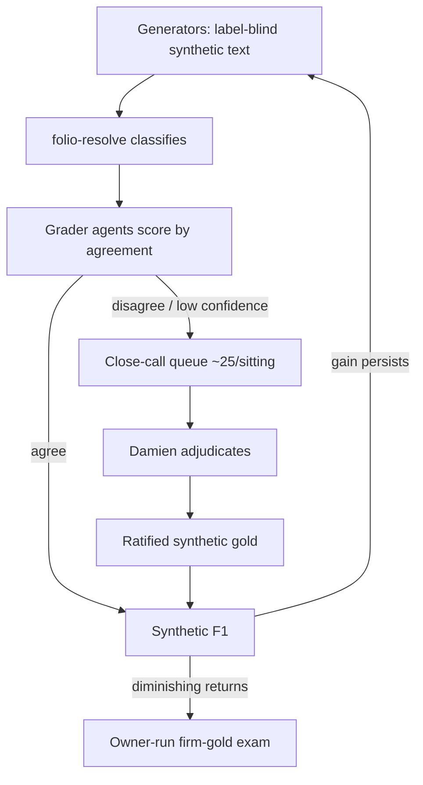

# Synthetic Benchmark F1 Campaign - Plan

## Goal Capsule

- Raise folio-resolve's measured F1 through two sequential stages: finish the Gate 1b gold adjudication and resume measured iterations against the firm gold, then stand up a public synthetic benchmark loop that agents can run end-to-end.
- Downstream adoption and per-consumer measurement (folio-enrich, folio-mapper, folio-insights) is not active scope; it is the round after this campaign converges.
- Product authority: this plan, plus the still-governing iteration protocol in `docs/plans/2026-07-27-001-feat-f1-improvement-loop-plan.md` for firm-gold scoring discipline.
- Open blockers: Gate 1b's adjudication sheet (`q1-sheet-v2-decisions` on cockpit ask `folio-resolve-2026-07-28-gold-audit-gate2`) is open on Damien; sittings begin as soon as the review workspace is reconciled (R1).

---

## Product Contract

### Summary

Finish the Gate 1b adjudication in ~25-row sittings and fold the results into the firm gold, then build a public, committable synthetic benchmark: Codex agents generate label-blind synthetic legal text, folio-resolve classifies it, grader agents score the classifications, and only genuine close calls reach Damien. Iterate against the synthetic F1 until returns diminish, with the firm-gold owner-run exam remaining the sole release gate. The same corpus then scores the unmodified downstream pipelines, and that head-to-head comparison — improve, never degrade — is the gate the deferred adoption round must pass through.

### Problem Frame

The v0.4.0 release proved the loop works — the recall engine measured tune F1 +0.0077 and Firm-2 F1 +0.0101 over the .2089/.1260 baselines with zero regressions — but the loop has two structural limits. First, the evaluation data is confidential law-firm material: agents can never read it, so every scored iteration routes through Damien, making him the loop's bottleneck. Second, absolute F1 is still low, and the attempt-0001 probe showed the residual misses are a ranking problem, not retrieval depth. Meanwhile the downstream consumers pin v0.4.0 but none constructs the recall engine, so nothing downstream improves until the library's F1 is worth adopting. The campaign needs an evaluation surface agents can run without Damien, and a disciplined path to a higher F1 before downstream adoption spends integration effort on it.

### Key Decisions

- KD1. **Sequence: Gate 1b and firm-gold iterations first, synthetic loop second, downstream adoption only after convergence.** (session-settled: user-directed — chosen over adopting downstream now: adoption should inherit a hardened F1, not the current one.) Governs R2, R3, R14.
- KD2. **The synthetic corpus is a public benchmark; the firm gold stays the private release exam.** (session-settled: user-directed — chosen over blending synthetic rows into the gold or tracking no synthetic metric: two numbers with clear roles, no leakage, agent-runnable.) Governs R7, R12, R13.
- KD3. **Adjudication reaches Damien in ~25-row sittings.** (session-settled: user-directed — chosen over 50–75 or 100+ batches: short phone-sized sittings, more round-trips accepted.) Governs R4, R10.
- KD4. **The synthetic generator is label-blind.** (session-settled: user-approved — chosen over letting generators see target concepts: a generator that writes toward known labels produces a benchmark that grades itself easy.) Governs R6.
- KD5. **Resolved close calls graduate into ratified synthetic gold.** (session-settled: user-approved — chosen over discarding adjudications after scoring: each sitting permanently hardens the benchmark.) Governs R11.
- KD6. **Agents pre-resolve aggressively; only badged judgment rows reach Damien.** (session-settled: user-approved — chosen over routing every ambiguous row to him: at 25 rows per sitting the queue must carry only high-information decisions.) Governs R4, R10.
- KD7. **Ranking, not retrieval, is the iteration lever.** Measured, not assumed: the label-limit probe showed more candidates slightly lower F1 while recall@10 rises — the misses live in ordering and calibration. Governs R5.
- KD8. **The synthetic corpus doubles as a cross-stack comparison baseline: the unmodified downstream pipelines are scored on the same corpus and gold before any adoption.** (session-settled: user-directed — chosen over comparing each stack's existing metrics: today's numbers come from different tasks and different gold, so only a shared benchmark makes folio-resolve and the downstream incumbents comparable; the working hypothesis that downstream may currently score higher is testable, not assumed away.) Governs R15, R16, R17.
- KD9. **folio-resolve's claimed incorporation of the downstream pipelines is audited, and missing parts are judged important only by measured F1 impact.** (session-settled: user-directed — chosen over trusting the extraction history: folio-resolve was built from the folio-enrich/folio-mapper pipelines in theory, but completeness was never validated in practice.) Governs R18, R19.

### Requirements

**Stage 1 — Gate 1b closeout and resumed iterations**

- R1. One canonical adjudication workspace serves the Gate 1b sheet: the tooling currently split across `feat/f1-eval-loop` and `feat/visual-eval-review` is reconciled onto a single branch before the first sitting.
- R2. The remaining Gate 1b backlog is queued into sittings, ordered by information value, with pre-checked rows auto-resolved per KD6.
- R3. Adjudication results fold into a new gold version, and measured iterations resume under the 2026-07-27 plan's protocol (attempt accounting, re-baseline rules) with the current attempt-budget state verified before the first scored run.
- R4. Each sitting presented to Damien contains roughly 25 rows and is completable on a phone.
- R5. Iteration work targets ranking and calibration per KD7; no further retrieval-widening attempts.

**Stage 2 — synthetic benchmark loop**

- R6. Generator agents produce realistic synthetic legal source text without access to the target concepts, labels, or gold mappings for the text they are writing.
- R7. The synthetic corpus, its gold, and its aggregate scores are committable and public; no firm surface string may enter any synthetic artifact.
- R8. folio-resolve classifies each synthetic input; grader agents score the classifications and reach a verdict by agreement, with disagreement or low confidence routing the row to the close-call queue.
- R9. The full generate → classify → grade → score cycle runs end-to-end by agents alone, with no owner step required for a synthetic iteration.
- R10. Close calls and judgment calls reach Damien in ~25-row sittings per KD3/KD6.
- R11. A row Damien resolves becomes ratified synthetic gold and is never re-graded by agents.
- R12. The loop iterates until diminishing returns; the default stop rule is two consecutive iterations with negligible synthetic-F1 gain and no novel disagreement classes, overridable by Damien.
- R13. No release or improvement claim rests on synthetic F1 alone: the owner-run firm-gold exam remains the release gate, and the frozen 79 stay unscored until the campaign's final report.

**Stage 2b — downstream comparison baseline**

- R15. The existing folio-enrich and folio-mapper pipelines, unmodified, run the synthetic corpus and receive per-repo precision, recall, and F1 on the shared gold.
- R16. folio-resolve and each downstream incumbent are compared on the same corpus and gold, reported per consumer.
- R17. The comparison is the adoption round's entry gate: adoption proceeds per consumer only where the folio-resolve-backed path measures at least as well as that consumer's incumbent — improve, never degrade; a losing comparison feeds the next iteration instead of the adoption round.
- R18. A component-parity audit maps each stage of the downstream matching pipelines (folio-enrich's annotation stages, folio-mapper's matching path) to its folio-resolve counterpart, marking each as ported, divergent, or absent — validating, not assuming, that the extraction was complete.
- R19. Whether an absent or divergent component matters is decided by measurement, not judgment: when an incumbent beats folio-resolve on the shared benchmark (R16), the gap is attributed to specific components from the R18 map, and those become the next iteration's port candidates.

**Continuity**

- R14. The deferred rounds are recorded as standing reminders in the cockpit work queue so they cannot be forgotten: downstream adoption + per-consumer P/R/F1 measurement (entered only through the R17 gate), and the ontokit integration decision.

### Actors

- A1. Damien — adjudicates close calls, runs the private firm-gold exam, owns stop/go on iterations.
- A2. Codex worker fleet — generates synthetic text, grades classifications, implements iteration changes; barred from firm rows (`eval/data/**`) per the standing fence, unrestricted on synthetic artifacts.
- A3. Orchestrator session — decomposes work, dispatches workers, verifies artifacts, assembles sittings, reports measurements.
- A4. folio-resolve — the system under test; classifies both firm-gold and synthetic inputs.

### Key Flows

- F1. Gate 1b sitting
  - **Trigger:** The reconciled workspace (R1) has unresolved sheet rows.
  - **Steps:** Agents assemble the next ~25-row batch by information value; pre-checked rows auto-resolve; Damien works the sitting; results fold into the live gold; the next batch queues.
  - **Outcome:** Gold advances a version; when the sheet empties, Stage 1 iterations resume.
  - **Covers:** R1, R2, R3, R4.
- F2. Synthetic iteration
  - **Trigger:** A candidate improvement to folio-resolve exists, or the benchmark needs its initial baseline.
  - **Steps:** Generators write label-blind synthetic text; folio-resolve classifies; graders score by agreement; agreed rows score immediately; disputed rows queue for Damien; his rulings graduate to ratified gold; synthetic F1 is computed and compared to the prior iteration.
  - **Outcome:** Continue, or stop on the R12 rule; a stopped loop hands a hardened F1 to the firm-gold exam and the R15–R17 downstream comparison, which together decide the adoption round.
  - **Covers:** R6–R13.

### Acceptance Examples

- AE1. **Covers R6.** Given a generation task for concepts in the Insurance branch, when the generator's prompt and context are inspected, then they contain no FOLIO labels, IRIs, or gold mappings for the rows being generated.
- AE2. **Covers R8, R10.** Given three graders score a classification 2-to-1 with the dissent above the confidence floor, when the batch closes, then the row enters the close-call queue rather than the scored aggregate.
- AE3. **Covers R11.** Given Damien ruled a queued row correct, when any later iteration re-runs grading, then that row's verdict comes from ratified gold and no grader re-scores it.
- AE4. **Covers R12.** Given two consecutive iterations each moved synthetic F1 by less than the agreed epsilon and surfaced no new disagreement class, when the next iteration is proposed, then the loop stops and the firm-gold exam is requested instead.
- AE5. **Covers R17.** Given the shared-benchmark comparison shows folio-resolve below folio-enrich's incumbent pipeline, when the adoption round is proposed, then adoption for folio-enrich holds, the gap is characterized, and it becomes the next iteration's target.

### Success Criteria

- The final owner-run firm-gold exam shows tune and Firm-2 F1 above the v0.4.0-accepted levels, with zero correct-to-incorrect regressions on Firm-2.
- A synthetic iteration completes end-to-end by agents alone, and its corpus, gold, and scores are committed publicly with the surface-string check passing.
- A published per-consumer comparison on the shared benchmark gives each downstream repo a go/no-go adoption verdict per R17.
- Damien's total adjudication load stays in ~25-row sittings; no sitting requires a desktop.

### Scope Boundaries

**Deferred for later — standing reminders, per R14**

- Downstream adoption + measurement: wire the recall engine into folio-enrich and folio-mapper behind opt-in flags, and measure per-consumer P/R/F1. Gated on this campaign's converged F1 and a passing R17 comparison per consumer.
- Ontokit integration: ontokit-api/web consume folio-python only today; whether they should consume folio-resolve is a separate future decision, not an assumption.

**Outside this campaign**

- Scoring the frozen 79 before the final report (per R13).
- Retrieval-depth iterations (measured dead end, KD7).
- Blending synthetic rows into the firm tune set (KD2).

### Dependencies / Assumptions

- The confidentiality fence stands: firm rows (`eval/data/**`) reach only Anthropic-surface contexts; Codex may touch `eval/` harness code that reads no firm rows (Damien's 2026-08-05 ruling). Synthetic artifacts are designed to be outside the fence entirely.
- `eval/folio_eval/clusters.py`'s surface-string check is the committability choke point for anything the synthetic loop writes.
- The attempt-budget state under the 2026-07-27 plan's check-in rules is unverified and must be checked before the first scored Stage 1 run (R3).
- Assumed: synthetic-F1 movement correlates with firm-F1 movement well enough to steer iterations; the firm exam at stage boundaries is the check on this assumption.
- Assumed but unvalidated: folio-resolve incorporates the downstream matching pipelines it was extracted from. The migration was staged (folio-enrich retired only its search path to folio-resolve; its remaining annotation stages live in-repo), so R18 tests this rather than trusting it.

### Outstanding Questions

**Deferred to Planning**

- Grader design: ensemble size, agreement threshold, confidence floor, and which models grade.
- Corpus composition: document types, branch coverage, size per iteration, and whether generation reuses folio-enrich's existing synthetic-document machinery.
- The R12 epsilon value and how disagreement classes are detected as novel.
- Score alignment across stacks for R15/R16: the level at which one gold scores both folio-resolve and the downstream pipelines (document-level concept sets vs span-level annotations), and whether folio-insights joins the comparison.
- Where the benchmark lives in this repo and how its runner integrates with `eval/folio_eval/`.
- Sitting delivery surface: how batches render for phone adjudication (the reconciled workspace, cockpit sheets, or both).

<!-- ce-section: work-relationships -->
### How This Work Fits Together

This plan owns the F1 campaign inside folio-resolve. The surrounding rounds are the current understanding, not a committed roadmap:

- Downstream adoption + measurement round — **depends on** this campaign's converged F1 and **enters only through** the R17 comparison gate; adopts the recall engine in consumers and measures per-consumer P/R/F1. Reminder held per R14.
- Ontokit integration decision — **can proceed independently**; **still to decide** whether ontokit consumes folio-resolve at all. Reminder held per R14.
- Gate 1b adjudication — owned here as Stage 1; its governing scoring protocol remains `docs/plans/2026-07-27-001-feat-f1-improvement-loop-plan.md`.
- The completed post-hardening round — `docs/plans/2026-08-06-post-hardening-integration-plan.md` shipped v0.4.0 and the consumer pins this campaign builds on.

### Sources / Research

- `docs/plans/2026-07-27-001-feat-f1-improvement-loop-plan.md` — governing iteration protocol, attempt accounting, gold model.
- `docs/handoffs/2026-08-06-f1-eval-loop-codex-transition.md` — the attempt-0001 no-op, the retrieval-vs-ranking probe evidence behind KD7, and the Codex fence.
- `docs/handoffs/2026-08-09-v0.4.0-post-release.md` — accepted v0.4.0 measurement, consumer pin state, Gate 1b residual.
- `docs/handoffs/2026-07-28-f1-loop-gate1b-handoff.md` — runner mechanics, audit-packet flags, privacy rules.
- `eval/folio_eval/downstream.py` — the existing consumer snapshot/diff harness the adoption round will extend.
