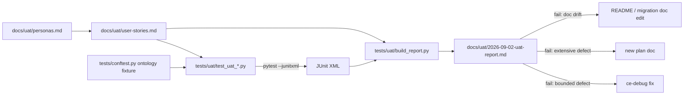

# Persona-Driven User Acceptance Testing - Plan

## Goal Capsule

- **Objective:** Every kind of person who depends on folio-resolve can see, from one committed
  report, that the library does what its README and consumer migrations promise for their use, and
  every promise that fails is either fixed or has a named repair plan.
- **Means:** Define the library's personas, write user stories for how each one uses it, encode
  each story as an executable acceptance test against the public API, run the suite, and publish
  the verdicts.
- **Product authority:** This plan owns the personas, the stories, the acceptance suite, and the
  results report. The Synthetic Benchmark F1 Campaign (`docs/plans/2026-08-16-001-feat-synthetic-benchmark-f1-campaign-plan.md`)
  keeps authority over scoring quality, F1 targets, and the adoption verdict; this plan never
  measures F1.
- **Open blockers:** None. The owner chose the deliverable form on 2026-09-02: a committed UAT
  suite plus a report.

## Product Contract

### Summary

Add a persona catalog, a user-story catalog, and a runnable acceptance suite that checks each
story against folio-resolve's public API and documented promises, then publish a results report
that routes every failure to a fix or a plan.

### Problem Frame

folio-resolve is a library with no UI, so "users" are the developers of four migrated consumer
repos, the operators who run the public synthetic evaluation lane, and the maintainers who release
it. The README makes precise promises to those people: exact example scores, decomposition
outputs, a homonym guard, place-name demotion, a rejected `law`→Delaware mapping, byte-identical
determinism, and offline installability with no optional extras. The existing unit suite verifies
modules in isolation; nothing verifies the promises the way a consumer experiences them, in the
order a consumer calls them, from the README's own examples. A month of eval-campaign work also
changed ranking code, and no acceptance layer says whether consumer-visible behavior still matches
the documentation.

### Key Decisions

- **Personas are derived from documented consumers and operator roles, not invented end users.**
  The README, `docs/migration/SCHEDULE.md`, and `eval/README.md` name every consumer and role.
  Governs R1.
- **Acceptance tests run offline against in-memory ontologies by default.** The unit suite already
  proves the library needs no optional extras; the acceptance suite keeps that property so any
  consumer can run it. Real-ontology scenarios are additive and skip cleanly. Governs R5, R6.
- **The suite ships in the repository with the report** (session-settled: user-directed — chosen
  over a report-only artifact: the owner wants the acceptance layer to persist and rerun). Governs
  R4, R8.
- **A failing story is a defect until classified.** Each failure is classified as a library
  defect, a documentation drift, or a test defect, and only the first two route to repair work.
  Governs R9, R10.
- **Owner-only lanes are out of scope.** Firm gold, the owner salt, consumer virtualenv
  comparisons, and LLM provider keys stay untouched; the operator persona is tested on the public
  synthetic lane with test-local inputs. Governs R7 and Scope Boundaries.

### Requirements

**Personas and stories**

- R1. A committed persona catalog names each persona, the consumer or role it stands for, its
  goal, and the public entry points it relies on, covering at least: pipeline integrator,
  scoring-only integrator, reconciliation integrator, annotation-app developer, LLM-judge
  integrator, ontology and spec maintainer, public synthetic-eval operator, and release
  maintainer.
- R2. A committed user-story catalog gives every story a stable ID, its persona, a one-sentence
  story in the "as a / I want / so that" form, and acceptance criteria that name observable
  outputs.
- R3. Every documented README promise with a concrete example is covered by at least one story,
  including the exact-score example, the decomposition examples, the shared-tail over-fire, the
  Action versus Auction guard, the place-name demotions, the rejected `law`→Delaware mapping, the
  quick-start example, the specificity-penalty example, and the determinism guarantee.

**Acceptance suite**

- R4. A runnable acceptance suite lives under the repository's test tree, with one or more tests
  per story, and each test names the story ID it covers.
- R5. The suite passes with the core install and no optional extras, using in-memory ontology
  fixtures.
- R6. Scenarios that need the `folio`, `spacy`, or `embedding` extras skip with a reason when the
  extra is absent and run when it is present.
- R7. Operator stories exercise the public synthetic lane end to end on a small test-local corpus,
  manifest, and salt, and never read protected data, the owner salt, or committed checkpoints.

**Report and routing**

- R8. A committed results report lists every story with its verdict, the commit and environment
  it ran against, and the command to rerun it.
- R9. Every failing story carries a classification of library defect, documentation drift, or
  test defect, and a link to the repair that resolves it.
- R10. A library defect that is bounded is fixed through a diagnosis loop within this work; a
  defect whose repair spans more than one module or changes documented behavior gets its own plan
  document rather than an inline fix.
- R11. Documentation drift is repaired in the README or migration docs in the same change that
  records it, so the report never cites a promise the docs no longer make.

### Actors

- A1. **Pipeline integrator (PI)** — builds a document or intake pipeline on `MatchPipeline`,
  `LabelResolver`, `SourceClassifier`, and `DomainPrior`, as folio-insights and alea-intake do.
- A2. **Scoring-only integrator (SI)** — imports the scorer and search-term helpers into an existing
  engine, as folio-mapper does.
- A3. **Reconciliation integrator (RI)** — combines the entity ruler, blocklist, gates, resolver, and
  reconciler around its own candidates, as folio-enrich does.
- A4. **Annotation-app developer (AA)** — builds review and feedback UI on the `annotate` package.
- A5. **LLM-judge integrator (LJ)** — supplies a model call behind the `Judge` protocol and relies on
  prompt builders and verdict enforcement.
- A6. **Ontology and spec maintainer (OM)** — curates the in-memory ontology, specs, lemma caches, and
  score calibration.
- A7. **Public synthetic-eval operator (EO)** — runs the offline synthetic scoring lane, leak check,
  and experiment protocol on public inputs.
- A8. **Release maintainer (RM)** — installs from the built wheel, verifies determinism, and confirms
  the version and extras.

### Key Flows

- F1. **Story-to-test authoring.** **Trigger:** a story exists in the catalog. The author reads
  its acceptance criteria, writes a test that names the story ID, runs it offline, and records the
  story as covered. **Covers R2, R4, R5.**
- F2. **Acceptance run and report.** **Trigger:** the suite is complete. The operator runs the
  suite with the core install, then again with extras present, and writes the report with
  per-story verdicts, commit, environment, and rerun command. **Covers R6, R8.**
- F3. **Failure routing.** **Trigger:** a story fails. The failure is classified; a bounded
  library defect enters a diagnosis loop and is fixed; an extensive defect gets a plan document;
  documentation drift is corrected in the docs; a test defect is fixed in the test. The report is
  updated with the link. **Covers R9, R10, R11.**

### Acceptance Examples

- AE1. **Given** the core install with no extras, **when** the acceptance suite runs, **then**
  every non-extra story passes or is reported as failing, and no test errors on a missing import.
  **Covers R5, R6.**
- AE2. **Given** the README exact-score example, **when** the story's test scores
  `arbitration rules` and `rules of arbitration` against *Arbitration Rules*, **then** the results
  are 99.0 and 88.0 respectively and both rank that concept first. **Covers R3.**
- AE3. **Given** a story that fails because the README's stated output no longer matches the
  library, **when** the failure is classified, **then** the report records documentation drift and
  the same change updates the README. **Covers R9, R11.**
- AE4. **Given** an operator story, **when** its test runs the synthetic lane, **then** it uses a
  corpus, manifest, and salt created inside the test and never opens `eval/data/` or a committed
  report. **Covers R7.**
- AE5. **Given** a failing story whose repair touches ranking semantics across the pipeline and
  the eval adapters, **when** it is routed, **then** a plan document is created and the report
  links to it instead of an inline fix. **Covers R10.**

### Success Criteria

- Every persona has at least three stories, and every story has at least one passing or
  classified-failing test.
- The report can be regenerated by rerunning the suite at the recorded commit.
- No failure is left unclassified, and no classified defect is left without a fix or a plan link.

### Scope Boundaries

- No new library capabilities; the suite tests what exists and what the docs promise.
- No F1, recall, or precision measurement; the campaign plan owns quality metrics.
- No owner-only lanes: firm gold, the owner salt, consumer comparison runs, LLM provider keys,
  and protected checkpoints are untouched.
- No release, tag, or consumer pin change; a passing suite does not by itself trigger a release.
- No UI; there is nothing to screenshot.

### Dependencies / Assumptions

- The unit suite's in-memory ontology fixture already seeds the README trap concepts and can be
  reused or extended by the acceptance suite.
- The public synthetic lane's test helpers already build small corpora, manifests, and salts
  in-test; the operator stories build on those helpers rather than committed artifacts.
- U9 attempt-0001 is running on a separate branch; acceptance tests target `main` and are
  rerun after any U9 merge that changes ranking order.

### Sources / Research

- `README.md` — the documented promises and quick-start example.
- `src/folio_resolve/__init__.py` — the public re-export surface.
- `tests/conftest.py` — the in-memory ontology fixture seeded with the README trap concepts.
- `tests/test_determinism.py` — the subprocess hash-seed determinism harness to mirror.
- `docs/migration/SCHEDULE.md` and `docs/migration/2026-08-05-v0.3.1-consumer-impact.md` — which
  consumer calls which entry points.
- `eval/README.md` and `eval/synthetic/README.md` — the operator surface and the public synthetic
  lane inputs.
- `eval/folio_eval/downstream.py` — `parse_junitxml`, the existing stdlib JUnit parser the report
  generator reuses.

---

## Planning Contract

### Key Technical Decisions

- KTD1. **The acceptance suite is a pytest package at `tests/uat/`, discovered by the existing
  `testpaths`, and every test carries the `uat` marker.** One command runs the whole suite and the
  unit suite keeps running it by default, so drift is caught on every push. Cites R4, R5.
- KTD2. **Catalogs and the report live under `docs/uat/`: `personas.md`, `user-stories.md`, and
  `2026-09-02-uat-report.md`.** Story IDs take the form `US-<persona code>-<nn>` (for example
  `US-PI-03`), and the persona code is the actor's two-letter code from the Actors section
  (PI, SI, RI, AA, LJ, OM, EO, RM). Cites R1, R2, R8.
- KTD3. **Real-ontology scenarios run only when the `folio` extra imports and the environment sets
  `FOLIO_RESOLVE_UAT_REAL_ONTOLOGY=1`; otherwise they skip with that reason.** The opt-in keeps CI
  offline while letting a maintainer with folio-python's own cache run them. The suite never reads
  a hard-coded cache path. Cites R6.
- KTD4. **Operator stories build their corpus, manifest, public metadata, and salt inside the
  test under `tmp_path`, mirroring the helpers in `tests/test_eval_synthetic_score.py`.** The
  suite never opens `eval/data/`, committed reports, or committed checkpoints. Cites R7.
- KTD5. **README promises are pinned to their documented literal values.** A test that fails
  against the README's exact number or list is classified by comparing with the unit suite's
  expectation for the same call: if the unit suite agrees with the library, the failure is
  documentation drift; if it agrees with the README, it is a library defect. Cites R3, R9.
- KTD6. **The report is generated, not hand-written.** `tests/uat/build_report.py` reads a JUnit
  XML from a `pytest tests/uat --junitxml` run plus `docs/uat/user-stories.md`, and emits the
  per-story verdict table, commit, Python version, extras present, and rerun commands. Story IDs
  are recovered from the JUnit `name` attribute (the `test_us_<code>_<nn>_` prefix), and
  `tests/uat/conftest.py` also stamps `record_property("story_id", ...)` parsed from the test
  name so the XML carries the ID as a testcase property that `build_report.py` reads first.
  Cites R8.
- KTD7. **Optional-dependency isolation is proven in a subprocess.** The core-install story
  installs a meta-path finder that raises on `spacy`, `faiss`, `sentence_transformers`, `numpy`,
  and `folio` imports, then imports the public surface and runs the quick-start example. This
  proves R5 without building a second virtualenv; the isolated core gate in the Verification
  Contract has only the `dev` extra present. Cites R5.
- KTD8. **Failure routing is a human-in-the-loop step performed by the orchestrating session,
  not by the suite.** The report records classification and links; the suite only reports
  pass, fail, skip, or classified-fail. A story whose failure is classified as an extensive
  defect and routed to a plan document is marked `xfail(strict=True)` with the reason
  `<classification>: <plan path>` in the same change that records the classification;
  `build_report.py` reports it as `fail (classified)` and takes the link from the reason, and
  an unexpected pass fails the suite so the marker is removed when the plan lands. Cites R9,
  R10, R11.

### High-Level Technical Design

### Assumptions and Risks

- The README examples were written against the fixture concepts in `tests/conftest.py`; if an
  example needs a concept the fixture lacks, the UAT conftest adds it rather than editing the
  shared fixture.
- The U9 branch changes ranking tie order in `src/folio_resolve/pipeline.py`. Suite tests that
  assert an ordering among equal scores may need re-running after that merge; the report records
  the commit it ran against so the rerun is explicit.
- KTD3's opt-in assumes folio-python already has a local ontology cache; a maintainer sets the
  variable only on a machine where that cache exists, so the suite never triggers a download.
- Exact-score assertions are brittle by design; that brittleness is the point of an acceptance
  layer, and KTD5 owns how a mismatch is classified.

### Sequencing

U1 and U2 first, in one dispatch. U3, U4, and U5 then run in parallel; each depends only on the
story IDs from U1 and the harness from U2. U6 runs last and consumes everything.

---

## Implementation Units

### U1. Persona and user-story catalogs

- **Goal:** Commit the persona catalog and the user-story catalog that every test cites.
- **Requirements:** R1, R2, R3, A1–A8.
- **Dependencies:** None.
- **Files:** `docs/uat/personas.md` (new), `docs/uat/user-stories.md` (new).
- **Approach:**
  1. Write one persona section per actor A1–A8 with its code (KTD2), the consumer or role it
     stands for, its goal, and the public entry points it relies on, sourced from `README.md`,
     `docs/migration/SCHEDULE.md`, and `eval/README.md`.
  2. Write at least three stories per persona in "as a / I want / so that" form with acceptance
     criteria naming observable outputs.
  3. Cover every README promise listed in R3 with at least one story, and mark which story owns
     each promise in a short coverage table at the end of `user-stories.md`.
  4. Keep both files free of protected data; use only the README's synthetic examples.
- **Patterns to follow:** the persona framing in `README.md` ("Personas"), the actor
  list in this plan.
- **Test scenarios:** Test expectation: none -- documentation unit; correctness is the coverage
  table's mapping of R3 promises to story IDs.
- **Verification:** Every promise in R3 appears in the coverage table with a story ID; every
  persona has at least three stories; story IDs are unique and follow KTD2.

### U2. Acceptance harness and report generator

- **Goal:** Provide the shared fixtures, markers, extras detection, and the report generator.
- **Requirements:** R4, R5, R6, R8 (KTD1, KTD3, KTD6, KTD7).
- **Dependencies:** None.
- **Files:** `tests/uat/__init__.py` (new, empty), `tests/uat/conftest.py` (new),
  `tests/uat/build_report.py` (new), `tests/uat/test_uat_harness.py` (new),
  `pyproject.toml` (register the `uat` marker).
- **Approach:**
  1. Register the `uat` marker and apply it to everything under `tests/uat/` via a conftest hook.
  2. Add a `readme_ontology` fixture that extends the shared `ontology` fixture with any concept
     the README examples need (for example *Delaware*, *Antitrust Law*, *Securities Law*,
     *Breach of Warranty of Habitability*) without editing `tests/conftest.py`.
  3. Add `extras_present` detection and a `real_ontology` fixture that skips per KTD3.
  4. Add a `blocked_optional_imports` helper that runs a snippet in a subprocess under a
     meta-path finder per KTD7 and returns the result.
  5. Implement `build_report.py` per KTD6 with a `main()` that takes the JUnit path, story
     catalog path, and output path, and prints the markdown it wrote. Parse the JUnit XML with
     `parse_junitxml` from `eval/folio_eval/downstream.py` (importable because pytest's
     `pythonpath` already includes `eval/`) rather than writing a second parser.
- **Patterns to follow:** `tests/test_determinism.py` for subprocess execution under
  `PYTHONHASHSEED`; `tests/conftest.py` fixture style; `eval/folio_eval/downstream.py`
  `parse_junitxml` for JUnit handling.
- **Test scenarios:**
  - The `uat` marker is applied to a sample test under `tests/uat/` and `pytest -m uat` selects it.
  - `real_ontology` skips with the KTD3 reason when the environment variable is unset.
  - `blocked_optional_imports` raises `ImportError` for `spacy` inside the subprocess and still
    imports `folio_resolve`.
  - `build_report.py` turns a hand-made JUnit XML with one pass, one fail, one skip into a table
    with the right verdict per story ID and lists an unmapped test under "unmapped".
- **Verification:** The harness tests pass with the core install; `build_report.py` runs without
  optional dependencies.

### U3. Integrator persona stories

- **Goal:** Encode the pipeline, scoring-only, and reconciliation integrator stories as tests.
- **Requirements:** R3, R4, R5 (A1, A2, A3; KTD5).
- **Dependencies:** U1, U2.
- **Files:** `tests/uat/test_uat_pipeline_integrator.py` (new),
  `tests/uat/test_uat_scoring_integrator.py` (new),
  `tests/uat/test_uat_reconciliation_integrator.py` (new).
- **Approach:**
  1. One test function per story, named `test_<story id lowercased with underscores>_<slug>` with
     the story ID repeated in the docstring.
  2. Pipeline stories run the README quick-start verbatim, thread a `DomainPrior`, classify a
     front-matter source, and resolve a conjoined heading through `LabelResolver`.
  3. Scoring stories pin the 99.0 and 88.0 example, the specificity-penalty example, and
     `generate_search_terms` expansions the way folio-mapper consumes them.
  4. Reconciliation stories run the entity ruler over a passage, apply the blocklist to
     Action versus Auction, demote Slovenia and Northern Mariana Islands with the gates, reject
     `law`→Delaware in the resolver, and merge ruler plus LLM candidates with provenance.
- **Patterns to follow:** existing assertions in `tests/test_pipeline.py`, `tests/test_scoring.py`,
  `tests/test_resolve.py`, `tests/test_reconciler.py` for call shapes; do not copy their tests.
- **Test scenarios:**
  - Covers AE2. `arbitration rules` scores 99.0 and `rules of arbitration` scores 88.0 against
    *Arbitration Rules*, and both rank it first through the pipeline.
  - `Proposed Findings of Fact and Conclusions of Law` decomposes to the README's three strings.
  - `Findings of Fact and Conclusions of Law` emits `Findings of Fact Law` alongside
    `Conclusions of Law`, and the pipeline returns no tag for the noise string.
  - `Action` never resolves to *Auction* with the seed blocklist loaded.
  - `Slovenian law` yields *Slovenia* demoted through the default pipeline (`gated` true and
    `gate_reason` naming the place-name demotion), while the exact query `Slovenia` matches
    *Slovenia* ungated with reason `exact-place-name`; `Presumptions` does not reach
    *Northern Mariana Islands* at 90.
  - `law` does not resolve to *Delaware* through `LabelResolver`.
  - A copyright-page source is classified as metadata and excluded.
  - `Habitability` scores 67.5 against *Breach of Warranty of Habitability* at full specificity
    penalty.
- **Verification:** All A1–A3 stories have a test; the file set passes or each failure is
  reproducible with the recorded input.

### U4. Application, judge, and maintainer persona stories

- **Goal:** Encode the annotation-app, LLM-judge, and ontology-maintainer stories as tests.
- **Requirements:** R3, R4, R5, R6 (A4, A5, A6; KTD3).
- **Dependencies:** U1, U2.
- **Files:** `tests/uat/test_uat_annotation_app.py` (new), `tests/uat/test_uat_llm_judge.py`
  (new), `tests/uat/test_uat_ontology_maintainer.py` (new).
- **Approach:**
  1. Annotation stories create an annotation with tags, record per-tag verdicts, reject and
     restore a tag, persist through `FeedbackStore`, and render segments plus an insights summary.
  2. Judge stories implement a fake `Judge` returning fenced JSON, build the judge and rerank
     prompts (`build_contextual_rerank_prompt` lives in `folio_resolve.judge`, not the package
     root), parse the response, enforce the verdict, and run the pipeline with the judge stage
     on.
  3. Maintainer stories build an `InMemoryOntology` from a spec, fit a `ScoreCalibration` from
     labeled samples and read a probability and band, run `augment_labels` with
     `on_missing_spacy="skip"` and with a cached lemma JSON, and run the same against the real
     ontology behind the KTD3 gate.
- **Patterns to follow:** `tests/test_annotate.py`, `tests/test_feedback_store.py`,
  `tests/test_judge.py`, `tests/test_lemma.py`, `tests/test_calibration.py`, `tests/test_spec.py`.
- **Test scenarios:**
  - Reject then restore returns the tag to its prior verdict and the store shows both events.
  - A judge response wrapped in markdown fences parses and a `rejected` verdict clamps the
    candidate's score to 0.0 through `enforce_verdict`.
  - `augment_labels` with `on_missing_spacy="skip"` returns the labels unchanged and no error.
  - Calibration probability is monotone across three increasing scores.
  - Real-ontology story skips with the KTD3 reason in the default environment.
- **Verification:** All A4–A6 stories have a test; skips carry the KTD3 reason text.

### U5. Operator and release-maintainer persona stories

- **Goal:** Encode the public synthetic-eval operator and release-maintainer stories as tests.
- **Requirements:** R3, R4, R5, R6, R7 (A7, A8; KTD3, KTD4, KTD7).
- **Dependencies:** U1, U2.
- **Files:** `tests/uat/test_uat_synthetic_operator.py` (new),
  `tests/uat/test_uat_release_maintainer.py` (new).
- **Approach:**
  1. Operator stories build a three-item corpus, its manifest, a leak manifest, a public-metadata
     file, and a salt under `tmp_path`, run the synthetic scorer in-process through
     `score_corpus_checkpointed` with the in-memory ontology as two shards plus finalize-only and
     compare bytes; run the leak checker over the report; and start and finish a synthetic
     experiment record with an explicit decision, passing the experiments log, pending path, and
     live-suspects path explicitly under `tmp_path` because their defaults live under
     `eval/reports/` and `eval/data/reports/`.
  1b. The `eval/run_synthetic.py` CLI story is a real-ontology story behind KTD3: it skips with
     the KTD3 reason in the core run and, when enabled, runs one shard end to end. It does not
     count toward R5.
  2. Release stories read the installed version and extras from package metadata, run the
     KTD7 blocked-imports subprocess over the public surface, and rerun the determinism probe
     under two hash seeds.
- **Patterns to follow:** `tests/test_eval_synthetic_score.py` helpers `_ontology`, `_corpus`,
  `_public_metadata`; `tests/test_eval_synthetic_checkpoint.py` for shard and finalize flows;
  `tests/test_eval_experiment.py` for the synthetic slice; `tests/test_determinism.py`.
- **Test scenarios:**
  - Covers AE4. The operator test never opens a path outside `tmp_path` and the repository's
    `eval/synthetic/` schema files; assert with the path audit.
  - Two in-process shards plus finalize-only produce a report byte-identical to a single-process
    run.
  - The CLI story skips with the KTD3 reason when the extra or the environment variable is absent.
  - A report containing a manifest surface fails the leak check with a nonzero collision count.
  - Covers AE1. The blocked-imports subprocess imports `folio_resolve` and runs the quick-start
    without optional extras.
  - Determinism probe output is identical under `PYTHONHASHSEED=0` and `PYTHONHASHSEED=1`.
- **Verification:** All A7–A8 stories have a test; the operator stories' path audit (monkeypatched
  `builtins.open` and `pathlib.Path.open` recording every opened path) shows each path resolves
  under `tmp_path` or `eval/synthetic/`.

### U6. Run, report, and route

- **Goal:** Produce the committed results report and route every failure.
- **Requirements:** R8, R9, R10, R11 (KTD6, KTD8).
- **Dependencies:** U1–U5.
- **Files:** `docs/uat/2026-09-02-uat-report.md` (new), `docs/uat/user-stories.md` (link column),
  `README.md` (only if drift is found).
- **Approach:**
  1. Run `tests/uat` with the core install and once more with extras present, each with
     `--junitxml`, and generate the report per KTD6 from the extras run, noting the core-run
     result in a second column.
  2. Classify each failure per KTD5 and KTD8; fix bounded library defects through a diagnosis
     loop; open a plan document for extensive defects; fix documentation drift in the same change.
  3. Re-run and regenerate the report after fixes. The recorded commit is the code commit the
     suite ran against (HEAD at generation time); the report and any documentation-drift edits
     land in one follow-up report-only commit.
- **Test scenarios:** Test expectation: none -- reporting unit; the report generator is tested
  in U2.
- **Verification:** The report lists every story with a verdict; no failure is unclassified;
  every classified defect links to a fix commit, a plan document, or a doc change.

---

## Verification Contract

| Gate | Command / check | Done signal |
|---|---|---|
| Full suite | `uv run pytest` | exit zero, count includes `tests/uat` |
| UAT only, core | `uv run --isolated --extra dev pytest tests/uat -m uat --junitxml=...` (only the `dev` extra present; the KTD7 subprocess is the in-suite proof) | exit zero or every failure classified in the report |
| UAT only, extras | `uv run --extra folio --extra spacy pytest tests/uat -m uat --junitxml=...` | exit zero or every failure classified |
| Types and lint | `uv run mypy src && uv run mypy eval && uv run ruff check` | exit zero; `tests/uat` passes Ruff |
| Determinism | `tests/test_determinism.py` plus the A8 story | identical output across seeds |
| Leak hygiene | `git diff --check`; no file under `docs/uat/` or `tests/uat/` names a path beneath `eval/data/` (the directory followed by a file or subdirectory name) or a salt filename; the bare directory string appears only in `tests/uat/conftest.py` as a `PROTECTED_ROOTS` constant that the audit test and story text reference | clean |
| Report freshness | check out the recorded code commit, run the suite and `build_report.py`, and diff against the report file from the follow-up commit | byte-identical apart from the timestamp line |

---

## Definition of Done

- `docs/uat/personas.md` and `docs/uat/user-stories.md` are committed with eight personas, at
  least three stories each, and a coverage table mapping every R3 promise to a story.
- `tests/uat/` runs inside `uv run pytest`, every story has at least one test naming its ID, and
  the core-install run has no import errors.
- `docs/uat/2026-09-02-uat-report.md` is committed, generated by `build_report.py`, and records
  commit, environment, extras, and rerun commands.
- Every failing story is classified and linked to a fix commit, a plan document, or a doc change,
  and the report was regenerated after the last fix.
- No experimental or abandoned test code remains; Ruff, mypy, and the full suite pass on the
  final commit.
