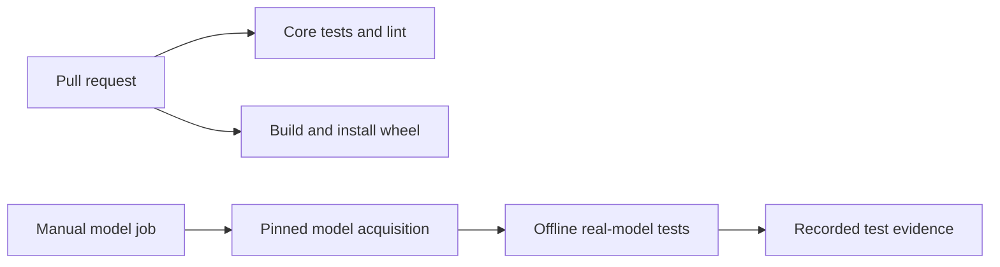

# Strengthen CI and embedding reliability

> **Historical draft (committed 2026-09-30).** U1–U4 were implemented after this draft was written: PR #48 (`6de6179`, CI), PR #50 (`44d340b`, embedding index validation), PR #51 (`74527f7`, offline pinned-model test), and PR #52 (`faa87a4`, public embedding recall baseline). The "implementation has not started" wording below describes the state at drafting time.

## Summary

Add pull-request verification, enforce embedding-provider contracts, and exercise the real optional model. Then measure semantic recall and runtime before investing in another model or index backend. This is a proposal for review; implementation has not started.

## Goal Capsule

Make library regressions visible before release and establish evidence for embedding improvements. Deliver four bounded units in order, with a review checkpoint before the measurement unit. Preserve the dependency-light core and existing matching defaults.

## Product Contract

### Problem frame

At main commit `799a26d`, the only workflow is `.github/workflows/publish.yml`; it builds and publishes distributions but does not run tests. Recent PRs #46 and #47 exposed environment-dependent failures that mocked loaders missed. The recorded core baseline is **1298 passed, 4 skipped**; that is historical evidence, not a new run during planning.

`BruteForceIndex.build` validates parallel inputs but assigns identifiers before calling the provider and never validates returned vector count, dimension, or finite values. By inspection, provider failure can leave new identifiers paired with old vectors. Existing embedding tests cover input lengths and the hashing provider, but do not cover these provider-output failures. These are hypotheses to prove with failing tests before production edits.

`LocalEmbeddingProvider` wraps sentence-transformers, yet its tests cover deferred import and unknown dimension only. The no-shared-token test reaches the answer through a shared word in a definition using hashing; it does not demonstrate learned semantic recall. The July plan proposed FAISS and caching, while the current implementation remains pure Python. That is an opportunity to measure, not evidence that a new backend is necessary.

### Requirements

- **R1.** Every pull request receives automated core test, lint, and package-install results without local gold data or optional model downloads.
- **R2.** Invalid embedding output fails at the boundary with a useful error; a failed rebuild preserves the previous usable index.
- **R3.** The optional local model is exercised end to end in a separate explicit job, and its presence cannot invalidate the lazy-import test.
- **R4.** A reproducible, public-fixture report compares semantic retrieval quality and runtime with embeddings disabled, hashing enabled, and the existing local model enabled.
- **R5.** Existing matching defaults, strict firm-gold freshness checks, and U10 comparison v2 artifacts remain unchanged.

### Success criteria

Core checks run on a clean checkout. Malformed-provider regressions demonstrably fail before the fix and pass after it. Real-model tests actually execute in their designated job. The measurement report records provenance and tradeoffs without claiming a model improvement from a smoke test.

## Scope Boundaries

Active proposal: U1–U3 for reliability, followed by U4 after review of its small public fixture set. No private gold, model tuning, campaign reruns, stop-rule changes, default-provider changes, or automatic release is included. U10 comparison v2 leak triage remains owner-reserved.

### Deferred to Follow-Up Work

FAISS, persistent vector caches, model replacement, dependency pruning, similarity batching optimization, and default score/threshold changes require U4 evidence and a separate plan. Repository-wide cleanup unrelated to these units is excluded.

## Planning Contract

### Key technical decisions

- **KTD1. Separate fast core and optional model jobs.** Start the core matrix with Python 3.11 and 3.12 on Linux; this is bounded initial coverage, not a claim that other Python versions are unsupported. Use the existing uv workflow convention. Real-model tests run on manual dispatch initially, with a recorded successful run required to complete U3. Workflow permissions are read-only, with no publishing credentials. GitHub's [Python CI documentation](https://docs.github.com/en/actions/tutorials/build-and-test-code/python) supports matrix testing and retained pytest results.
- **KTD2. Validate before replacing index state.** Build new vectors into temporary local state, check vector count, positive declared dimension, per-vector width, and finite numeric values, then replace the index state together. Preserve zero-vector cosine behavior. Apply equivalent dimensional/finite checks to query and pair-scoring inputs. Do not change provider protocol signatures or scoring formulas.
- **KTD3. Keep model tests reproducible and isolated.** Use the existing model family with a pinned downloadable model snapshot and record its revision and package versions. Prefer passing a local snapshot path through the existing constructor over adding a new public API. Separate model acquisition from offline test execution. Core tests do not depend on model availability.
- **KTD4. Measure before optimizing.** U4 produces a diagnostic report, not a campaign adoption verdict. Freeze public fixtures before comparing variants. Report recall at 1 and 5, wrong-candidate behavior on negative controls, build time, warm-query p50/p95, and peak memory with machine/model/ontology provenance. Do not set adoption thresholds from the observed winning result.

### Assumptions and risks

The first priority is repeatable verification, followed by embedding correctness, then measured quality. The full lint/type-check baseline and optional dependency compatibility have not been rerun during planning. Inventory failures during U1; fix only narrow relevant issues and surface any broad cleanup separately. Do not hide failures with blanket exclusions. Mypy adoption across the whole repo is deferred unless its current configured scope already passes.

A model download can fail independently of the library. The optional job must distinguish acquisition failure from inference/test failure, and a missing model must not produce a false passing result. Pinning the snapshot is an implementation prerequisite, not a selected revision in this document.

### Delivery strategy

After approval, branch from current main. Land U1 independently; keep U2 and U3 in focused changes. Review the U4 fixture cases before collecting comparative evidence. Follow the repository's recorded Codex review gate for each code PR. Do not include existing untracked instruction or handoff files.

## High-Level Technical Design

For index rebuilds: prepare inputs and vectors, validate the complete result, then replace live state. Any preparation or validation failure leaves live state untouched.

## Implementation Units

### U1. Add pull-request and package verification

**Requirements:** R1, R5. **Dependencies:** None.

**Files:** `.github/workflows/ci.yml` (new), `pyproject.toml` only if test configuration requires it, `README.md` contributor verification notes.

**Approach:** Configure core tests and Ruff, plus a wheel build/install smoke check outside the source checkout. Retain pytest failure output. Keep release publishing unchanged. Inventory the four baseline skips and label why each is expected.

**Patterns:** Existing uv-based publish workflow and pytest configuration.

**Test scenarios:**

- A clean checkout without ignored local gold passes the core suite, including the real-loader mismatch/collision regressions from PRs #46–47.
- A deliberate failing test in a temporary verification branch makes the test job fail; restore it before landing.
- The installed wheel imports and reads bundled package data from a directory outside the checkout, without source-tree Python paths.

**Verification:** Both configured Python versions report results; test failures propagate; wheel smoke proves packaged data is present. No model downloads or publishing permission in core CI.

### U2. Enforce embedding output integrity and atomic rebuilds

**Requirements:** R2, R5. **Dependencies:** U1 preferred, no runtime dependency.

**Files:** `src/folio_resolve/embedding.py`, `tests/test_embedding.py`.

**Approach:** Implement KTD2 using small deterministic faulty providers. Keep errors attributable to the operation and malformed output without logging input text. Limit validation changes to the embedding boundary.

**Execution note:** First observe failures for malformed provider output and a failed rebuild of an already valid index, then change production code.

**Patterns:** Existing input-length regression and cosine edge-case tests.

**Test scenarios:**

- Too few or too many returned vectors are rejected during build.
- Invalid declared dimension, ragged/wrong-width vectors, NaN, and infinity are rejected before query results are produced.
- A provider exception or malformed rebuild leaves concept count and prior query results unchanged.
- Valid empty builds and zero vectors retain current behavior.
- Query, candidate scoring, and pair similarity reject invalid vectors consistently; valid providers preserve current ordering and cosine results.

**Verification:** New regressions show expected red/green output; existing embedding, pipeline, and reconciler tests pass; core CI stays green.

### U3. Exercise the optional local model end to end

**Requirements:** R3, R5. **Dependencies:** U1, U2.

**Files:** `tests/test_embedding.py`, `tests/test_embedding_integration.py` (new), `.github/workflows/embedding.yml` (new), `pyproject.toml` marker registration, `README.md` optional-test instructions.

**Approach:** Add core adapter tests for single/batch conversion and normalization arguments using a tiny fake model, plus a separate integration marker using real sentence-transformers and a pinned local model snapshot per KTD3. Run lazy-import assertions in a fresh subprocess so test order cannot make them fail. Exercise the actual index and pipeline with an in-memory public ontology fixture.

**Patterns:** Optional dependency boundaries in `embedding.py`, public ontology fixtures in pipeline tests, existing UAT environment reporting.

**Test scenarios:**

- Importing the core in a fresh process does not import sentence-transformers, even when another test already used it.
- Real single and batch embeddings have the declared dimension, finite values, and consistent cosine behavior.
- Real model → index → pipeline expansion yields finite semantic candidates with the expected provenance.
- Explicit model job fails clearly if its required snapshot is absent; default core runs exclude the marker without importing heavy dependencies.
- Offline execution succeeds after acquisition and does not fetch ontology or private fixtures.

**Verification:** A successful designated job records nonzero executed integration tests, snapshot revision, dependency versions, and results. Adapter tests alone are insufficient evidence.

### U4. Establish an embedding quality and runtime baseline

**Requirements:** R4, R5. **Dependencies:** U3 and review of proposed public fixtures.

**Files:** `benchmarks/embedding_recall.py` (new), `benchmarks/fixtures/embedding_recall.json` (new), `tests/test_embedding_benchmark.py` (new), `docs/benchmarks/embedding-baseline.md` (new).

**Approach:** Build a standalone benchmark outside campaign machinery. Include public ontology concepts, ambiguous legal terms, genuine paraphrases without shared label/definition tokens, and unrelated negative controls. Separate the small query fixture set from the candidate corpus: use the same complete pinned public ontology snapshot for all variants, recording its revision, concept count, and digest. Store expected concept sets, fixture provenance, and fixture digest. If that snapshot cannot be obtained, report a fixture-only smoke result and defer backend/cache conclusions until representative-scale evidence exists. Compare the three fixed variants under KTD4; use deterministic fake outputs to test metric calculations, not to establish model quality. Report disagreements for review instead of editing labels to favor a model.

**Patterns:** Existing real pipeline and embedding APIs; ordinary JSON fixtures. Do not reuse private synthetic-campaign artifacts.

**Test scenarios:**

- Hand-calculated rank lists produce correct recall metrics, including multiple acceptable concepts and missing targets.
- Negative controls are reported separately from recall denominators.
- An unchanged fixture/model pair produces stable identifiers and comparable ranking evidence; timing variation is reported rather than asserted exactly.
- Disabling embeddings yields no semantic-path candidates, while enabled variants retain candidate provenance.

**Verification:** Report raw ranked outputs and aggregate metrics for all variants, with cold build and warm-query timings separated. Conclude with evidence for retaining the current implementation or a narrowly scoped follow-up; no production behavior changes in this unit.

## Verification Contract

Use the recorded baseline as context, then establish fresh results during execution. Mandatory gates are core suite, changed-file lint, package smoke, U2 red/green proof, and an actually executed real-model integration run for U3. U4 additionally requires reviewed public fixtures and reproducible metric calculations. Record any expected skips explicitly. No tests or benchmarks were run to author this plan.

## Definition of Done

Approved units are implemented and reviewed with the repository's receipt convention. Their verification gates pass and evidence is retained. U4 is complete only with a comparative report; a promise to measure later is insufficient. No U10 data, private gold, matching defaults, or release state changes as a side effect.

## Sources and Research

- `src/folio_resolve/embedding.py` and `tests/test_embedding.py`: provider boundary and test gaps.
- `src/folio_resolve/pipeline.py`: optional semantic expansion with five candidates.
- `.github/workflows/publish.yml` and `pyproject.toml`: workflow and dependency baseline.
- `docs/solutions/2026-09-19-synthetic-score-manifest-verification.md`: observed regression and full-suite evidence.
- `docs/plans/2026-07-15-001-feat-folio-matching-v0-plan.md`: original FAISS/cache ambition, not proof it was implemented.
- `docs/solutions/2026-09-04-u9-iteration-traps.md` and campaign-plan KTD12/U9 rulings remain authoritative for the excluded campaign lane.
