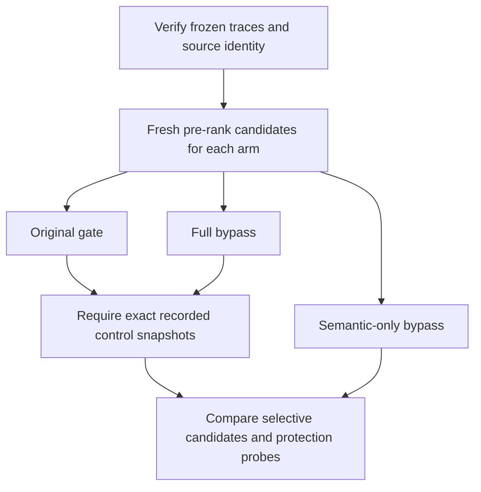

# Semantic-Only Gate Replay - Plan

## Goal Capsule

- **Objective:** Determine whether preserving lexical short-label protections retains the observed local-model recall gain, and expose the remaining admissions.
- **Means:** Replay recorded candidate inputs through the real ranker under one semantic-only gate policy (KTD1/KTD2).
- **Authority:** Frozen owner-approved cases govern relevance; this experiment cannot authorize production adoption.
- **Execution profile:** Two dependent units, followed by recorded review and delivery.
- **Stop condition:** Report the measured result; do not tune another policy, provider, threshold, or answer set within this plan.

## Product Contract

### Summary

Compare the original gate, the previously measured full bypass, and a semantic-only bypass using the saved public candidate traces. Report which recall gains, candidate admissions, and guard losses remain when lexical short-label filtering is preserved.

### Problem Frame

The [full ablation](../benchmarks/embedding-gate-ablation.md) recovers Negligence at rank 5 with the local model, but also removes a lexical protection. Hashing admits five candidates for N1 without a recall gain. Separating paths can test the lexical loss; it cannot by itself establish that semantic candidates are safe.

### Requirements

**Controlled comparison**

- R1. Use exactly the eight approved cases and pre-rank candidate inputs recorded in the three committed ablation artifacts; reject input, fixture, or library drift before interpreting results.
- R2. Relax ShortLabelGate only when a candidate's extraction path is exactly `semantic`; retain ordinary short-label behavior for every other path, including unknown paths.
- R3. Preserve the real blocklist, place gate, score floor, deduplication, tie-breaking, and ranking behavior; reproduce both original and full-bypass final snapshots exactly before comparing the selective arm.
- R4. Keep production code, prior benchmark runners, fixtures, plans, and measured artifacts unchanged.

**Evidence and interpretation**

- R5. Record complete candidate snapshots and deltas, approved target final ranks, positive hit@1/@5 with six-query denominators, negative candidate counts, and named protection probes separately.
- R6. Identify this as ranking replay of previously measured retrievals, not a new model or corpus retrieval measurement; neither the existing negative controls nor a preserved lexical guard establishes general precision or adoption readiness.

### Key Decisions

- **Keep the unambiguous initial cases.** Governs R1/R5. (session-settled: user-directed — chosen over the twelve proposed fixtures: the owner selected only unambiguous cases initially.)

### Scope Boundaries

No production gate API changes, provider allowlist, geographic enrichment, new model, threshold tuning, new annotations, or private evaluation. U10 triage and PR45 remain excluded. Any production policy needs a separate proposal and stronger relevance evidence.

## Planning Contract

### Key Technical Decisions

- KTD1. **Replay immutable pre-rank snapshots.** Load `baseline.retrievals[].before` from each ablation artifact, cross-check it against the recorded bypass inputs, and reconstruct fresh candidates for each arm. Pin input artifact digests to the committed evidence and check recorded source/fixture identities. No model or ontology acquisition is required because retrieval is held fixed (R1/R6).
- KTD2. **Carry extraction path within the rank-call scope.** Use a benchmark-local adapter that supplies the current candidate's path to the injected short gate while delegating the complete candidate stream to the existing ranker. Do not copy its deduplication or sorting algorithm, split ranking into independent path batches, or infer path from label/score. Scope must reset after exceptions and blocked candidates must not misalign it (R2/R3).
- KTD3. **Compare both controls before reporting the new policy.** Exact reproduction covers complete metadata and ordering, not just target presence. Reuse delta and metric helpers where their contracts fit, but preserve the frozen runners (R3/R4/R5).

### High-Level Technical Design

### Assumptions and Decision Rule

Path selection is a diagnostic hypothesis, not an endorsed production policy. Conclude that it preserves the observed benefit only when local P1 remains in the top five, both local exact targets remain first, and lexical protection probes match normal behavior. Independently report every semantic admission and negative-query result across all variants, even when that condition passes. A failure rejects this hypothesis without tuning. In either outcome, retain production defaults and state what this evidence cannot establish.

## Implementation Units

### U1. Add verified semantic-only ranking replay

**Goal:** Reproduce prior controls and isolate path-selective gating.

**Requirements:** R1-R6. **Dependencies:** Committed ablation evidence.

**Files:** Create `benchmarks/embedding_semantic_gate_replay.py` and `tests/test_embedding_semantic_gate_replay.py`.

**Approach:** Implement KTD1-KTD3 using the existing ranker, candidate snapshots, and comparison helpers. Include baseline/full/selective guard comparisons and a compact provenance record with all consumed source and artifact hashes.

**Execution note:** Begin with characterization and a failing real-ranker test for semantic recovery alongside lexical suppression; capture red before implementing the adapter.

**Patterns:** `benchmarks/embedding_gate_ablation.py`, `benchmarks/embedding_diagnostics.py`, `tests/test_embedding_gate_ablation.py`, and `src/folio_resolve/pipeline.py`.

**Test scenarios:**

- A semantic short label survives selective gating while an equally scored lexical candidate remains suppressed.
- Unknown, decomposition, and entity-ruler paths retain ordinary short-label behavior; exact lexical candidates survive.
- A duplicate IRI with different paths retains the actual strongest eligible candidate, with original order and tie-breaking semantics.
- Blocked aliases and tagged places remain suppressed on both lexical and semantic paths; a semantic candidate already below 45 stays absent.
- A blocked candidate before an eligible candidate does not shift path context; failures and later calls leave no stale context.
- Current source, fixture, artifact, case, or paired-input drift is rejected; incorrect original/full control outputs prevent a selective verdict.
- All three actual saved variants reproduce their controls; guard probes never enter relevance denominators.

**Verification:** Focused real-ranker tests, actual frozen replay, unchanged normal-mode guard tests, and no production diff.

### U2. Record the selective comparison and limits

**Goal:** Make the policy's remaining tradeoffs inspectable.

**Requirements:** R1/R3-R6. **Dependencies:** U1.

**Files:** Create `docs/benchmarks/embedding-semantic-gate-replay.md` and `docs/benchmarks/embedding-semantic-gate-replay.json`.

**Approach:** Record all three variants in one artifact, show every changed candidate versus original and full bypass, and apply the Decision Rule. Include the distinction between actual retrieval evidence and controlled guard inputs.

**Test expectation:** No additional tests for generated prose; independently verify report rows, counts, ranks, identities, and decision arithmetic against the output.

**Verification:** Both prior controls exactly reproduced for every case; all selective deltas and guard outcomes represented without adoption claims.

## Verification Contract

Run focused replay and existing guard tests, the project's isolated full core suite, Ruff, and configured mypy. Verify raw artifact identities and arithmetic independently. Retain the Codex review prompt and verdict before shipping. No deployment or latency verification applies to replay-only benchmark tooling.

## Definition of Done

Both units satisfy their verification criteria, the report follows observed results, and tests/static checks/recorded review pass. Production code, frozen inputs and prior artifacts, and unrelated workspace files remain unchanged. Finish after delivering this evidence; further policy work is separate.
