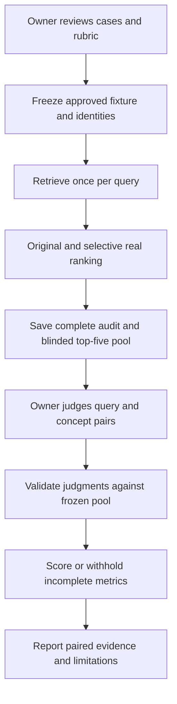

# Public Embedding Precision Evidence

## Goal Capsule

- Objective: Quantify the relevance cost of the observed selective-gating recall gain on a bounded public challenge set.
- Means: Compare original and semantic-only gating with the pinned local model; collect and review pooled candidate judgments before calculating precision.
- Authority: Owner-approved query intents and relevance judgments govern scoring. Existing intended targets are not exhaustive relevance labels.
- Stop condition: Deliver the paired evidence and its limitations. Do not tune or adopt a production policy.
- Checkpoint: The proposed cases and rubric in `docs/benchmarks/embedding-precision-fixtures-proposal.md` require owner review before collection; pooled candidate judgments require a later review before definitive precision scoring.

## Product Contract

### Summary

Extend the public benchmark with a small, explicitly approved challenge set and a candidate-relevance review workflow. Measure whether retaining lexical protections also limits irrelevant semantic admissions.

### Problem Frame

`docs/benchmarks/embedding-semantic-gate-replay.md` shows local hit@5 rising from 2/6 to 3/6 while lexical guard behavior is preserved. It also records semantic Judgment, Bid, Seller, and Ratification admissions. The eight existing fixtures identify intended targets; they do not establish which other returned concepts are irrelevant. Therefore candidate counts alone cannot support a precision claim.

### Requirements

- R1. Preserve all existing fixtures, prior runners, measured artifacts, production code and defaults. Keep private eval/U10 and PR45 out of scope.
- R2. Begin with only owner-approved unambiguous cases and a written relevance rubric. Preserve explicit approval provenance tied to the exact case/rubric digest. No approval by inference, elapsed time, or a generic approval flag.
- R3. Compare only original and exact-semantic-path bypass using the existing pinned local model, corpus normalization, top-k five and floor 45. Retrieve once per query and rank fresh copies of the same candidate stream for both arms through the real ranker. No ontology branch enrichment.
- R4. Pool unique query/IRI pairs from the union of both final top-five lists. Keep arm identity, rank, score and path out of the judgment view while retaining complete audit snapshots. Include the existing eight cases and every approved addition; reject duplicates and unexpected omissions.
- R5. Relevant, irrelevant and uncertain judgments remain distinct. Missing and uncertain judgments never silently become irrelevant. Relevance is keyed by query and IRI, not extraction path; path evidence remains available in the audit.
- R6. Report intended-target hit@1/@5 separately from relevance metrics; expose negative admissions, changed winning paths, judgment coverage and all unjudged results. Keep old and new cases and geographic positives distinguishable.
- R7. Reject source, model, corpus, query, approval, candidate-pool and judgment identity drift. Never silently rerun retrieval while applying judgments.
- R8. Describe the challenge-set selection bias, small sample, weak negatives and remaining uncertainty. No production adoption threshold, statistical significance claim, tuning loop, or general-quality claim follows from this work.

### Key Decisions

- Unambiguous initial cases only (session-settled: user-directed, over the broader twelve-case proposal). Governs R2.
- Present expected answers for owner review before treating them as benchmark truth (session-settled: user-approved next-step scope). Governs R2/R5.

### Scope Boundaries

No new provider, model revision, score threshold, gate policy, semantic index algorithm, geographic metadata inference, private dataset, or production endpoint. Full bypass and hashing results remain prior diagnostic evidence; they do not add annotation arms here. Ambiguous assignment and privilege/breach paraphrases remain excluded.

## Planning Contract

### Key Technical Decisions

- KTD1. Add separate fixtures and runner rather than mutating frozen evidence. Reuse source/corpus/model verification and pipeline construction from `benchmarks/embedding_recall.py`, trace patterns from `benchmarks/embedding_diagnostics.py`, and the tested selective gate adapter from `benchmarks/embedding_semantic_gate_replay.py`. Transfer the original pipeline's gates/configuration into the selective adapter; do not use its empty-ontology convenience constructor for new retrieval. Governs R1/R3/R7.
- KTD2. Store collection, judgments and scoring as distinct artifacts with content digests. Freeze approved queries and configuration before collection. Bind each judgment sheet to the exact pool and rubric. Approval records cite the actual owner decision and digest; copying an approval string is not an authorization mechanism. Governs R2/R4/R5/R7.
- KTD3. Pool both arms at depth five and deduplicate by query/IRI. The judgment sheet includes labels, definitions, aliases and parents from the pinned corpus in deterministic IRI order, without policy or ranking cues. This is ordinary relevance pooling, adapted here to require explicit handling of unjudged results rather than an assumed negative label. Governs R4/R5.
- KTD4. Separate intended-target retrieval success from candidate relevance. P@5 for a query is the number of relevant returned top-five concepts divided by five; unfilled slots contribute zero. Report returned count alongside it. A definitive value requires judgments for every returned top-five concept. With unjudged results, publish bounds R/5 to (R+U)/5 and coverage, not a point estimate. Governs R5/R6.

### High-Level Technical Design

### Metrics and interpretation

With all eight additions approved, there are 16 queries: 12 intended-target positives and four negative controls. Existing positive hit rates retain their six-query denominator; new positive hit rates use six. Also show combined 12-positive counts, with exact/paraphrase/geographic strata so exact-label additions cannot hide unchanged paraphrase misses. If the owner accepts a subset, derive and report denominators from that exact fixture.

For positive queries, report paired P@5 values only when both arms' returned top-five results are fully judged. Do not silently average only fully judged queries: the full-positive macro is withheld until every positive query is complete; bounds and coverage remain available. Empty positive result lists yield P@5 zero and zero returned results, not perfect precision.

For negatives, report returned count, judged-relevant count, judged-irrelevant count and unjudged count per arm. Do not reward empty negative lists with a precision score. A relevant judgment on a no-intended-target case is an annotation conflict requiring owner resolution before final scoring, not permission to relabel the case silently. Show unwanted admissions as explicit irrelevant query/IRI pairs and identify whether they are newly admitted under selective gating. Retain candidates below final rank five for audit but do not call them judged unless separately reviewed; this includes the prior local Seller admission for Auction at rank six.

The maximum initial review pool is 160 query/IRI pairs (16 queries × two arms × five results), usually smaller after deduplication and empty lists. Missing ontology definitions are shown as missing. This is a purposive diagnostic set; it is not a blind holdout because the cases were motivated by previous results.

### Research basis

The repo's frozen replay establishes the question and provides the adapter and comparison patterns. `benchmarks/embedding_recall.py` currently implements target hit metrics only; no existing helper provides the required relevance-judgment contract. The [Stanford information retrieval text on assessing relevance](https://nlp.stanford.edu/IR-book/html/htmledition/assessing-relevance-1.html) describes pooling results across systems for human assessment; it motivates KTD3. Our stricter unjudged handling is an explicit design choice for this small, fully inspectable pool.

## Implementation Units

### U1. Add approval-bound collection and judgment preparation

**Goal:** Produce identical-input paired runs and an inspectable candidate pool without premature precision claims.

**Requirements:** R1–R5/R7. **Dependencies:** Owner approval of exact cases and rubric.

**Files:** New `benchmarks/embedding_precision.py`, `benchmarks/fixtures/embedding_precision.json`, `tests/test_embedding_precision.py`; new `docs/benchmarks/embedding-precision-collection.json` and `docs/benchmarks/embedding-precision-judgments.json`.

**Approach:** Persist approved cases/rubric/decision provenance, verify pins, collect one raw candidate stream per query, rank copies under each policy, and write complete candidate metadata and target ranks. Produce a separate unjudged review sheet and its pool digest. Reproduce the existing eight local baseline/selective snapshots before using new-case evidence. Preserve prior runners and artifacts.

**Execution note:** Write failing real-ranker and fixture-integrity tests before implementation. Mocking model output is suitable for fast contract tests; it does not replace the pinned real-model collection.

**Test scenarios:** Rejected unapproved or altered fixtures; invalid/duplicate IRIs; exact existing control equality; semantic versus lexical same-IRI path competition; preserved blocklist/place/floor/ties; fresh candidate mutation isolation; deterministic pool deduplication; missing definitions; no rankings or arm names in judgment view; source/model/corpus mismatch; collection output contains no precision verdict.

**Verification:** Focused tests and one pinned local collection reproduce existing controls and retain hashes. New public queries are not revised after inspecting their output.

### U2. Add judgment validation and transparent scoring

**Goal:** Calculate only metrics supported by reviewed judgments.

**Requirements:** R2/R4–R8. **Dependencies:** U1. Scoring implementation may proceed on controlled test inputs while real judgments await owner review.

**Files:** `benchmarks/embedding_precision.py`, `tests/test_embedding_precision.py`; new `docs/benchmarks/embedding-precision-results.json` after real judgment approval.

**Approach:** Validate judgment provenance, pool membership, complete expected pair identities and labels. Reject conflicting duplicate judgments and stale digests. Produce target hits, judged relevance counts, P@5 or bounds, coverage, negative counts and paired additions without model inference. Owner-approved intended targets may be used as positive examples only under the approved rubric; absent labels stay unjudged.

**Test scenarios:** Hand-computable metrics for full/partial/empty result sets; uncertain and absent judgments; missing/extra/duplicate pairs; changed query/pool/rubric; negative-intent/relevant-label conflict; no denominator drift when cases are omitted by owner choice; no macro from a biased complete-case subset; same IRI through different paths counts once; scoring never loads a model or reruns retrieval.

**Verification:** Independent hand calculations agree with tests; unresolved judgments withhold definitive metrics while retaining honest bounds and coverage.

### U3. Complete reviewed evidence and report limitations

**Goal:** Deliver a reviewable paired precision/recall report.

**Requirements:** R1/R2/R5–R8. **Dependencies:** U1/U2 and owner review of the actual pooled candidates.

**Files:** `docs/benchmarks/embedding-precision-judgments.json`, `docs/benchmarks/embedding-precision-results.json`, new `docs/benchmarks/embedding-precision.md`.

**Approach:** Record owner decisions without inventing labels, score the frozen collection, and enumerate relevance gains, irrelevant admissions and uncertain cases. Explain Judgment's winning-path change using query/IRI relevance independently of extraction path. Report whether the observed recall gain comes with judged relevance losses; do not translate this into an adoption decision.

**Test expectation:** No tests mirroring generated prose. Independently check every reported count, rank, denominator, judgment link and digest against raw artifacts.

**Verification:** Report is complete even if some judgments remain uncertain, provided unsupported metrics remain withheld and limits are explicit. A pending owner response is not an uncertain judgment and cannot be fabricated to finish.

## Verification Contract

Run focused benchmark and existing real-ranker tests, the isolated core suite, Ruff and configured mypy after implementation. Run the pinned local model once for approved queries, with exact controls and input hashes; preserve its raw output for deterministic rescoring. Independently validate report arithmetic and approval/pool bindings. Retain the repository-required Codex review prompt and verdict before shipping code. No deployment monitoring applies to this benchmark-only work.

## Definition of Done

Approved cases and actual judgment decisions have traceable provenance; both policies use the same retrievals; controls reproduce; coverage and metrics are honest; tests and recorded review pass; source and frozen evidence remain unchanged. Stop at the evidence report. Until case approval arrives, the plan and proposal are the deliverables, and measurement does not start.
