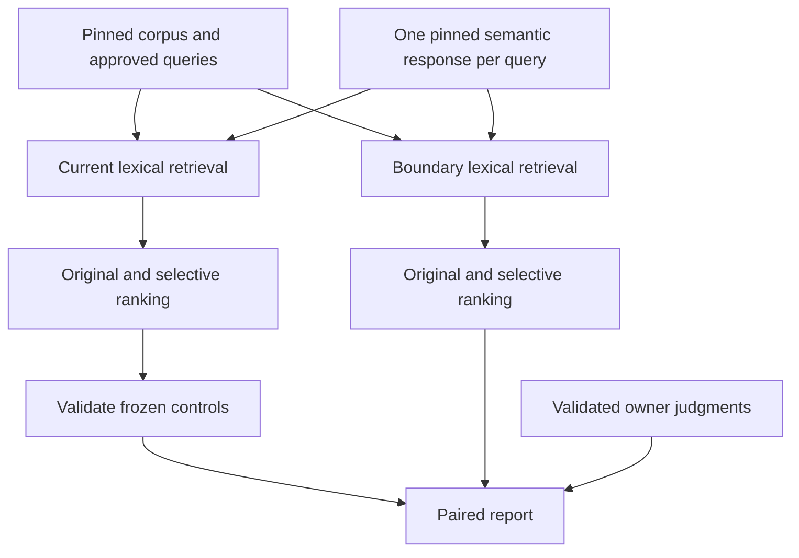

# Measure lexical word boundaries on public queries

## Goal Capsule

**Objective:** Give maintainers defensible evidence about whether whole-word containment improves public-query retrieval while retaining useful longer-label matches.

**Means:** A benchmark-only paired lexical experiment (KTD1–KTD3).

**Authority:** The owner's approved fixtures and categorical judgments govern relevance; this plan governs the new experiment. Existing frozen evidence remains authoritative for its original runs.

**Execution profile:** Characterization first, then one controlled comparison. The implementing agent owns verification and a reviewed benchmark PR. Stop interpretation if control reproduction or provenance fails. A neutral or negative result completes the experiment; it does not authorize tuning until an improvement appears.

## Product Contract

### Summary

Compare today's substring scoring with whole-word containment using the same 16 approved public queries, corpus, semantic candidates, and two previously studied gate policies. Deliver a reproducible report and a decision about whether a subsequent production proposal is warranted.

### Problem Frame

The existing selective-gate experiment recovered Negligence, increasing intended-target hit@5 from 8/12 to 9/12. Precision remains unresolved: 26 of 55 pooled pairs are owner-designated unjudged, and strict and expanded precision bounds overlap.

For Riga, the original-gate results include Surigao del Norte, Surigao del Sur, and Water Supply and Irrigation Systems through label search. Source inspection identifies unrestricted containment bonuses in label, preferred-label, and definition scoring. That mechanism warrants measurement; it does not establish that the unjudged concepts are irrelevant. Riga Stock Exchange is a useful longer-label preservation case.

### Requirements

- R1. Characterize actual lexical scoring and provider retrieval before adding the alternative, including the Riga examples and legitimate whole-word phrases.
- R2. Compare the two lexical policies under both original and selective gates while holding fixtures, targets, corpus, model, thresholds, limits, and ranking context fixed.
- R3. Apply the alternative before provider sorting and limits, allowing replacement candidates to enter; preserve other scoring terms and ranking behavior.
- R4. Preserve every existing owner judgment by exact query/IRI identity. Keep all previously unjudged pairs and newly encountered pairs unjudged; use the approved strict and expanded rubrics with fixed denominators and honest bounds.
- R5. Report per-query target hit@1/hit@5, strict and expanded P@5 bounds, judgment coverage, admissions on the four negative controls, candidate membership, scores, winning paths, and aggregate results on the existing groups.
- R6. Keep production code and all prior fixtures, runners, collections, and review sheets unchanged. Record the new experiment separately with reproducible provenance.

### Key Decisions

- Preserve ambiguous pairs as unjudged (session-settled: user-directed — chosen over treating omissions as irrelevant: the owner explicitly called them too ambiguous). Governs R4.
- Report both strict direct-match and expanded categorical relevance (session-settled: user-approved — chosen over one blended relevance score: the owner approved both interpretations). Governs R4–R5.

### Scope Boundaries

This is a public benchmark experiment. Production adoption, model changes, new semantic retrieval windows, threshold tuning, extra query approval, private eval, and U10 leak triage are outside this work.

### Success Criteria

A valid control reproduction and a complete paired report answer whether the containment mechanism changes retrieval without losing intended targets or reviewed useful matches on this set. No numerical gain is required for completion. Overlapping bounds or new unknown candidates must result in an inconclusive precision verdict where appropriate.

## Planning Contract

### Key Technical Decisions

- KTD1. **Change containment bonuses, not candidate eligibility.** Create an isolated experimental scorer based on the current production scorer. Replace only its four raw containment predicates: query in label, label in query, query in preferred label, and query in definition. Retain equality, minimum lengths, ratio checks, overlap, synonyms, definition weighting, specificity penalty, rounding, and type handling. A concept can still score through another channel after losing its containment bonus. Trace which field and occurrence supplied each containment award.
- KTD2. **Use literal phrase boundaries.** Keep current lowercasing and whitespace handling. An occurrence qualifies only when neither adjacent character is a Unicode letter, number, combining mark, or underscore; text edges qualify. Examine all occurrences so an embedded first occurrence cannot hide a later whole-word occurrence. Preserve internal phrase spacing and punctuation exactly; introduce no stemming, stopword phrase rewriting, accent normalization, or tokenizer replacement. Hyphens and apostrophes delimit words under this experiment. Empty needles earn no containment bonus. Existing exact-equality behavior remains unchanged.
- KTD3. **Reretrieve lexical candidates over the complete pinned corpus.** Use a benchmark-only InMemoryOntology variant overriding label search and preserving deterministic score/IRI sorting. Both full-query label search and decomposition use it. Compute semantic candidates once per approved query with the pinned local model and replay that same semantic response through both lexical arms of the real pipeline. Rank fresh candidate copies with original and selective policies, giving four cells. Do not approximate reretrieval by deleting saved top-five candidates or by globally monkeypatching production scoring.
- KTD4. **Control reproduction is the interpretation gate.** Before comparing alternatives, require the current lexical arm's complete original and selective snapshots for all 16 cases to match the frozen precision collection. Validate source hashes, approved fixture identity, corpus identity, model revision and files, execution configuration, and categorical approval receipt. Source drift or mismatch ends this attempt with a diagnostic; never rewrite historical evidence to make it match.
- KTD5. **Reuse scoring arithmetic with a new evidence envelope.** Consume the frozen collection and categorical sheet through their existing validators. Transfer annotations only by exact query/IRI and unchanged query text; validate current concept metadata before transfer. Reuse the existing summary arithmetic without weakening its validation. New collection identifiers and hashes belong to a new schema, not a forged historical collection. Report each lexical comparison within its fixed gate policy; differences across gates are context, not lexical effects.

### High-Level Technical Design

### Assumptions and Dependencies

The existing local model and ontology assets can be located or restored at their recorded hashes. Their machine-specific locations are runtime inputs, not portable plan paths. No asset substitute is acceptable. The current benchmark uses InMemoryOntology; conclusions do not automatically cover FolioPythonProvider's upstream candidate limits.

This is a bounded local experiment with established patterns in the baseline, diagnostics, gate replay, and precision runners. No new dependency or external service is needed. A small benchmark-local scorer copy isolates the treatment without a premature public API; source hashes and differential controls constrain copy drift.

### Deferred Implementation Details

Final helper names and artifact serialization details may follow existing benchmark conventions. Runtime provenance, actual candidate changes, replacement candidates, and score effects remain execution questions; this plan claims no measured boundary improvement.

## Implementation Units

### U1. Characterize containment and implement the isolated policy

**Goal:** Establish a faithful baseline and a narrowly defined boundary treatment.

**Requirements:** R1, R3, R6. **Dependencies:** None.

**Files:** Create `benchmarks/embedding_lexical_boundaries.py` and `tests/test_embedding_lexical_boundaries.py`; inspect `src/folio_resolve/scoring.py`, `src/folio_resolve/ontology.py`, `tests/test_scoring.py`, and `tests/test_ontology.py` without modifying them.

**Approach:** Follow KTD1–KTD2. Retain baseline and experimental paths in the benchmark module. Make per-field diagnostics explain score changes without becoming a second scoring implementation.

**Execution note:** First record passing characterization against the real scorer/provider and an expected failing test for the new boundary contract, then implement the alternative. Preserve real output from both observations.

**Patterns to follow:** Type-defensive scorer tests and real InMemoryOntology tests; benchmark-local experimental policies in `benchmarks/embedding_semantic_gate_replay.py`.

**Test scenarios:**

- Riga receives substring bonuses for embedded label occurrences under the real baseline; the alternative removes those specific bonuses while preserving exact Riga and whole-word Riga Stock Exchange bonuses.
- Query-in-label, reverse label-in-query, preferred-label, and definition-only containment each honor the same boundary rule; surviving overlap and synonyms retain their original contributions.
- Case differences, punctuation, hyphens, apostrophes, digits, underscores, non-ASCII letters, combining marks, and repeated occurrences have explicit expected boundary outcomes.
- Empty or non-string text, missing definitions, and invalid synonym entries remain type-defensive; existing exact equality is unchanged.
- Scores for inputs without affected containment predicates agree exactly with production, including specificity penalties and rounding.

**Verification:** Characterization and new-policy tests pass; a focused diff of the benchmark scorer against production shows only the intended predicate and trace changes.

### U2. Collect four controlled retrieval and ranking cells

**Goal:** Measure full reretrieval while proving the controls reproduce.

**Requirements:** R2, R3, R6. **Dependencies:** U1.

**Files:** Extend `benchmarks/embedding_lexical_boundaries.py` and `tests/test_embedding_lexical_boundaries.py`; create `docs/benchmarks/embedding-lexical-boundaries-collection.json`.

**Approach:** Follow KTD3–KTD4. Reuse baseline corpus/model loading and rank snapshot helpers read-only. Save complete retrieval streams, ranking snapshots, configuration, source and input hashes, and corpus/semantic provenance before summary generation. Treat the frozen precision collection as an input, never an output.

**Patterns to follow:** `retrieve_once` and `rank_pair` in `benchmarks/embedding_precision.py`; snapshot copying and control checks in `benchmarks/embedding_semantic_gate_replay.py`.

**Test scenarios:**

- A small real ontology with an embedded match ahead of a valid replacement demonstrates treatment before label-search truncation and deterministic tie ordering.
- A decomposed query uses the chosen lexical policy for each component; a shared semantic response is identical in both lexical streams.
- Reversing the order in which arms are ranked produces identical snapshots, proving no cross-arm mutation.
- Changed fixture, model, corpus, source, or baseline snapshot blocks comparative reporting with a specific mismatch.
- All 16 real-model control snapshots match the frozen evidence before the alternative is interpreted.

**Verification:** Complete controls reproduce; all four cells exist for every case; prior artifact hashes remain unchanged.

### U3. Score owner judgments and report the bounded result

**Goal:** Produce an evidence-backed recommendation about a future production proposal.

**Requirements:** R4–R6. **Dependencies:** U2.

**Files:** Extend `benchmarks/embedding_lexical_boundaries.py` and `tests/test_embedding_lexical_boundaries.py`; create `docs/benchmarks/embedding-lexical-boundaries-results.json` and `docs/benchmarks/embedding-lexical-boundaries.md`.

**Approach:** Follow KTD5 and the Product Contract's settled relevance decisions. Report counts alongside bounds, compare within each gate policy, and separately enumerate reviewed direct/expanded gains and losses, unknown additions/removals, and containment-only mechanism changes. Preserve the existing group membership and target IRIs.

**Patterns to follow:** `benchmarks/embedding_precision_relations.py`, the frozen precision summary arithmetic, and `docs/benchmarks/embedding-precision.md`.

**Test scenarios:**

- The 29 existing classifications transfer unchanged; the 26 ambiguous pairs and every newly surfaced pair remain null wherever present.
- Missing slots contribute zero with denominator five; negatives stay outside positive precision denominators; group macros retain all member queries.
- Unknown pairs withhold unsupported points and widen bounds; dropping unknown candidates alone does not become a claimed precision improvement.
- A child or relationship counts only in expanded precision, and a query-specific judgment is not reused for another query.
- All four cells' hit counts, group denominators, bounds, and candidate diffs can be independently recomputed from the collection.

**Verification:** Offline report reproduction agrees exactly. The report distinguishes mechanism changes from relevance evidence and names any loss of intended targets or owner-reviewed useful matches, including Riga Stock Exchange.

## Verification Contract

During implementation, run the new focused tests plus the existing scoring, ontology, pipeline, embedding benchmark, gate replay, precision, and categorical suites. Run the repository's established core suite, Ruff, and configured mypy checks before shipping. Preserve red/green output, command exit status, complete control equality evidence, source/input hash checks, and independent arithmetic in the execution receipt. This planning task itself runs no tests or model collection.

The real-model comparison uses the recorded MiniLM revision `1110a243fdf4706b3f48f1d95db1a4f5529b4d41`, 18,325 concepts, semantic top-k 5, label limit 10, score floor 45, no branch inference, and empty domains/headings/context. Capture exact dependency versions and local asset digests rather than silently resolving newer versions.

## Definition of Done

All three units produce tested benchmark artifacts, valid control reproduction, unchanged prior evidence, and a reproducible report. The recommendation can be promising, neutral, harmful, or inconclusive; it must be supported by the paired observations and coverage limits. No production change or claim of general precision follows automatically. Retain the review prompt and verdict required by repository policy before shipping the benchmark PR.

## Sources

- `docs/benchmarks/embedding-precision.md` and its collection, reviewed judgments, and results: observed gain, unknown coverage, metric definitions, and input pins.
- `src/folio_resolve/scoring.py`: four raw containment predicates and independent overlap/synonym contributions.
- `src/folio_resolve/ontology.py`: shared scorer, complete InMemoryOntology search, deterministic sort before limit.
- `src/folio_resolve/pipeline.py`: main and decomposition label search, semantic expansion, rank boundary.
- `benchmarks/embedding_precision.py` and `benchmarks/embedding_precision_relations.py`: control validation, snapshots, owner rubric, and summary arithmetic.
