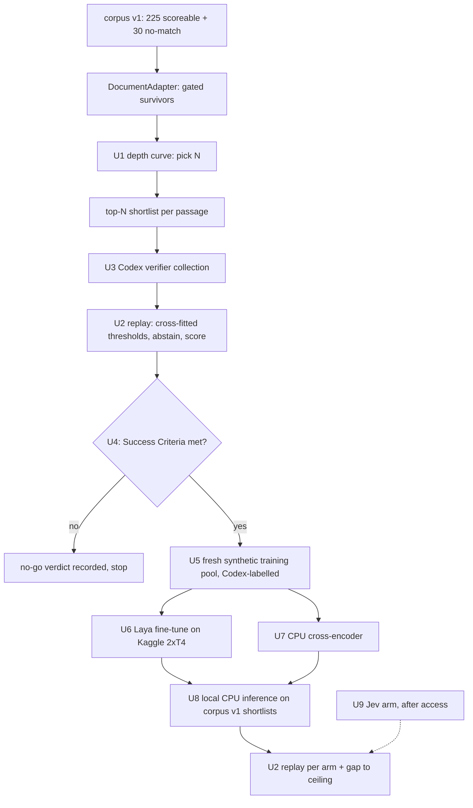

# Calibrated Shortlist Verifier Experiment - Plan

## Goal Capsule

- **Objective:** Establish, with benchmark evidence, whether a calibrated per-candidate verifier with a "nothing applies" abstention can deliver the significant F1 improvement that folio-mapper and folio-enrich require before adopting a folio-resolve pipeline.
- **Means:** An LLM verifier ceiling run over the existing shortlist, then, only if it clears the bar, a locally run Laya model distilled from that verifier; Jev follows as a comparison arm once access exists.
- **Product authority:** Damien. This is benchmark-lane evidence only; the 2026-09-21 adoption gate in `docs/migration/SCHEDULE.md` still governs any consumer change.
- **Authority order:** Product Contract Requirements win on behavior; Planning Contract KTDs win on mechanism; units implement both and amend neither.
- **Stop conditions:** Stop after U4 with a no-go verdict when the ceiling misses the Success Criteria (R5). Stop U6 and U9 at their external blockers rather than substituting another route.
- **Execution profile:** Codex workers implement units per the standing `worker_route=codex`, testing U3 and U5 against fake runners only; the orchestrator verifies artifacts and ships. A Codex worker's sandbox has no network, so the orchestrator runs the live `codex exec` collections (U3, U5 labelling) and the U5 generator dispatch through `agents/worker-wrapper.sh` on the home box after those tests pass. Stage 1 (U1–U4) runs entirely on the home box with no GPU.
- **Open blockers:** None for stage 1. U6 needs Damien's Kaggle account for the GPU run. U9 needs Damien's TypeSafe early access.

---

## Product Contract

### Summary

Add a verification step after retrieval that decides, for each shortlisted FOLIO concept, whether it is a correct tag for the passage, and decides whether any concept applies at all.
Prove the idea first with a strong LLM verifier on the synthetic benchmark; distil it into a fast local Laya model only if that ceiling shows a significant F1 lift.

### Problem Frame

The current evidence locates folio-resolve's F1 losses after retrieval, not in it.
In the committed synthetic comparison (`eval/reports/synthetic-comparison-v1.json`), the library candidate had already retrieved every concept the incumbents won but ranked them 7th to 36th, below its answer cutoff.
Every system, incumbents included, returned tags for 30 of 30 no-match controls, so none of them can abstain.
Micro-F1 sits between 0.44% and 2.86% across the three systems on strict exact-concept scoring.

Jev (TypeSafe, API-only, invite waitlist) and Laya (Apache-2.0, ~421M-parameter ModernBERT, runs locally) are "System 1" typed-decision models: text plus a predefined small option set in, calibrated probabilities out.
Neither retrieves or links entities, and neither can choose among FOLIO's 18,000+ concepts directly: Jev chooses directly from at most 255 options and Laya degrades past roughly 20 to 30 labels.
Their fit is therefore the post-retrieval decision, exactly where the losses are.
Laya's own documentation reports near-random zero-shot accuracy on specialised domains until fine-tuned, and all of its comparative benchmarks are self-reported.

### Key Decisions

- **Target the shortlist verifier and abstention seam first.** It addresses both measured failures, and a verifier that removes noise lets retrieval run looser for recall. (session-settled: user-directed — chosen over a branch/domain router and sense-disambiguation-only: the verifier targets the two failures the benchmark actually measured.) Governs R1, R2, R3.
- **Measure an LLM ceiling before any distillation.** A distilled model cannot beat its teacher, so a ceiling that does not move F1 ends the experiment cheaply. Governs R4, R5, R8.
- **Laya first; Jev as a later arm.** Laya runs locally with no egress review and is the only candidate with a documented fine-tuning path; Damien will obtain Jev access for a follow-on comparison. (session-settled: user-directed — chosen over Jev-only and a simultaneous Laya+Jev start: Laya is testable now, Jev after access.) Governs R9, R10, R11.
- **Evidence only; no consumer changes.** Consumers keep their incumbent pipelines per the 2026-09-21 adoption gate. Governs R13.

### Requirements

**Verifier behavior**

- R1. For each passage, the verifier assigns every shortlisted candidate concept a calibrated probability that it is a correct tag for that passage.
- R2. The verifier also produces a passage-level probability that no FOLIO concept applies, and a passage judged no-match emits zero tags.
- R3. Tag admission uses a probability threshold in place of the current fixed score cutoff and top-k budget, so a correct concept ranked below the old cutoff can still be admitted.

**Stage 1: ceiling**

- R4. A strong LLM verifier runs over the existing candidate shortlist on the synthetic benchmark, with retrieval and shortlist inputs held identical to the comparison baseline, so any difference is attributable to the verifier.
- R5. Stage 1 reports whether the ceiling meets the Success Criteria; stage 2 starts only if it does, and a miss closes the experiment with a recorded no-go verdict.
- R6. Stage 1 also reports how many correct concepts were never in the shortlist, separating the verifier's reachable gain from retrieval misses it cannot fix.

**Stage 2: Laya distillation**

- R7. Laya is fine-tuned on verifier labels produced by the stage 1 verifier.
- R8. Training labels never come from passages used for scoring; the benchmark is split, or labels are generated on separate synthetic or public text.
- R9. The distilled Laya arm is scored on the same held-out passages and metrics as the stage 1 ceiling, reporting both its F1 and its gap to the ceiling.
- R10. Laya runs locally; no passage text leaves the machine for the Laya arm.

**Jev arm**

- R11. Once Damien has Jev access, Jev is scored as an additional arm on the same held-out passages and metrics; only synthetic or public passages may be sent to Jev until it passes Damien's per-surface perimeter test.

**Reporting and boundaries**

- R12. Every arm reports strict exact-concept precision, recall, and micro-F1 as the headline, the owner-approved expanded metric alongside, the no-match false-positive rate on controls, and calibration quality of the emitted probabilities.
- R13. No change reaches folio-mapper or folio-enrich; a passing result is evidence for a later per-consumer head-to-head under the adoption gate.

### Acceptance Examples

- AE1. **Covers R2.** Given a no-match control passage, when the verifier's no-match probability exceeds its threshold, then the passage emits zero tags and counts as a correct abstention.
- AE2. **Covers R3.** Given a passage whose gold concept was retrieved at rank 24, when the verifier assigns it a probability above the admission threshold, then it is emitted even though it was below the old top-k cutoff.
- AE3. **Covers R5.** Given a stage 1 ceiling whose F1 lift is not statistically significant, when the stage 1 report lands, then the experiment closes with a no-go verdict and no Laya fine-tuning runs.
- AE4. **Covers R8.** Given a passage in the scoring set, when training labels are assembled, then that passage contributes no label.

### Success Criteria

- **Significant F1 lift:** the paired F1 difference against the comparison baseline has a 95% bootstrap interval excluding zero, using the repository's existing paired-bootstrap convention.
- **Abstention works:** the no-match false-positive rate on controls falls well below the current 30 of 30.
- **Recall holds:** strict recall does not fall below the baseline's.
- **Laya is worth keeping:** the distilled arm retains most of the ceiling's lift at local, low-latency cost; the acceptable gap is set when stage 1 numbers exist.

### Scope Boundaries

- **Deferred for later:** a branch/domain router that narrows retrieval to FOLIO top-level branches; sense disambiguation as a standalone guard; the Jev arm until access exists.
- **Not in this work:** changes to retrieval itself, consumer pipeline changes or pins, and firm-lane data in any external-model arm.

### Dependencies / Assumptions

- The synthetic benchmark, its gold, and the paired-bootstrap scorer under `eval/` remain the evaluation harness.
- The verifier is an eval-lane contract, not the library's `Judge` protocol (`src/folio_resolve/judge.py`), whose verdict-and-adjusted-score output does not carry probabilities (KTD3).
- Laya fine-tuning needs a GPU of roughly 2xT4 class for about five hours per its documentation; the home box and `hetzner-dev` have none, so it runs on Kaggle's free tier (KTD8).
- Laya and Jev performance claims are vendor or author self-reports and are treated as unverified until measured here.

### Sources / Research

- `docs/benchmarks/consumer-legacy-comparison.md`: winners retrieved but ranked 7 to 36, 30/30 no-match false positives, paired-bootstrap convention.
- `docs/migration/SCHEDULE.md`: the 2026-09-21 active adoption gate.
- `docs/benchmarks/embedding-precision.md`: the strict and expanded relevance metrics.
- `docs/solutions/2026-09-04-u9-iteration-traps.md`: required reading before touching the eval lane.
- Jev: https://typesafe.ai/blog/introducing-system-one-models-and-jev
- Laya: https://github.com/NandhaKishorM/laya

---

## Planning Contract

**Product Contract preservation:** restructured, no scope change. The four Deferred-to-Planning questions are resolved in place by KTD1, KTD2, KTD5, KTD6 and KTD7. The Judge-protocol and GPU assumptions are updated to match KTD3 and KTD8.

### Key Technical Decisions

- KTD1. **Codex is the stage 1 verifier, reached through `codex exec`.** It runs on Damien's ChatGPT login, so no API key enters any shell, and it matches the standing Codex worker route. A Claude verifier arm is added only if the Codex ceiling looks weak; it would read its key from a mode-600 file under `~/.config/`, never an environment variable. Governs R4.
- KTD2. **The paired baseline is the kept synthetic candidate, attempt-0004, on corpus v1.** It is the current full-corpus state (225 scoreable items, 363 gold relations, micro-F1 0.017513, no-match FP 30/30; `eval/reports/synthetic-attempt-0004-eligible-anchor-v1.json`). The stale 60-item incumbent comparison is not re-run here; the per-consumer head-to-head belongs to the later adoption round (R13). Governs R4, R5.
- KTD3. **The verifier is a new eval-lane contract, not a library change.** A verifier returns one decision record per passage: a probability per shortlisted IRI plus a passage-level no-match probability. It lives under `eval/folio_eval/` with `lever_scope: adapter_only`, so the stop counter and consumer pins are untouched. Promotion into `src/folio_resolve/` is follow-up work. Governs R1, R2, R13.
- KTD4. **Shortlist depth N comes from a measured recall-by-depth curve, not a guess.** Only 3.3% of gold relations sit in today's top 6 (attempt-0004 depth probe), and survivors average about 1,800 per passage (449,421 across attempt-0004's run), so neither depth is usable. U1 measures gold recall at depths up to the existing `DEPTH_PROBE_MAX` of 200. N is the smallest depth where recall is within 1 percentage point of the depth-200 value, capped at 100 for cost. Governs R3, R6.
- KTD5. **Verifier outputs are collected once, committed, and replayed offline.** LLM calls are non-deterministic, so each collection is a committed, leak-checked JSON with its model id, prompt-template hash, corpus and adapter hashes, and every raw decision. Scoring loads the collection and never calls a model. This mirrors the collect-then-rescore split in `benchmarks/embedding_precision.py`. Governs R4, R9, R12.
- KTD6. **Thresholds are chosen by 5-fold cross-fitting on corpus v1.** Each item's admission and no-match thresholds come only from the other four folds. Folds are assigned deterministically from a hash of `item_id` under a pinned seed; the 30 no-match passages are spread across folds the same way. Every arm uses the same folds, so arms stay comparable, and no item's own label ever tunes its threshold. Governs R3, R8.
- KTD7. **Laya is trained with its binary `noul` primitive, once per (passage, candidate) pair, plus one no-match question per passage.** The `choice` primitive degrades past about 20–30 labels and N will exceed that. Each pair question states the passage, the concept label and its FOLIO definition. The fine-tune starts from the 1,024-token `laya-typed-decisions` checkpoint, because passage plus definition can exceed the base checkpoint's 512 tokens. Governs R7, R9.
- KTD8. **The Laya fine-tune runs on Kaggle's free 2xT4 tier, and a small cross-encoder trained on this box's CPU runs alongside as a fallback arm.** (session-settled: user-directed — chosen over renting a paid GPU, CPU cross-encoder only, and skipping distillation: $0, matches Laya's own notebook, and the training data is the public synthetic corpus.) `hetzner-dev` was checked and has no GPU (4 vCPU, 7 GB RAM). Governs R7, R10.
- KTD9. **Laya and the cross-encoder live in an isolated eval-only environment, never in `pyproject.toml`'s extras.** Laya pins `transformers` 5.x and `torch` 2.14+, while the library's `embedding` extra pulls `sentence-transformers` 3.x. Keeping them apart keeps the library's resolution untouched. The environment's pins and licenses (Laya: Apache-2.0) are recorded in `THIRD-PARTY.md`. Governs R10, R13.
- KTD10. **Laya's training pool is fresh label-blind synthetic text, never corpus v1.** New passages come from the existing generator (`eval/synthetic/generation/`) under its sandbox contract. They get shortlists from the same adapter and labels from the stage 1 Codex verifier. A disjointness assertion (item ids and normalized text hashes) fails the build if any corpus v1 passage appears. Governs R7, R8.

### High-Level Technical Design

The experiment is a gated two-stage pipeline. Every model call writes a committed collection, and every score replays from a collection. The flowchart below shows the order and the go/no-go gate.



Each passage's decision record has this shape and admission rule. It is directional, not a signature:

```text
decision(passage) = { no_match_p: float, candidates: [{iri, p}] }   # p in [0, 1]
emit(passage)     = []                                   if no_match_p >= t_nomatch
                  = [iri for iri, p in candidates if p >= t_admit]  otherwise
```

### Assumptions

- Codex returns well-formed per-candidate probabilities for a shortlist of up to 100 concepts in one call per passage. U3 splits a shortlist into batches if a single call is unreliable.
- Kaggle's free tier still offers 2xT4 sessions long enough for the ~5-hour fine-tune. If a session limit interrupts training, the run resumes from a checkpoint.
- The training pool needs about 400–800 passages (roughly 20,000–80,000 labelled pairs at N of 50–100). The exact count is set in U5 from the Laya notebook's reported sample needs.

---

## Implementation Units

### U1. Measure the shortlist depth curve

**Goal:** Report, for corpus v1, what share of gold relations appears among each passage's top-k gated survivors for k up to 200, and fix N (KTD4).

**Requirements:** R3, R6; KTD4.

**Dependencies:** None.

**Files:**
- `eval/folio_eval/verifier_depth.py` (new)
- `eval/run_verifier_depth.py` (new)
- `docs/benchmarks/verifier-shortlist-depth.json`, `docs/benchmarks/verifier-shortlist-depth.md` (new)
- `eval/synthetic/verifier/baseline-collection-v1.json` (new, committed)
- `tests/test_eval_verifier_depth.py` (new)

**Approach:**
1. Reuse `DocumentAdapter.adapt` survivors in their existing sort order, running at the attempt-0004 source state.
2. Compute micro and mean per-item gold recall at depths 6, 10, 20, 30, 50, 75, 100, 150 and 200.
3. Apply the KTD4 rule to choose N, and report gold relations never retrieved at depth 200 as the misses the verifier cannot fix (R6).
4. From the same adapter run, commit a per-item baseline collection in the U2 schema: each scoreable passage's top-6 under the existing answer rule, and no abstention on no-match controls. The attempt-0004 report and its experiment record are aggregate-only ("paired per-item outcomes unavailable"), so this collection is the sole paired `before` input for U2 and U4.

**Patterns to follow:** `depth_probe` in `eval/folio_eval/synthetic_score.py`; runner discipline from `eval/run_synthetic.py` (`PYTHONHASHSEED=0` re-exec, ontology pin assert, pristine tree per `docs/solutions/2026-09-04-u9-iteration-traps.md`).

**Test scenarios:**
- A fixture with gold at ranks 3, 12 and 40 reports recall 1/3 at depth 10, 2/3 at 20 and 3/3 at 50.
- A gold IRI absent from all survivors is counted in the unreachable tally at every depth.
- The KTD4 rule picks the smallest depth within 1 point of depth-200 recall, and caps at 100 when that depth exceeds 100.
- A passage with fewer survivors than the requested depth contributes its full list without error.
- A depth above `DEPTH_PROBE_MAX` raises.

**Verification:** Committed JSON and Markdown report the curve, the chosen N, and the unreachable count; the baseline collection is committed; all pass the leak check.

### U2. Verifier decision contract and offline scorer

**Goal:** Turn any arm's committed decision collection into strict and expanded P/R/F1, no-match FP rate, calibration metrics and a paired bootstrap against the baseline, all offline.

**Requirements:** R1, R2, R3, R12; AE1, AE2; KTD3, KTD5, KTD6.

**Dependencies:** None (U1 supplies N at run time only).

**Files:**
- `eval/folio_eval/verifier.py` (new)
- `tests/test_eval_verifier.py` (new)

**Approach:**
1. Define the per-passage decision record and a collection schema carrying the provenance fields from KTD5; loading validates probabilities in [0, 1] and that every IRI is in that passage's shortlist. A passage the verifier could not decide is an explicit `failed` record: it scores as an empty emission (all gold IRIs are FNs; a no-match control counts as an abstention), stays in the paired set, and is counted in the report.
2. Implement the admission rule from the High-Level Technical Design.
3. Implement KTD6 fold assignment and per-fold threshold selection, choosing the threshold pair that maximizes micro-F1 on the other four folds.
4. Score through the existing `score_items` and answer-rule machinery; compute the no-match FP rate outside `score_items` as the synthetic lane already does.
5. Report Brier score and 10-bin ECE for candidate probabilities against gold membership, and for no-match probabilities against the no-match slice.
6. Pair against the U1 baseline collection with `pair_items` and `f1_delta_ci` from `eval/folio_eval/report.py` (2,000 draws, seed 20260727); assert both sides cover the same item ids, because `pair_items` silently drops unmatched items.
7. Report the expanded metric from the owner-approved categories in `docs/benchmarks/embedding-precision-judgments.json` only where judgments exist, as bounds, never as a point estimate over unjudged pairs.

**Patterns to follow:** `score_corpus` and `_score_from_adapter_results` in `eval/folio_eval/synthetic_score.py`; the bounds convention in `docs/benchmarks/embedding-precision.md`.

**Test scenarios:**
- Covers AE1. A no-match passage whose no-match probability exceeds its fold's threshold emits zero IRIs and counts as a correct abstention.
- Covers AE2. A gold IRI at shortlist rank 24 with probability above the admission threshold is emitted and counts as a TP.
- A candidate probability of 1.2 or an IRI outside the passage's shortlist fails collection loading with a message naming the item.
- Fold assignment is identical across two runs and across arms, and no item's own fold ever contributes to its threshold.
- Perfectly calibrated synthetic probabilities score ECE near 0; all-0.9 probabilities on 50%-positive data score ECE near 0.4.
- A collection identical to the baseline's predictions yields an F1 delta of 0 with an interval containing 0.
- A collection missing an item present in corpus v1 is rejected rather than scored as empty.
- A collection with one `failed` item loads, scores that item as all-FN, and keeps it in the paired set.
- Pairing a collection against a baseline with a different item-id set raises instead of shrinking the sample.

**Verification:** The scorer reproduces attempt-0004's micro-F1 of 0.017513 from the U1 baseline collection.

### U3. Codex verifier collector

**Goal:** Produce the committed stage 1 collection: one Codex decision record per corpus v1 passage over its top-N shortlist.

**Requirements:** R1, R2, R4; KTD1, KTD5.

**Dependencies:** U1 (N), U2 (collection schema).

**Files:**
- `eval/folio_eval/verifier_collect.py` (new)
- `eval/run_verifier_collect.py` (new)
- `eval/synthetic/verifier/prompt_template_v1.md` (new)
- `eval/synthetic/verifier/codex-collection-v1.json` (new, committed output)
- `tests/test_eval_verifier_collect.py` (new)

**Approach:**
1. Build each prompt from the passage, the top-N shortlist (label plus FOLIO definition, with IRIs replaced by opaque per-prompt handles) and the instructions to return a probability per handle and a no-match probability as JSON. Candidate order is shuffled under a pinned per-item seed so rank position does not leak the lexical score.
2. Invoke `codex exec` per passage through an injectable runner, run from a fresh empty temporary directory (`-C`) with `--skip-git-repo-check`, `--ephemeral`, a read-only sandbox, the prompt on stdin and `--json` event output, so the verifier cannot read `eval/synthetic/corpus_v1.jsonl`, whose rows carry the gold. A reply whose event stream shows any command or tool execution is rejected as a failed attempt. Validate the JSON, map handles back to IRIs, retry a malformed or rejected reply at most twice, then record the item as `failed` (U2) rather than guessing.
3. Checkpoint per item so an interrupted run resumes without re-asking finished items.
4. Write the collection with the KTD5 provenance and run the leak check before it lands.

**Execution note:** Start with the collector tested against a fake runner; make no live Codex calls until the fake-runner tests pass.

**Patterns to follow:** checkpointed runs in `eval/folio_eval/synthetic_checkpoint.py`; `render_prompt` leak refusals in `eval/folio_eval/generation.py`.

**Test scenarios:**
- A fake runner returning valid JSON produces a record whose IRIs map back exactly through the handles.
- A reply omitting one handle, or giving a probability outside [0, 1], triggers a retry; three bad replies mark the item failed and the run continues.
- A resumed run skips items already in the checkpoint and makes no runner call for them.
- The shuffled candidate order is identical across runs for the same item and differs from lexical rank order in a fixture.
- No IRI string appears in any rendered prompt.
- A fake reply whose event stream includes a shell command is never recorded as a decision, and counts as a failed attempt.
- The runner's working directory is an empty temporary directory outside the repository.
- A collection containing a firm surface collision fails the leak check and is not written.

**Verification:** The collection covers all 255 corpus v1 passages (or lists failures explicitly), passes the leak check, and loads through U2 without error.

### U4. Stage 1 ceiling report and go/no-go

**Goal:** Score the Codex collection against the baseline, record the experiment, and publish the stage 1 verdict.

**Requirements:** R5, R6, R12; AE3; Success Criteria; KTD2.

**Dependencies:** U2, U3.

**Files:**
- `eval/run_verifier_report.py` (new)
- `docs/benchmarks/verifier-ceiling.json`, `docs/benchmarks/verifier-ceiling.md` (new)
- `eval/reports/synthetic_experiments.jsonl` (append one record)
- `tests/test_eval_verifier_report.py` (new)

**Approach:**
1. Replay the collection through U2 and compare with attempt-0004.
2. Evaluate the Success Criteria mechanically and write a `go` or `no-go` verdict with every number that decided it.
3. Record the experiment through the existing leak-guarded writer: open it with `start_attempt` (`lever_scope: adapter_only`, prior scores from the U1 baseline collection) and close it with `finish_attempt` decision `park`, whose reason carries the `go`/`no-go` verdict and its deciding numbers. The writer accepts only `keep`, `revert` or `park`, and the verifier changes no tree code.
4. File the verdict as a Cockpit outcome record for Damien through `cockpit-decide`.

**Test scenarios:**
- Covers AE3. A fixture whose F1 interval contains zero yields `no-go` and names the failing criterion.
- A fixture that lifts F1 significantly but drops recall below baseline yields `no-go`.
- A fixture meeting every criterion yields `go`.
- The appended experiment record carries `lever_scope: adapter_only`, decision `park`, the verdict in its reason, and passes the manifest leak guard.

**Verification:** Report committed and leak-checked; its F1, interval and no-match rate recompute from the committed collection.

### U5. Laya training pool

**Goal:** Build a Codex-labelled training pool of fresh synthetic passages that shares nothing with corpus v1.

**Requirements:** R7, R8; AE4; KTD10.

**Dependencies:** U4 verdict `go`; U3 collector.

**Files:**
- `eval/synthetic/verifier/training-assignments-v1.json` (new)
- `eval/synthetic/verifier/training-pool-v1.jsonl` (new, committed)
- `eval/folio_eval/verifier_pool.py` (new)
- `tests/test_eval_verifier_pool.py` (new)

**Approach:**
1. Derive label-blind assignments across the eight document kinds and dispatch generators through `agents/worker-wrapper.sh` under the generation sandbox contract.
2. Run the same adapter and top-N shortlist, then label with the U3 collector.
3. Flatten into `noul` pair examples (KTD7) plus one no-match example per passage.
4. Assert disjointness from corpus v1 by item id and normalized-text hash, and leak-check the pool.

**Test scenarios:**
- Covers AE4. A pool containing a corpus v1 passage, even with changed whitespace, fails the disjointness assertion.
- One passage with N candidates flattens to N pair examples plus one no-match example.
- An item that failed Codex labelling is excluded from the pool and counted in the manifest.

**Verification:** Pool manifest records passage count, pair count, positive rate, disjointness proof and leak-check pass.

### U6. Laya fine-tune on Kaggle

**Goal:** Produce a fine-tuned Laya checkpoint from the training pool, with its hash recorded.

**Requirements:** R7, R10; KTD7, KTD8, KTD9.

**Dependencies:** U5; Damien's Kaggle account (external blocker).

**Files:**
- `eval/laya/README.md` (new: the Kaggle run procedure and resume steps)
- `eval/laya/requirements.lock` (new: pinned isolated environment)
- `eval/laya/finetune_config.json` (new)
- `THIRD-PARTY.md` (Laya, `transformers`, `torch` entries)

**Approach:**
1. Adapt Laya's published 2xT4 fine-tuning notebook to read the committed pool; hold out 10% of pool passages for temperature fitting.
2. Damien starts the Kaggle session; the checkpoint and its SHA-256 are published as a Kaggle output dataset, never committed to the repository.
3. Record checkpoint hash, base checkpoint revision, epochs and fitted temperature in `eval/laya/finetune_config.json`.

**Test expectation:** none -- this unit is a run procedure and configuration; U8 carries the behavioral tests for the resulting checkpoint.

**Verification:** Checkpoint hash recorded, downloadable, and reproducible from the committed config and pool.

### U7. CPU cross-encoder fallback

**Goal:** Train a small cross-encoder on the same pool locally as the fallback arm.

**Requirements:** R7, R10; KTD8, KTD9.

**Dependencies:** U5.

**Files:**
- `eval/verifier_models/cross_encoder_train.py` (new)
- `eval/verifier_models/cross_encoder_config.json` (new)
- `THIRD-PARTY.md` (cross-encoder base model entry)
- `tests/test_eval_cross_encoder.py` (new)

**Approach:**
Model-dependent tests here and in U8 carry a `verifier_models` pytest marker, registered and excluded from the default run like `embedding_integration`, and run inside the KTD9 environment.

1. Fine-tune a small pretrained cross-encoder (roughly 22M–150M parameters; the specific base is chosen at implementation from those with permissive licenses) on the pair examples, in the KTD9 isolated environment.
2. Fit temperature on the same 10% held-out pool passages as U6.

**Test scenarios:**
- Training on a 20-example toy pool completes and reproduces identical weights under a fixed seed.
- The trained model's outputs are probabilities in [0, 1] after temperature scaling.
- Training refuses a pool whose disjointness manifest is missing.

**Verification:** Weights hash recorded; training finishes on the home box CPU.

### U8. Local inference and stage 2 report

**Goal:** Score the Laya and cross-encoder arms on corpus v1 shortlists, locally on CPU, and report each arm's F1 and gap to the Codex ceiling.

**Requirements:** R9, R10, R12; KTD5, KTD9.

**Dependencies:** U2, U6 and/or U7.

**Files:**
- `eval/verifier_models/infer.py` (new)
- `eval/synthetic/verifier/laya-collection-v1.json`, `eval/synthetic/verifier/cross-encoder-collection-v1.json` (new, committed)
- `docs/benchmarks/verifier-distilled.json`, `docs/benchmarks/verifier-distilled.md` (new)
- `tests/test_eval_verifier_infer.py` (new)

**Approach:**
1. Run each model over every corpus v1 passage's top-N shortlist in the isolated environment, fully offline, writing collections in the U2 schema.
2. Replay through U2 with the same folds and baseline, and add a gap-to-ceiling table plus measured CPU latency per passage.

**Test scenarios:**
- Inference with network access disabled succeeds, proving no passage text leaves the machine (R10).
- A collection from each arm loads through U2 and scores every corpus v1 item.
- The same checkpoint produces an identical collection on a second run.

**Verification:** Report committed and leak-checked; distilled F1, interval, gap to ceiling and latency recompute from the committed collections.

### U9. Jev arm

**Goal:** Score Jev on the same corpus v1 shortlists once Damien has access.

**Requirements:** R11, R12.

**Dependencies:** U2, U3; Damien's TypeSafe early access (external blocker).

**Files:**
- `eval/verifier_models/jev_collect.py` (new)
- `eval/synthetic/verifier/jev-collection-v1.json` (new, committed)
- `tests/test_eval_jev_collect.py` (new)

**Approach:**
1. Add a Jev runner behind the U3 collector's injectable runner seam, reading its credential from a mode-600 file under `~/.config/`.
2. Send only corpus v1 synthetic passages; refuse any input path outside `eval/synthetic/`.

**Test scenarios:**
- The runner refuses an input file outside `eval/synthetic/`.
- A missing credential file fails with a message naming the expected path, before any network call.
- A fake Jev response maps into a U2-valid collection.

**Verification:** Jev collection committed, leak-checked and scored through U2 alongside the other arms.

---

## Scope Boundaries

### Deferred to Follow-Up Work

- Promoting a winning verifier into `src/folio_resolve/` behind the library's Protocol seams.
- A Claude verifier arm, added only if the Codex ceiling looks weak (KTD1).
- The per-consumer head-to-head against folio-mapper and folio-enrich incumbents required by the adoption gate.

---

## Risks

| Risk | Mitigation |
| --- | --- |
| The Codex ceiling is itself too weak because the shortlist misses most gold | U1 reports unreachable gold before any Codex spend; a low reachable ceiling is itself a no-go finding |
| Codex probabilities are poorly calibrated | Thresholds are cross-fitted (KTD6) and ECE is reported, so miscalibration lowers the measured result rather than hiding |
| Distilled models learn Codex's mistakes | Expected: R9 reports the gap to the teacher, and the teacher's own error is measured against gold in U4 |
| Kaggle session limits interrupt training | Checkpointed training resumes (U6 README); the CPU cross-encoder arm proceeds regardless |
| 255 passages give wide intervals | The significance criterion already demands an interval excluding zero; a wide interval yields no-go, not a false go |
| Dependency drift between Laya and the library | KTD9's isolated environment |
| Codex shares bias with the gold: corpus v1 gold was graded by two Codex graders and one Claude grader per passage, so a Codex verifier may agree with gold partly through shared model tendencies and overstate the ceiling | The U4 report states the grader mix beside the verdict, so a `go` is read with that caveat |

---

## Verification Contract

| Gate | Command | Applies to | Pass signal |
| --- | --- | --- | --- |
| Unit tests | `uv run pytest tests/test_eval_verifier*.py tests/test_eval_cross_encoder.py tests/test_eval_jev_collect.py` | U1–U9 as each lands | all pass |
| Full suite | `uv run pytest` | every unit | no regressions |
| Model tests | `uv run pytest -m verifier_models` inside the KTD9 isolated environment from `eval/laya/requirements.lock` | U7, U8 | all pass |
| Lint | `uv run ruff check .` | every unit | clean |
| Types | `uv run mypy eval/folio_eval` | units touching `eval/folio_eval/` | clean |
| Leak gate | `uv run python eval/run_leakcheck.py check` on each committed collection, pool and report | U1, U3, U4, U5, U8, U9 | zero collisions, versions match |
| Recompute | U2 replay of each committed collection | U4, U8, U9 | reported numbers reproduce exactly |
| Review | recorded Codex review pass per the repo `CLAUDE.md` review gate | each PR | verdict `merge` |

---

## Definition of Done

- Stage 1: U1–U4 merged; `docs/benchmarks/verifier-ceiling.md` carries a `go` or `no-go` verdict that recomputes from committed collections; a Cockpit outcome record reports it.
- Stage 2, only after `go`: U5, U7 and U8 merged; U6 merged or recorded as blocked on the Kaggle account; `docs/benchmarks/verifier-distilled.md` reports each arm's gap to the ceiling.
- U9 lands when Jev access exists; until then it stays open as a blocked unit, not a failure.
- No change to `src/folio_resolve/`, `pyproject.toml` extras, or any consumer repository.
- Abandoned or experimental code from approaches that did not pan out is removed from the diff.
