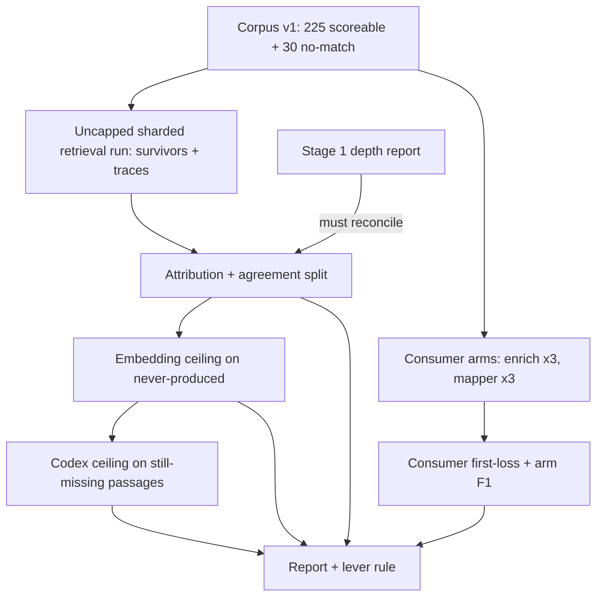

# Retrieval Recall Loss Attribution - Plan

## Goal Capsule

- **Objective:** For every gold concept that retrieval misses on synthetic corpus v1, the team knows where folio-resolve, folio-enrich, and folio-mapper each lose it and what could recover it, so the next retrieval lever builds on what the consumers already do and is chosen from evidence rather than guessed.
- **Means:** a sharded rerun of today's retrieval that keeps every candidate, six measured consumer arms, two offline recovery ceilings, and a rule-based lever recommendation (KTD1, KTD4, KTD6, KTD7).
- **Product authority:** Damien. His choices are recorded in Cockpit records `folio-resolve-2026-09-26-0333-verifier-stage1-next`, `folio-resolve-2026-09-28-0013-retrieval-recall-scope`, `folio-resolve-2026-09-28-0018-retrieval-recall-approach`, `folio-resolve-2026-09-28-0031-retrieval-recall-plan-confirm`, `folio-resolve-2026-09-28-0034-retrieval-recall-incumbents`, `folio-resolve-2026-09-28-0040-consumer-llm-model-cap`, and `folio-resolve-2026-09-28-0042-consumer-llm-luna`. The Product Contract wins on behavior; KTDs win on mechanism.
- **Stop conditions:** stop and ask Damien if the R4 reconciliation fails, if projected LLM spend exceeds the R15 cap, if an arm cannot run at its pinned consumer commit, or if a report fails the leak preflight after one repair.
- **Execution profile:** Codex workers implement U1 through U7 against fake runners and fixtures; the orchestrator performs U8's live runs, because they need network access, API keys, and a pristine worktree.
- **Open blockers:** None.

---

## Product Contract

Product Contract preservation: changed — R1 gains an ontology-absent stage; R7 fixes the LLM ceiling mechanic; R9 fixes the local-fix bar and the consumer-stage bar; R10 defines concentration against the base rate; R11 adds a paired interval for consumer adoption; R13 to R15 add consumer arms; AE1 corrected to cumulative counts. All changes were confirmed by Damien on 2026-09-27 (records `...-plan-confirm`, `...-incumbents`, `...-model-cap`, `...-luna`, `...-recall-plan-review-decisions`).

### Summary

A loss report for the synthetic benchmark that places each missing gold concept at the stage where folio-resolve, folio-enrich, and folio-mapper each lose it, tests whether a local meaning-based search (and, once, an offline LLM) could recover the ones never produced, and ends with a rule-based choice of the next lever that prefers building on a consumer stage that already works.

### Problem Frame

Stage 1 of the calibrated shortlist verifier (`docs/plans/2026-09-23-2130-feat-calibrated-shortlist-verifier-plan.md`) raised strict F1 from 1.75% to 5.64%, but it also showed that retrieval caps every verifier. Of 363 gold relations, 280 never reach the top 200 retrieval candidates, and the 100-deep verifier shortlist caps recall at 19.3% (`docs/benchmarks/verifier-shortlist-depth.md`).

The cause is unknown. Each passage keeps a median of about 1,740 candidates after the gates, out of about 3,400 raw candidates, yet the depth run saved only the top 200. A missing gold concept could be ranked below 200, removed by a gate, or never produced by the lexical matchers at all. Each of those points at a different lever, and building the wrong one wastes a full iteration.

folio-enrich and folio-mapper already beat folio-resolve's whole-pipeline candidate on the shared 60-passage pilot (micro-F1 2.44% and 2.86% against 0.44%; `docs/benchmarks/consumer-legacy-comparison.md`), and each has stages folio-resolve lacks: enrich's local candidate gathering and mapper's embedding blend and branch retrieval. Those runs disabled every LLM stage, so neither consumer's production pipeline has been measured on this benchmark. Owner direction since 2026-09-21 is to preserve each consumer pipeline until a change measurably improves that consumer's F1.

Retrieval in folio-resolve's synthetic adapter is lexical only. The gold was graded by two Codex graders and one Claude grader per passage, so part of the gap may reflect disputed gold rather than retrieval.

### Key Decisions

- **Measure before building.** (session-settled: user-approved — chosen over building the branch/domain router directly: the right lever depends on where gold is lost.) Governs R1, R9, R10.
- **Local first; an LLM only once, offline, as a yardstick for folio-resolve's own retrieval.** (session-settled: user-directed — chosen over allowing an LLM at request time: Damien prefers local only, with an LLM used as little as possible.) Governs R6, R7.
- **Attribution plus recovery ceilings plus a grader-agreement split.** (session-settled: user-approved — chosen over attribution alone and over auditing the gold first: attribution alone would need a second round to find a fix.) Governs R5, R6, R7, R8.
- **The local-fix bar is 25% within the top 50, fixed before results.** (session-settled: user-approved — chosen over 15% and 40% bars: set before any ceiling result is seen.) Governs R9.
- **Build on folio-enrich and folio-mapper, measured with their LLM stages on.** (session-settled: user-directed — chosen over measuring folio-resolve alone and over consumer arms without LLM stages: build on the consumers' pipelines and improve their F1 rather than re-create them.) Governs R9, R13, R14.
- **A consumer stage must recover at least 10% of folio-resolve's misses in the consumer's no-LLM arm to outrank other levers.** (session-settled: user-approved — chosen over 5% and 20% bars: without a bar a single recovered concept would win.) Governs R9, R10.
- **folio-mapper's test runner gains a model override so its Luna arm can run; its production pipeline is untouched.** (session-settled: user-approved — chosen over dropping the mapper Luna arm and over mapper's OpenAI default: keeps the arm Damien chose.) Governs R13.
- **folio-enrich runs only its no-LLM arm.** (session-settled: user-directed — chosen over capping enrich's calls and raising the budget, running it uncapped, or routing it through a subscription: enrich's code sets no token limit, and its no-LLM arm produced only 3 of folio-resolve's 293 misses.) Governs R13, R15.
- **An app stage 'recovers' a miss when it produces it as a candidate; the Codex ceiling resolves names with the grading resolver.** (session-settled: user-directed — chosen over committed-only recovery and exact-label matching: the verifier re-ranks whatever retrieval supplies, and exact matching left 92% of Codex names unmatched.) Governs R7, R9.
- **Gemini 3 Flash as the consumers' baseline model, GPT-6 Luna as a second arm, $25 total cap.** (session-settled: user-directed — chosen over Luna only and Gemini only: Gemini is what the consumers ship, and Luna tests whether a model switch itself raises their F1.) Governs R13, R15.
- **A lever must win on recall and F1 without costing precision.** (session-settled: user-directed — chosen over recall alone: Damien does not want to sacrifice existing precision.) Governs R11.

### Requirements

**Loss attribution (folio-resolve)**

- R1. Each of the 363 gold relations on corpus v1's 225 scoreable items is assigned exactly one stage: in the top 100, ranked 101 to 200, kept by the gates but ranked below 200, removed by a named gate (alias blocklist, place-name, short-label, or score floor), never produced as a raw candidate, or absent from the ontology snapshot the run loads.
- R2. The report gives the count and share of relations at each stage, overall and by doc-type stratum.
- R3. For relations kept but ranked below 200, the report shows how far below the cut they sit, so a ranking lever's reachable gain is visible.
- R4. Attribution runs on the same adapter, corpus, and gold as stage 1, and its top-100 and top-200 counts reconcile exactly with `docs/benchmarks/verifier-shortlist-depth.md`.

**Grader agreement**

- R5. Every stage count, for every arm, is also split by how many of the three graders agreed on the relation, using the recorded grader votes.

**Recovery ceilings**

- R6. For relations folio-resolve never produced, a local meaning-based search over every concept in the ontology snapshot reports how many it places within its top 10, 25, 50, and 100 suggestions per passage.
- R7. One offline Codex pass, run only over passages that still hold never-produced relations after R6, names the concepts each passage discusses in free text; names are matched to concepts with the same resolver that turned grader names into gold, and names that resolve to nothing or to several concepts are counted separately, never guessed.
- R8. Each ceiling also reports how many non-gold concepts it proposes per passage, so recall recovered is weighed against the precision it would cost.

**Lever choice**

- R9. The report ends with one recommended lever. A stage of folio-enrich or folio-mapper is preferred as the lever to port or improve when, in that consumer's no-LLM arm, it produces as a candidate at least 10% of the gold relations folio-resolve misses. Otherwise the stage holding the largest share of recoverable misses picks ranking, gate tuning, or a new local candidate source, and a new local source qualifies only if R6 recovers at least 25% of never-produced relations within its top 50 suggestions.
- R10. A ranking, gate, local-source, or consumer-stage recommendation proceeds straight to brainstorming that lever without a new question to Damien. A result where only an LLM recovers the misses (the R7 ceiling or a consumer's LLM arm), or where the misses concentrate in 2-of-3-grader gold, goes back to Damien before any lever work. Misses concentrate in 2-of-3 gold only when their 2-of-3 share exceeds the 2-of-3 share of all gold, with the 95% interval of the difference above zero.

**Consumer arms**

- R13. folio-enrich and folio-mapper each run over the same 225 scoreable items and 30 no-match controls: both in a deterministic (no LLM) arm, and folio-mapper also as its full pipeline with Gemini 3 Flash and with GPT-6 Luna.
- R14. For every arm, each gold relation is assigned the consumer stage where it is first lost, or committed if it survives to the final output, and the report gives each arm's strict micro precision, recall, and F1 plus its no-match false-positive rate. These arm scores are each consumer's baseline for R11.
- R15. Paid LLM calls across all consumer arms stay under $25 in total, and no full paid run starts until a canary projects the full cost under that cap.

**Guardrails for the eventual lever**

- R11. Whatever lever follows must raise gold recall at the 100-deep shortlist, must raise end-to-end F1 when the stage 1 verifier re-runs on the new shortlist (95% interval above zero), and must keep precision at the verifier's operating point at or above stage 1's 3.3%; the verifier shortlist stays 100 deep. A lever adopted into a consumer must also beat that consumer's R14 baseline, with a paired item-bootstrap 95% interval of the F1 gain above zero.

**Run discipline**

- R12. Report prose passes the firm-surface leak preflight before any compute, and every long run is checkpointed and sharded so an interrupted run resumes rather than restarts.

### Acceptance Examples

- AE1. **Covers R1, R4.** **Given** stage 1's depth report, **then** the attribution counts 70 relations in the top 100 and 13 at ranks 101 to 200, 83 in total, and a gold relation at rank 140 lands in the 101-to-200 stage.
- AE2. **Covers R1.** **Given** a gold concept whose only raw candidate was dropped by the short-label gate, **then** it is counted as gate-removed (short-label), not as never produced.
- AE3. **Covers R9, R10.** **Given** most recoverable misses are never produced and the local search recovers few of them while the LLM recovers many, **then** the report recommends no local lever and the result goes to Damien.
- AE4. **Covers R9, R14.** **Given** folio-mapper's embedding stage commits 20 relations that folio-resolve never produced, **then** porting or improving that stage is the recommended lever ahead of building a new source.
- AE5. **Covers R15.** **Given** the canary projects $31 for all paid arms, **then** no full paid run starts and the projection goes to Damien.

### Scope Boundaries

- Building any lever (reranker, gate change, new candidate source, consumer-stage port, domain router) is deferred to the brainstorm R10 authorizes.
- Consumer repositories are run read-only at pinned commits; no consumer code, configuration, deployment, or pin changes, except the folio-mapper test-runner model override that U9 adds.
- Fixing verifier abstention and training Laya stay parked under the stage 1 no-go.
- The Jev verifier arm is approved separately and waits on TypeSafe access.
- Gold is not re-graded or edited; the agreement split informs the lever choice only.
- The pending U10 v2 comparison and its publication decision are untouched.

<!-- ce-section: work-relationships -->
### How This Work Fits Together

This plan covers the loss diagnosis only. The breakdown below is the current understanding, not a committed roadmap.

- Retrieval lever brainstorm and build: **Depends on** this report's R9 recommendation.
  - Stage 1 verifier re-run on the improved shortlist: **Depends on** that lever, and is judged by R11.
  - Consumer adoption of the lever: **Depends on** beating that consumer's R14 baseline.
- Jev verifier arm: **Can proceed independently of** this work once TypeSafe access exists.
- Verifier abstention fix and Laya training: **Still to decide**, after the lever result.

### Dependencies / Assumptions

- The local embedding model pinned in `benchmarks/fixtures/embedding_model_files.json` (all-MiniLM-L6-v2) is not cached on this machine and needs a one-time download that must match the pinned hashes.
- Google and OpenAI API keys are already present in the orchestrator's shell environment; no new credential is created.
- The uncapped folio-resolve run is assumed to cost about what the last depth run did, roughly 9 wall-hours on 8 shards.
- Gold is LLM-graded; the grader-agreement split is the only check on its reliability in this work.

### Sources / Research

- `docs/benchmarks/verifier-shortlist-depth.md` and `docs/benchmarks/verifier-ceiling.md` — stage 1 depth curve and verdict.
- `docs/benchmarks/consumer-legacy-comparison.md` — consumer pilot scores, stage attribution, and the adoption gate.
- `docs/solutions/2026-09-04-u9-iteration-traps.md` — pristine-tree canary, per-metric-family baselines, gate-before-dedup.
- `docs/solutions/2026-08-17-leak-gate-owner-scans-and-manifest-regeneration.md` and the 2026-09-07 review-gate and U10 rerun learnings in `docs/solutions/` — leak gate and fresh-worktree dependency traps.
- `docs/plans/2026-08-16-001-feat-synthetic-benchmark-f1-campaign-plan.md` — KTD12 stop rule and the per-consumer adoption gate.

---

## Planning Contract

### Key Technical Decisions

- KTD1. **Reuse `DocumentAdapter.adapt` unchanged and persist its traces in a new checkpoint schema.** `adapt()` already emits one `CandidateTrace` per unique IRI with its gate disposition, after the gate-before-dedup fix; the stage 1 checkpoint discards traces and caps survivors at 200. A new store schema keeps every survivor and every trace, so gate attribution is never re-derived outside the adapter. Governs R1, R3, R12.
- KTD2. **Reconcile by recomputation, not by eye.** The attribution step recomputes the depth curve from the uncapped survivors with the existing `depth_curve` logic and fails closed unless the top-100 and top-200 hit counts equal the committed `docs/benchmarks/verifier-shortlist-depth.json`. Governs R4.
- KTD3. **Agreement comes from recorded votes, resolved the way grading resolved them.** Recorded votes key concepts by label, so resolve each vote's labels to IRIs with `grade.resolve_gold_value` over the same label dictionary that graded corpus v1 (as `grade._resolve_vote` does), keep the maximum confidence per IRI, then count votes at or above `grade.DEFAULT_FLOOR`. Fail closed if any gold relation resolves to fewer than two qualifying votes. Governs R5.
- KTD4. **Consumer arms extend the existing comparison harness.** `eval/folio_eval/comparison.py` already runs each consumer's own synthetic runner under a clean-tree guard and captures per-stage snapshots; both runners already accept `--llm-on`. The harness changes as follows:
  1. Each child process gets an environment built from an allowlist (PATH, HOME, the hash seed, and the runner's own settings) plus only that arm's provider key under the consumer's own variable name. Every other provider key is absent, and deterministic arms get none. This matters because mapper picks the first provider whose key is set, and OpenAI's key comes before Google's.
  2. The identity check requires the runner header's lane, `llm_provider`, and `llm_model` to equal the arm definition, and fails closed otherwise.
  3. LLM-lane validators per consumer: enrich stage values are IRI lists under the runner's reported names, and mapper's `committed` is an IRI list equal to `iris`, with its other stages accepted as recorded counts. The deterministic validators stay unchanged.
  4. Each arm runs as small item batches, one runner invocation per batch, persisted machine-locally and skipped on resume, because both runners write output only at the end and fail the whole run on one item error.
  5. Consumers run from detached clean worktrees at the pinned commits, enrich `bb576ac` (the pilot pin) and mapper at U9's commit (the pilot pin `626412b` plus the runner override), each with its own `backend/.venv`.
  Governs R12, R13, R14.
- KTD5. **Per-consumer first-loss stage comes from each consumer's own stage order.** enrich: `EntityRuler`, `StringMatch`, `Reconciliation`, `Resolution`, then final output; the LLM lane's stage names are read from the runner's output. A relation's stage is the first snapshot it is absent from after appearing, or "never produced" if no snapshot holds it. Mapper's LLM lane records only `committed` as IRIs (its other stages are counts), so mapper LLM arms report committed versus not committed, and mapper's per-stage losses (`stage1_filter`, `embedding_rerank`) come from its deterministic arm. Governs R14.
- KTD6. **The embedding ceiling indexes every ontology class with label plus definition text and queries both the whole passage and sentence windows.** It uses `LocalEmbeddingProvider` and `BruteForceIndex` from `src/folio_resolve/embedding.py`, asserts `HF_HUB_OFFLINE=1` and `TRANSFORMERS_OFFLINE=1`, and imports `verify_model_files` from `benchmarks/embedding_recall.py` as the other embedding modules do. The model truncates at 256 word pieces and many passages run longer, so it also queries sentence windows under that limit and ranks each concept by its best window score. It reports both rankings, and R9's bar is judged on the better one. Governs R6, R8.
- KTD7. **The LLM ceiling reuses the verifier collector's runner seam.** `Runner`, `CodexRunner`, and `parse_events` from `eval/folio_eval/verifier_collect.py`, an empty temporary working directory outside the repo, three attempts per item, and a typed failure histogram. The prompt carries passage text only, never IRIs. If more than 10% of items fail after retries, the report is not publishable. Because two Codex votes alone can make a relation gold, recovery is reported separately for relations whose qualifying votes are Codex-only and for those that include the Claude vote, and the report labels the LLM ceiling an upper bound. Governs R7, R8.
- KTD8. **Spend is capped by a hard cumulative guard, with a canary projection first.** Prices for `gemini-3-flash-preview` and `gpt-6-luna` are pinned with a date in the harness config, and an arm whose model has no pinned price fails closed. Each paid arm first runs five scoreable passages to measure a per-item cost (from the consumers' logged usage where available, otherwise a conservative per-call token bound), and all paid arms together must project under $25 before any full run. During full runs, spend accumulates per batch, and the harness stops before any batch whose worst-case cost would cross $25. Governs R15.
- KTD9. **Consumer outputs are reused, not replayed.** Neither consumer can record or replay raw LLM responses without code changes, which the read-only-at-pinned-commits scope boundary forbids. Each arm's per-stage snapshots are kept machine-local and fingerprinted, so later lever tests compare against them without paying again. Governs R13, R15.
- KTD10. **Each step binds to the previous step's finalized artifact.** The attribution checkpoint carries its own fingerprint; the ceilings and consumer attribution bind to the SHA-256 of the finalized attribution JSON, so a ceiling can never run against a stale attribution. Governs R4, R12.
- KTD11. **Record the report as a parked diagnostic.** With `--record-experiment`, the report logs one entry to the synthetic experiment ledger with `lever_scope="adapter_only"` and `decision="park"`, following `eval/folio_eval/verifier_report.py`. Governs R12.
- KTD12. **folio-mapper's test runner reads an optional model name from the environment.** At the pilot pin its runner always uses the registry default per provider (OpenAI's is `gpt-5.5`). U9 adds a runner-only override in folio-mapper, lands it through folio-mapper's own review, and the mapper pin moves to that commit, whose pipeline code is otherwise identical to `626412b`. Governs R13.

### High-Level Technical Design

Paid consumer arms pass the canary gate in KTD8 before their full run; deterministic arms run without it.

### Assumptions

- The consumer runners' `--llm-on` lanes still build their full pipelines at the pinned commits; a one-passage canary per arm confirms this before any projection.
- GPT-6 Luna accepts the parameters enrich's OpenAI provider sends; the enrich Luna canary is where a rejection would surface.

---

## Implementation Units

### U1. Uncapped attribution checkpoint and sharded run

**Goal:** Run today's retrieval over corpus v1 and keep every survivor plus every per-IRI trace, sharded and resumable.
**Requirements:** R1, R3, R12; KTD1, KTD10.
**Dependencies:** none.
**Files:**
- `eval/folio_eval/recall_attribution.py` (new)
- `eval/run_recall_attribution.py` (new, thin launcher)
- `eval/folio_eval/synthetic_checkpoint.py` (new schema variant, own version constant)
- `tests/test_eval_recall_attribution.py` (new)

**Approach:**
1. Add a checkpoint payload variant that stores all survivors and the trace fields (IRI, gate disposition, gate reason, pre- and post-gate score) under its own schema version, reusing the store's atomic writes and `checkpoint_item_key` sharding.
2. Mirror `eval/folio_eval/verifier_depth.py`'s `main`: corpus and config loading, `build_checkpoint_fingerprint`, sharded collection, and `--finalize-only`.
3. Leak-preflight the fixed report prose before compute (R12).

**Patterns to follow:** `eval/folio_eval/verifier_depth.py`, `eval/run_verifier_depth.py`, `eval/folio_eval/synthetic_checkpoint.py`.
**Test scenarios:**
- A two-item fake corpus writes one checkpoint file per item whose survivors exceed 200 and whose traces include a blocklisted IRI.
- Resuming after one shard completes recomputes only the missing items.
- A stage 1 checkpoint directory is rejected by the new schema version.
- A dirty tree, including an untracked file, fails at fingerprint time with the scorer's own error.
- A fixed-prose leak collision fails before any item is adapted.

**Verification:** A fake-corpus run produces uncapped survivors and traces that round-trip through the store; stage 1 checkpoints are untouched.

### U2. Attribution, ontology-absent stage, agreement split, and reconciliation

**Goal:** Assign each gold relation one stage, split by grader agreement, and prove the numbers match stage 1.
**Requirements:** R1, R2, R3, R4, R5; KTD2, KTD3.
**Dependencies:** U1.
**Files:**
- `eval/folio_eval/recall_attribution.py`
- `tests/test_eval_recall_attribution.py`

**Approach:**
1. A pure function over survivors, traces, gold, ontology IRIs, and grader votes returns one stage per `(item, gold IRI)`, with rank for survivors.
2. Stratify by `GoldItemRecord.stratum_id`.
3. Recompute the depth curve with the existing logic and fail closed on any mismatch with the committed depth JSON.

**Test scenarios:**
- Covers AE1. A gold IRI at survivor rank 140 lands in the 101-to-200 stage, and cumulative top-200 equals top-100 plus that stage.
- Covers AE2. A gold IRI whose only trace is `short_label_gate` is gate-removed (short-label).
- A gold IRI absent from every trace but present in the ontology is never produced; one absent from the ontology is ontology-absent.
- A relation with two votes at the floor and one below is 2-of-3; three at the floor is 3-of-3.
- A vote naming a gold concept by its alternative label resolves to the gold IRI and counts toward agreement.
- A gold relation that resolves to fewer than two qualifying votes raises an error.
- An item with empty gold contributes no relations; no-match items never appear in attribution.
- A survivor list that yields a different top-200 count than the committed depth JSON raises a reconciliation error.

**Verification:** Stage counts sum to 363, and reconciliation passes on a fixture copied from the committed depth JSON shape.

### U3. Consumer LLM lane, key plumbing, and spend canary

**Goal:** Run folio-enrich and folio-mapper in all six arms over corpus v1 without changing either consumer.
**Requirements:** R13, R15; KTD4, KTD8, KTD9.
**Dependencies:** none.
**Files:**
- `eval/folio_eval/comparison.py` (LLM lane in the consumer runner and its identity checks)
- `eval/folio_eval/recall_consumers.py` (new: arm definitions, canary, projection)
- `tests/test_eval_comparison.py`
- `tests/test_eval_recall_consumers.py` (new)

**Approach:**
1. Add an LLM lane that passes `--llm-on` and builds each child environment per KTD4: the allowlist, the arm's provider and model through the consumer's own settings names (enrich `FOLIO_ENRICH_LLM_PROVIDER` and `FOLIO_ENRICH_LLM_MODEL`), and only the arm's key.
2. Extend the identity check and add the LLM-lane validators per KTD4.
3. Define the arms: two consumers by deterministic, Gemini 3 Flash, and GPT-6 Luna, with the mapper arms at U9's commit.
4. Run each arm in resumable item batches per KTD4.
5. Pin model prices, canary five passages per paid arm, project, and enforce the cumulative cap per KTD8.
6. Keep row-level stage snapshots machine-local; publish only fingerprints.

**Execution note:** Keys never appear in argv, logs, snapshots, error messages, or test fixtures.
**Patterns to follow:** `run_consumer_stack`, `write_stage_snapshots`, and the existing clean-tree guard in `eval/folio_eval/comparison.py`.
**Test scenarios:**
- With both a Google and an OpenAI sentinel key in the parent environment, a Gemini arm's child environment holds only the Google key under the consumer's own name, a deterministic arm's holds no provider key, and the parent environment is unchanged.
- A runner reporting lane `deterministic` for an LLM arm is rejected, and so is `llm-on` for a deterministic arm.
- A runner header whose `llm_provider` or `llm_model` differs from the arm definition is rejected.
- A mapper LLM row whose non-committed stages are integer counts passes the LLM-lane validator; the same row fails the deterministic validator.
- A fake runner that fails batch 3 leaves batches 1 and 2 persisted, and a rerun executes only batch 3 onward.
- A fake canary projecting $31 across paid arms blocks the full run and reports the projection (Covers AE5).
- A projection of $12 allows the full run, and the run stops before a batch whose worst-case cost would take cumulative spend past $25.
- An arm whose model has no pinned price fails before any call.
- The rendered command, logs, snapshot files, and a consumer failure's error message contain no key value (a sentinel key string is absent from every output).
- A consumer runner that exits non-zero surfaces its tail output and records no partial batch.

**Verification:** Fake runners exercise every arm end to end; no fixture, output, or error message contains a sentinel key.

### U4. Consumer first-loss attribution and arm scores

**Goal:** For every arm, place each gold relation at its first-loss stage and score the arm.
**Requirements:** R5, R14; KTD5.
**Dependencies:** U2, U3.
**Files:**
- `eval/folio_eval/recall_consumers.py`
- `tests/test_eval_recall_consumers.py`

**Approach:** A pure function over one arm's stage snapshots and gold returns a first-loss stage per relation and the arm's strict micro precision, recall, F1, and no-match false-positive rate, reusing `eval/folio_eval/score.py` counting. It also cross-tabulates folio-resolve's never-produced relations against each arm's committed and produced sets.
**Test scenarios:**
- A relation present in mapper's deterministic `stage1_filter` and absent from `embedding_rerank` is lost at `embedding_rerank`.
- A mapper LLM row with integer stage counts yields only committed or not-committed attribution.
- A relation in no enrich snapshot is never produced for that arm.
- A relation committed by mapper but never produced by folio-resolve appears in the cross-tab (Covers AE4 input).
- Arm F1 on a three-item fixture matches a hand count.
- A no-match item with any committed concept counts toward the false-positive rate.

**Verification:** Arm scores reproduce the committed 60-item pilot counts when fed that pilot's deterministic snapshots.

### U5. Local embedding ceiling

**Goal:** Measure how many never-produced relations a local meaning-based search recovers.
**Requirements:** R6, R8; KTD6.
**Dependencies:** U2.
**Files:**
- `eval/folio_eval/recall_embedding_ceiling.py` (new)
- `tests/test_eval_recall_embedding_ceiling.py` (new)
- `tests/test_embedding_recall_ceiling_integration.py` (new, `embedding_integration` marker)

**Approach:** Build one index over every ontology class. For each affected passage, query the whole passage and each sentence window at depth 100, rank concepts by their best window score, and derive the 10, 25, 50, and 100 counts plus non-gold counts for both rankings (KTD6).
**Test scenarios:**
- With `HashingEmbeddingProvider` and a four-concept ontology, a passage sharing tokens with a gold definition recovers it at depth 10.
- A gold concept discussed only in a passage's last sentence window is recovered by the window ranking.
- Counts are monotonic across depths.
- Missing offline environment variables fail before the model loads.
- A model file whose hash differs from the manifest fails before indexing.
- The integration test, run only with the marker, loads the pinned model and embeds one passage.

**Verification:** Unit tests pass without the model; the marked test passes once the model is downloaded.

### U6. Codex proposer ceiling

**Goal:** Measure how many still-missing relations one offline LLM pass could recover.
**Requirements:** R7, R8; KTD7.
**Dependencies:** U5.
**Files:**
- `eval/folio_eval/recall_llm_ceiling.py` (new)
- `tests/test_eval_recall_llm_ceiling.py` (new)

**Approach:** Render a passage-only prompt asking for the legal concepts discussed, parse the final agent message, normalize each name, and map it by exact preferred or alternative label. Checkpoint per item and resume.
**Patterns to follow:** `eval/folio_eval/verifier_collect.py` and `tests/test_eval_verifier_collect.py`'s fake runner.
**Test scenarios:**
- A fake reply naming a gold concept's alternative label recovers that relation.
- A name matching two concepts is counted as ambiguous and recovers nothing.
- A name matching nothing is counted as unmatched.
- A reply containing a tool event is rejected and retried, and three failures record the item as failed.
- With 3 of 20 items failed, the report is marked not publishable.
- The rendered prompt contains no IRI or ontology host.
- Recovered relations are split into Codex-only-majority and Claude-included-majority counts.

**Verification:** Fake-runner runs produce recovered, ambiguous, unmatched, and failed counts that sum to the proposals made.

### U7. Report, lever rule, and experiment record

**Goal:** Publish one leak-checked report and a rule-derived lever recommendation.
**Requirements:** R2, R3, R8, R9, R10, R12; KTD10, KTD11.
**Dependencies:** U2, U4, U5, U6.
**Files:**
- `eval/folio_eval/recall_report.py` (new)
- `eval/run_recall_report.py` (new, thin launcher)
- `docs/benchmarks/recall-loss-attribution.md` and `.json` (generated)
- `tests/test_eval_recall_report.py` (new)

**Approach:** Build the report dict first, render Markdown from it, leak-scan both, then write atomically. The lever rule is a pure function over the stage counts, the consumer cross-tab, and the ceilings. Bind inputs by SHA-256 per KTD10.
**Test scenarios:**
- Covers AE4. A consumer stage recovering the largest share yields a consumer-stage recommendation.
- Covers AE3. Never-produced dominant with an embedding recovery of 20% at depth 50 and a large LLM recovery routes to Damien.
- Never-produced dominant with 30% embedding recovery at depth 50 recommends a new local source.
- Kept-below-200 dominant recommends ranking; gate-removed dominant recommends gate tuning.
- Misses concentrated in 2-of-3 gold route to Damien.
- An input whose SHA-256 differs from the bound attribution is rejected.
- A leak collision in rendered prose blocks the write and says the checkpoint is intact.
- `--record-experiment` writes one ledger line with `decision="park"` and refuses a dirty tree.

**Verification:** A fixture pipeline renders both files, and the rule's output matches each scenario.

### U8. Live runs and publication

**Goal:** Produce the real report.
**Requirements:** R1 to R15.
**Dependencies:** U1 to U7.
**Files:** `docs/benchmarks/recall-loss-attribution.md` and `.json`; `eval/reports/synthetic_experiments.jsonl`.
**Approach:**
1. From a clean worktree under `~/worktrees/`, canary one item, then run U1 on 8 shards and finalize.
2. Create detached clean worktrees of folio-enrich at `bb576ac` and folio-mapper at U9's commit under `~/worktrees/`, each with its own `backend/.venv`, and point the consumer specs there.
3. Run the deterministic consumer arms, then one-passage canaries for the paid arms, then the five-passage projection; run full paid arms only under the cap.
4. Download and verify the embedding model, run U5, then U6 with Codex.
5. Finalize U7 with `--record-experiment`, and rerun the leak scan and an absolute-path grep after every repair.

**Test expectation:** none -- operational run of already-tested code.
**Verification:** Both report files exist, reconcile per R4, pass the leak scan, and the ledger has one new park entry.

### U9. folio-mapper runner model override

**Target repo:** folio-mapper (paths below are relative to that repo).
**Goal:** Let folio-mapper's synthetic test runner run a chosen model so its GPT-6 Luna arm is possible.
**Requirements:** R13; KTD12.
**Dependencies:** none.
**Files:**
- `backend/scripts/synthetic_runner.py`
- the runner's existing test file under `backend/tests/` (add one if none exists)

**Approach:** Branch from `626412b`. When an optional model variable is set, `--llm-on` uses it instead of the registry default for the selected provider, and the output header records the model actually configured. Unset keeps today's behavior exactly. Production pipeline code is unchanged.
**Test scenarios:**
- With the variable unset, the runner builds the same config as today.
- With the variable set to `gpt-6-luna` and only an OpenAI key present, the config and header name `gpt-6-luna`.
- With the variable set but no provider key, the runner exits with its existing error.

**Verification:** folio-mapper's test suite passes, and the commit lands through folio-mapper's normal review; U3 and U8 pin to it.

---

## Verification Contract

| Gate | Command | Applies to | Pass signal |
| --- | --- | --- | --- |
| Unit tests | `uv run pytest` | U1 to U7 | all pass; `embedding_integration` excluded by default |
| Model test | `uv run pytest -m embedding_integration tests/test_embedding_recall_ceiling_integration.py` | U5, U8 | passes with the pinned snapshot, offline |
| Lint | `uv run ruff check eval tests` | U1 to U7 | clean |
| Types | `uv run mypy` and `uv run mypy eval` | U1 to U7 | clean |
| Leak gate | `uv run python eval/run_leakcheck.py check --manifest eval/synthetic/firm-surface-manifest-v1.json --salt-file eval/data/leakcheck-salt docs/benchmarks/recall-loss-attribution.md docs/benchmarks/recall-loss-attribution.json` | U7, U8 | collisions=0; read the count, not only the exit code |
| Review | Codex review with prompt and verdict retained off-tree | whole diff | receipt line per `CLAUDE.md`, verdict `merge` |

---

## Definition of Done

- Every requirement R1 to R10 and R12 to R15 is met by a unit whose tests pass (U9's in folio-mapper), and the report files exist with R4 reconciliation passing. R11 is the guardrail for the lever R10 authorizes and is verified when that lever is built, not by this plan's units.
- Paid LLM spend across consumer arms is under $25, with the canary projection recorded in the report.
- No API key value appears in any committed file, log, or snapshot.
- The leak scan reports zero collisions on both report files, and no absolute path appears in committed files.
- The ledger has one new park entry, and a Codex review receipt with verdict `merge` is recorded.
- Code from abandoned approaches is removed from the diff.
